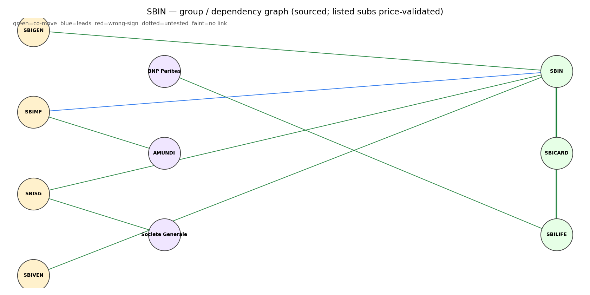
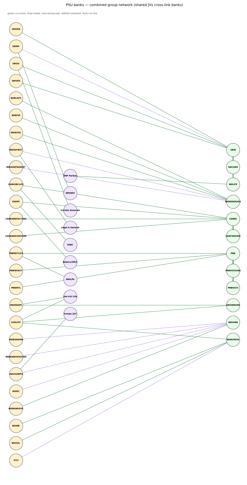
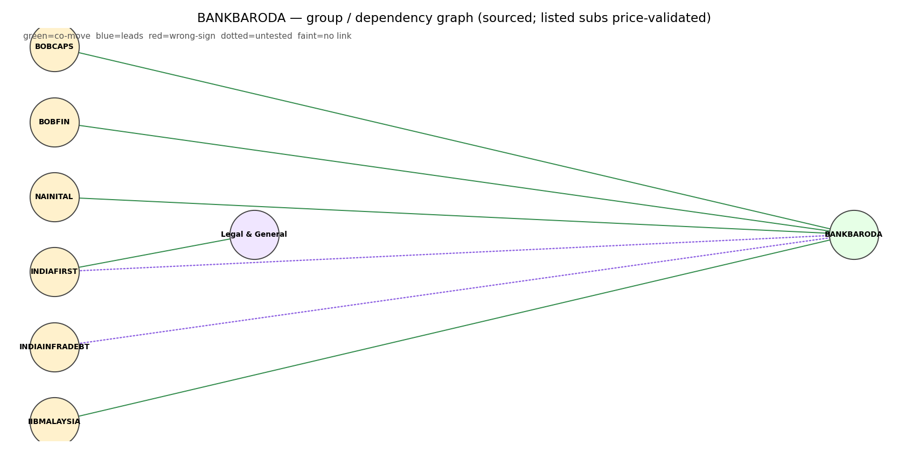
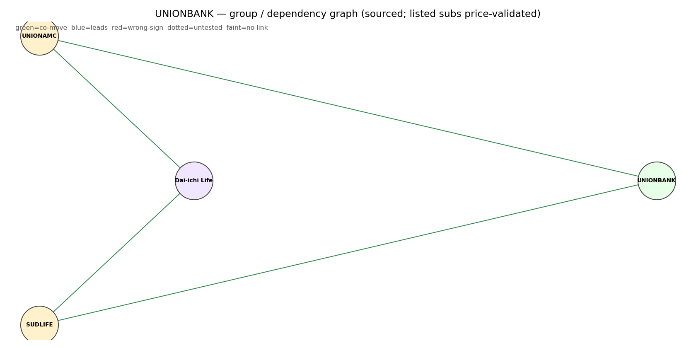
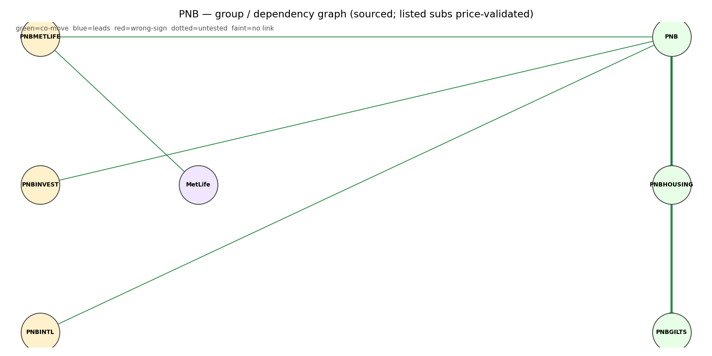
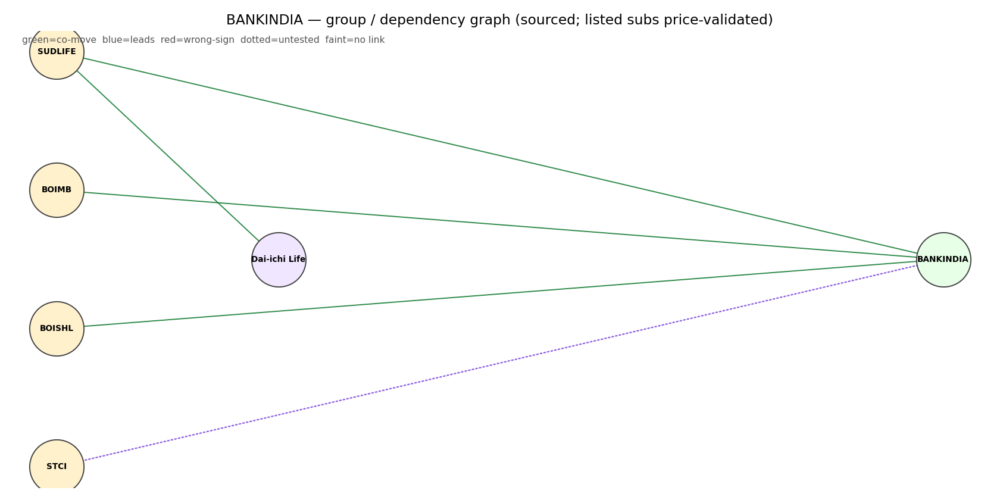

# Top-10 PSU Banks — Comprehensive Report

*Date: 2026-06-06. Universe: top 10 of the 12 NIFTY PSU BANK constituents by market cap (dropped
CENTRALBK #11, PSB #12). All prices split-adjusted (jugaad `adjust=True`). Provenance marked:
**(computed)** = our scripts · **(sourced)** = dated disclosure · **`unknown`** = not honestly
sourceable. Companion files: `00_industry.md` (sector frameworks), `<BANK>_equity_research.md`
(per name), `01_observations.md` (price-action/volume/profit → buy-sell), `strategies/`, `data/`,
`charts/`, `filings/`, `references.md`.*

---

## 1. Sector screener — top-10 PSU banks (ranked by market cap)
_TradingView-style listing. **Stance** = our computed analyst-rating analog (see [01_observations](01_observations.md) for the why; [GLOSSARY](GLOSSARY.md) for every column). All sourced from screener 2026-06-06; price/DMA/vol computed split-adjusted; tally vs jugaad <0.2%._

| Symbol | Price ₹ | Mkt cap ₹Cr | P/E | P/B | ROE% | Div% | 5y PAT CAGR | 1y ret | vs50% | vs200% | RelVol | Deliv% | Stance |
|---|--:|--:|--:|--:|--:|--:|--:|--:|--:|--:|--:|--:|---|
| **SBIN** | 978.0 | 902,477 | 10.8 | 1.51 | 15.4 | 1.77 | 30.0% | 20.7% | -4.6 | -0.8 | 1.35 | 43.6 | 🟡 Hold/add@200 |
| **BANKBARODA** | 264.0 | 136,369 | 6.88 | 0.82 | 12.7 | 3.22 | 73.0% | 4.0% | -1.7 | -4.5 | 1.32 | 37.4 | 🔴 Wait |
| **UNIONBANK** | 167.0 | 127,481 | 6.56 | 0.95 | 15.7 | 2.84 | 47.0% | 10.1% | -2.8 | +4.3 | 0.77 | 39.2 | 🟢 Buy (dips) |
| **CANBK** | 136.0 | 123,189 | 6.87 | 1.05 | 16.1 | 3.09 | 44.0% | 17.2% | +1.4 | -0.4 | 1.2 | 40.4 | 🟢 Accumulate |
| **PNB** | 107.0 | 122,802 | 6.68 | 0.82 | 13.0 | 2.81 | 48.0% | -2.4% | -0.6 | -7.5 | 1.1 | 30.4 | 🔴 Avoid/wait |
| **INDIANB** | 842.0 | 113,421 | 9.69 | 1.42 | 15.4 | 2.17 | 30.0% | 33.2% | -3.3 | +1.5 | 1.62 | 34.8 | 🟢 Buy (base) |
| **BANKINDIA** | 141.0 | 64,402 | 6.08 | 0.71 | 12.4 | 3.29 | 39.0% | 13.5% | -1.3 | -0.3 | 0.99 | 40.5 | 🟡 Watch reclaim |
| **IOB** | 32.9 | 63,412 | 11.7 | 1.71 | 15.6 | 0.0 | 48.0% | -18.8% | -2.9 | -9.5 | 0.42 | 44.2 | 🔴 Avoid |
| **MAHABANK** | 79.2 | 60,909 | 8.68 | 1.83 | 22.7 | 2.78 | 65.0% | 39.8% | +5.1 | +23.7 | 0.6 | 38.0 | 🟡 Hold—don't chase |
| **UCOBANK** | 25.3 | 31,675 | 12.8 | 1.03 | 8.5 | 1.74 | — | -25.6% | -0.9 | -11.5 | 0.59 | 39.3 | 🔴 Avoid |

## 2. The markets they are invested in (loan-book / credit deployment)

**Two books per bank:** the **loan book** (credit by sector) and the **investment book** (mostly
G-secs/SLR). Screener's *quarterly segment P&L* table is premium-gated, so the loan-book sector split is
sourced two ways instead: **(2a)** the RBI system-wide release, and **(2b)** each bank's screener
**Key-Points advance mix**.

### 2a. System-wide — RBI Sectoral Deployment of Bank Credit (April 2026, sourced)
Authoritative RBI release (all scheduled commercial banks, ~95% of non-food credit; system-wide,
not PSU-specific). Full table: `data/RBI_sectoral_deployment_apr2026.{xlsx,json,md}`. **YoY credit
growth (Apr 2026 vs Apr 2025), sourced:**

| Sector | YoY growth | (prior yr) | Note |
|---|---|---|---|
| **Non-food credit (total)** | **15.8%** | 9.8% | broad acceleration |
| Services | **18.6%** | 10.1% | **fastest** — driven by NBFCs **+27.7%**, commercial real estate, trade |
| Personal loans | 16.0% | 11.9% | housing +11.4%, vehicle robust, credit-card moderating |
| Industry | 15.1% | 7.0% | infra/basic metals/engineering strong; construction/textiles weak |
| Agriculture & allied | 13.7% | 9.2% | slowest, still improved |

**Read:** bank credit is being deployed fastest into **Services (esp. lending to NBFCs)** and
**Personal/housing** — i.e. the PSU banks' growth markets are NBFC wholesale funding, real estate,
infra and retail mortgages, not classical agri/industry. This is the system picture; per-bank mix
follows in 2b.

### 2b. Per-bank — domestic advance mix (Q3 FY26, sourced: screener Key Points)
Each bank's loan book split across Retail / Corporate / Agri / MSME — full table in
[`00_industry` §5](00_industry.md) and a chart on every company page. The cohort splits into a
**corporate-heavy** group (PNB, UNIONBANK, BANKINDIA, CANBK — corporate ~41–43%; CANBK's corporate book
is ~⅓ NBFC / ~⅓ infrastructure) and a more **RAM/retail-tilted** group (INDIANB, IOB, MAHABANK,
UCOBANK, SBIN, BANKBARODA). Mapping this onto 2a: the corporate-heavy names carry the most direct
NBFC/infra exposure — the fastest-growing *and* most concentrated system segments. Investment-book SIZE
is sourced from each balance sheet (`data/<sym>_balance_sheet.csv`); the annual-report segment notes in
`filings/ar/` remain available for deeper exposure detail.

## 3. Full dashboard — fundamentals × price-action (computed, 2026-06-04)
| Bank | P/B | ROE% | 5y profit CAGR | TTM profit | 1-yr ret | vs50 | vs200 | vol(20/120) | deliv% | absorp |
|---|---|---|---|---|---|---|---|---|---|---|
| SBIN | 1.51 | 15.4 | 30% | +7% | +20.7% | −4.6 | −0.8 | 1.35 | 43.6 | 0.15 |
| BANKBARODA | 0.82 | 12.7 | 73% | −4% | +4.0% | −1.7 | −4.5 | 1.32 | 37.4 | 0.19 |
| UNIONBANK | 0.95 | 15.7 | 47% | +8% | +10.1% | −2.8 | **+4.3** | 0.77 | 39.2 | 0.13 |
| CANBK | 1.05 | 16.1 | 44% | +2% | +17.2% | **+1.4** | −0.4 | 1.20 | 40.4 | **0.40** |
| PNB | 0.82 | 13.0 | 48% | 0% | −2.4% | −0.6 | −7.5 | 1.10 | 30.4 | 0.13 |
| INDIANB | 1.42 | 15.4 | 30% | +4% | **+33.2%** | −3.3 | **+1.5** | 1.62 | 34.8 | 0.17 |
| BANKINDIA | **0.71** | 12.4 | 39% | +13% | +13.5% | −1.3 | −0.3 | 0.99 | 40.5 | 0.20 |
| IOB | 1.71 | 15.6 | 48% | +60% | **−18.8%** | −2.9 | −9.5 | 0.42 | 44.2 | 0.28 |
| MAHABANK | 1.83 | **22.7** | 65% | +27% | **+39.8%** | **+5.1** | **+23.7** | 0.60 | 38.0 | 0.04 |
| UCOBANK | 1.03 | 8.5 | 0% | +48% | **−25.6%** | −0.9 | −11.5 | 0.59 | 39.3 | 0.19 |

(P/B, ROE, growth = sourced screener; returns/DMA/volume/delivery/absorption = computed split-adjusted.)

## 4. What the table says (groupings)
- **Momentum leaders (above 200-DMA, strong 1-yr):** MAHABANK (+39.8%, ROE 22.7% — best operator,
  but P/B 1.83 richest & price **+23.7% above 200-DMA = extended**), INDIANB (+33.2%, above 200-DMA),
  UNIONBANK (+10.1%, above 200-DMA, ROE 15.7%, cheap P/B 0.95). CANBK (+17.2%, above 50-DMA, highest
  absorption 0.40).
- **Cheap & basing (near DMAs):** BANKINDIA (cheapest P/B 0.71, +13% TTM, at its DMAs),
  BANKBARODA (P/B 0.82, but below both DMAs, −4% TTM).
- **Weak price-action laggards:** PNB (−2.4% 1-yr, −7.5% below 200-DMA), and the two clear losers
  **IOB (−18.8%) and UCOBANK (−25.6%)** — both far below their 200-DMA yet carry the **richest P/E
  (11.7, 12.8)** and huge TTM growth (60%, 48%). That combination = base-effect earnings on
  collapsing prices; the market is de-rating them despite the optics. Treat their TTM growth as a
  low-base artefact, not momentum.
- **SBIN:** the quality anchor — pulling back to its 200-DMA on the highest volume (1.35×) and
  highest-but-one delivery (43.6%); investor accumulation into weakness.

## 5. Strategy evidence (see `strategies/`)
- **EARNED: 50-DMA mean-reversion** on the PSU-bank basket (2021–): Sharpe 1.32 / **over-null
  +0.23** / CAGR 32.4% / maxDD −19.5% / 18 trades. The 25-DMA (textbook), 100, 200 all LOSE to
  buy-and-hold. The sector's reversion edge lives at the **50-DMA**. (computed)
- **Flow-gate stacked on 50-DMA: NO EDGE** here (over-null −0.40, 5 trades) — over-filtered in a
  one-way bull. Honest negative; needs a wider universe + non-bull regime. (computed)

## 5b. What drives the sector / who leads — influence graph (computed)
Lead-lag-validated graph (2023–, daily; `graph/influence_report.txt`, `charts/influence_graph.png`):
- **NIFTY50 → PSU_BANK +0.90** — daily moves are **dominated by market beta**, not bank-specific
  news. (i.e. on any given day the basket mostly does what the market does.)
- **Bellwethers** (constituents most representative of the basket, by co-move): **PNB +0.44,
  CANBK +0.42, BANKBARODA +0.41**, UNIONBANK +0.39, SBIN +0.38 — watch the large caps to read the
  cohort. The small caps **IOB +0.30, UCOBANK +0.31** are the least representative (they march to
  their own, weaker, drum — consistent with their laggard price-action).
- **VIX leads PSU_BANK by 1 day −0.34** (risk-off hits with a lag) — the one usable daily signal.
- **US10Y / USDINR: no daily link** (corr ≈ +0.06) — macro transmits to PSU banks **via flow over
  weeks**, not daily price. Don't trade these banks off daily yield/FX ticks.

## 5c. Group / dependency graph — SBIN (sourced)
The bank↔group-entity dependency graph for the bellwether, built the authoritative way (each edge a
sourced disclosure with SBI's stake as strength; listed subsidiaries price-validated against the
parent). Full graph: `graph/dependency_SBIN.json`; diagram: `charts/dependency_SBIN.png`.

- **Listed subsidiaries co-move with the parent** (price overlay = corroboration): SBI Cards
  **SBICARD corr +0.31**, SBI Life **SBILIFE corr +0.32** — the group link shows up in prices.
- **Unlisted group entities** (no price node): SBI General Insurance (69.95%), SBI Funds Mgmt /
  SBI MF (IPO expected 2026), SBI-SG (65%), SBI Ventures (100%).
- **JV partners** (foreign): BNP Paribas (SBI Life), AMUNDI (SBI MF), Société Générale (SBI-SG).
- Stakes/relationships sourced from SBI disclosures (Wikipedia/SBI affiliates) + the SBI-MF-IPO
  filing; see `references.md`.

**Method finding (honest):** screener's Related-Party feed is **useless for banks** — it returns
transaction TYPES (Advance/Deposit/Remuneration), not counterparty entities. This is exactly why the
dependency-graph SKILL ranks screener as *corroboration only* and the annual-report AOC-1 / direct
disclosures as authoritative. The graph above uses the authoritative path.

### 5d. Group networks (all banks) — sourced
Per-bank group/dependency graphs (subsidiaries/JVs; stakes as edge strength; listed subs price-validated) and the combined PSU network where shared JVs cross-link banks (**Star Union Dai-ichi Life = Union Bank + Bank of India**).

## 5d. Credit ratings — senior, long-term (agent-read from CRISIL rationale, dated)
Read from each bank's latest CRISIL rationale (`filings/ratings/`, fetched by `_ratings.py`; the agent
extracts — the doc rates many instruments, so this is the *senior*/highest grade, with AT1/Tier-I noted).
See [GLOSSARY — Credit ratings](GLOSSARY.md#credit-ratings-what-the-grades-mean) for the scale.

| Bank | Senior (LT) | AT1 / Tier-I | Short-term | Latest CRISIL action |
|---|---|---|---|---|
| SBIN | CRISIL AAA/Stable | AAA/Stable | — | Reaffirmed, 5 Mar 2026 |
| BANKBARODA | CRISIL AAA/Stable | AA+/Stable | — | Reaffirmed, 2 Jan 2026 |
| UNIONBANK | CRISIL AAA/Stable | AA+/Stable | — | Reaffirmed, 11 Dec 2025 |
| CANBK | CRISIL AAA/Stable | AA+/Stable | A1+ | Reaffirmed, 18 Feb 2026 |
| PNB | CRISIL AAA/Stable | AA+/Stable | A1+ | Reaffirmed, 12 Dec 2025 |
| INDIANB | CRISIL AAA/Stable | — | — | Assigned (infra bonds), 16 Mar 2026 |
| BANKINDIA | CRISIL **AA+**/Stable | — | — | Assigned (infra bonds), 18 Dec 2025 |
| IOB | CRISIL **AA+/AA**/Stable | — | — | Reaffirmed, 26 Jun 2025; FD on notice of withdrawal |
| MAHABANK | `unknown`† | — | A1+ | Reaffirmed (CDs), 4 Nov 2025 |
| UCOBANK | `unknown`† | — | A1+ | Reaffirmed (CDs), 14 Aug 2025 |

*All the big PSUs hold **AAA/Stable** senior; **BANKINDIA and IOB sit a notch lower at AA+** — the rating
agencies' read of the weaker franchises, consistent with their lower ROE / price-action in §3.
†CRISIL rates only MAHABANK's and UCOBANK's Certificates of Deposit (short-term **A1+**); their long-term
senior rating is by ICRA/CARE — not yet read (the ICRA docs are fetched, Fitch needs a browser pass).*

## 6. Caveats (discipline)
- RBI sectoral data is **system-wide**, not PSU-only; per-bank loan mix is now sourced (screener
  advance-mix, §2b). Repo/policy current level: pull from RBI before quoting a number.
- Trailing 5-yr profit CAGRs (39–73%) are off cyclical-loss bases — **not** forward guides.
- The 50-DMA edge is one basket / one bull window; modest. Not investment advice.

## 7. References — `references.md` + audit PDFs in `filings/`.
