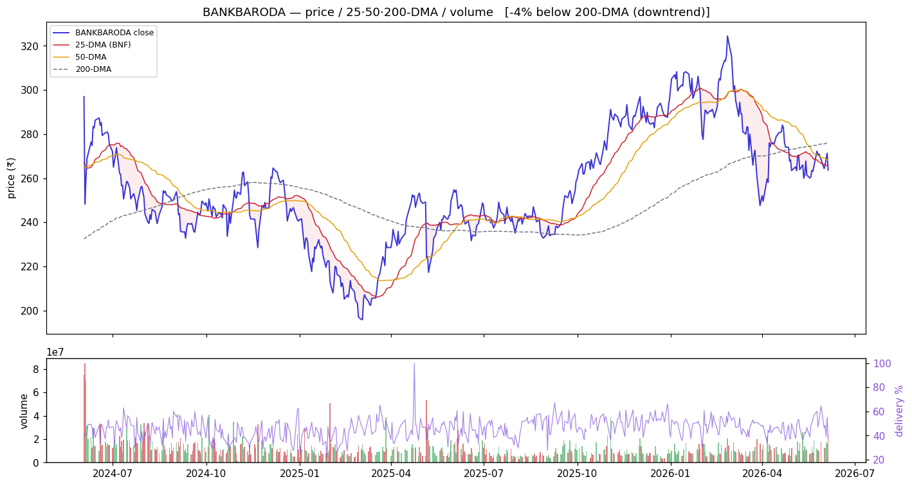
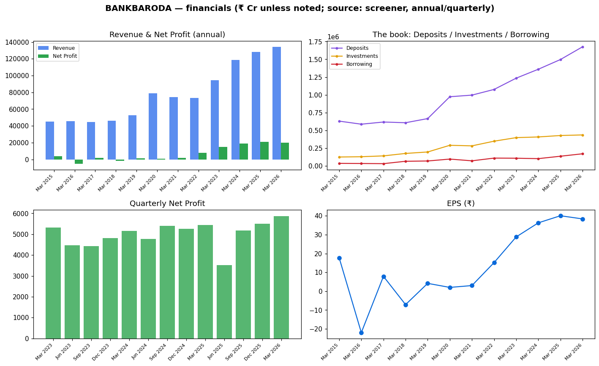
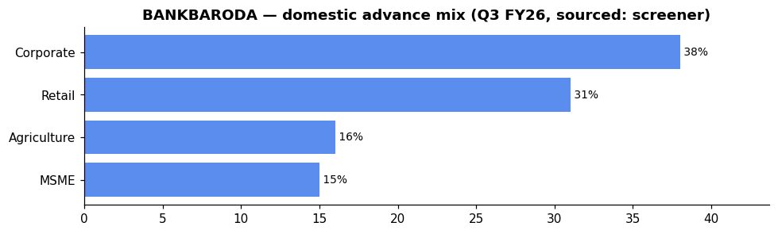

# Bank of Baroda (BANKBARODA) — Equity Research

*2026-06-06. Prices split-adjusted (jugaad `adjust=True`). Provenance on every figure:
**(computed)** = our scripts · **(sourced)** = dated disclosure · **`unknown`** = not sourceable.
[GLOSSARY](GLOSSARY.md) explains every header, term and chart colour.*

> ### 🔴 Stance: **Wait for 200-DMA reclaim**
> **₹264** · Mcap **₹1,36,369 Cr** · P/E **6.88** · P/B **0.82** · ROE **12.7%** · Div **3.22%** · 1-yr **+4.0%**
> Trend: 🔴 **downtrend** — −1.7% vs 50-DMA, −4.5% vs 200-DMA (below both, weakest in the top-4)
> **Why 🔴:** below both DMAs on elevated volume (1.32×), **lowest absorption (0.19)**, TTM profit
> **−4%** and ROE 12.7% (lowest of the four) — cheap on P/B (0.82) but momentum is against it;
> the sector's EARNED 50-DMA reversion play requires a **200-DMA reclaim** first. Strong CASA (38.9%)
> and domestic NIM 3.04% are positives — better NIM franchise than CANBK — but the chart says wait.
>
> **Links:** [Screener](https://www.screener.in/company/BANKBARODA/consolidated/) · [TradingView](https://in.tradingview.com/symbols/NSE-BANKBARODA/) · [BSE](https://www.bseindia.com/stock-share-price/bank-of-baroda/BANKBARODA/532134/) · [NSE](https://www.nseindia.com/get-quotes/equity?symbol=BANKBARODA)

---

## Visuals (charts first)

### Price · volume · 25/50/200-DMA · delivery

> **What it shows:** split-adjusted daily price with 25/50/200-day moving averages, volume bars
> (green up / red down) and delivery %. **How to read:** above the 200-DMA = long-term uptrend; the
> **50-DMA is the buy-the-dip anchor** (the sector's EARNED strategy). **BANKBARODA now (2026-06-04,
> computed):** −1.7% vs 50-DMA, −4.5% vs 200-DMA — below both DMAs with delivery 37.4%, RelVol
> 1.32×, **absorption 0.19 (low)** = no decisive buyer soaking up supply. Needs to reclaim the
> 200-DMA to confirm the value thesis; until then, cheap can stay cheap.

### Financials — revenue/profit · the investment book · quarterly · EPS

> **What it shows:** annual Revenue & Net Profit; **the book** (Deposits ₹16.76 L cr vs Investments
> ₹4.36 L cr=G-sec/SLR vs Borrowing ₹1.70 L cr — where the money sits); quarterly Net Profit
> momentum; EPS. ₹ Cr, sourced screener. The post-FY21 recovery turned chronic losses into record
> profit (FY26: ₹20,021 Cr concall / ₹20,070 Cr screener).

### Group / dependency graph

> **What it shows:** subsidiaries/JVs (sourced; edge = stake %). Green node = listed (price-validated
> co-move with parent), yellow = unlisted, purple = foreign JV partner.
> [Legend](GLOSSARY.md#graph-diagrams).

---

## About & Key Points (sourced — screener, concall)

**About:** Bank of Baroda — incorporated **1908**, nationalised **1969**, **merged with Vijaya Bank
and Dena Bank on 1 Apr 2019**; HQ Baroda Corporate Centre, Mumbai. Full-service PSU bank (personal /
corporate / international / SME / rural / NRI / treasury). Among India's **top-5 banks by assets and
deposits**, ~**6% market share (FY24)** (sourced, screener key points).

**Quality ratios (FY26, concall & Q4 FY26, sourced):** NIM **2.89%** (domestic NIM **3.04%**),
GNPA **1.89%** (−37 bps YoY), NNPA **0.45%** (−13 bps YoY, below 0.5%), CASA **38.9%** (+45 bps QoQ),
PCR **93.94%**, CRAR **15.82%**, CET1 **13.16%**, LCR **~127%**. Cost of funds **4.87%** (FY26, ↓23 bps).
Cost-to-Income: **`unknown`** (premium-gated on screener).

**Loan book growth (FY26, concall, sourced):** global advances **+16.2%** YoY (domestic +14.5%,
international +24.4%). RAM (Retail/Agri/MSME) now **61%** of book — retail book crossed **₹3 L Cr**
(+17.9%: auto +20.6%, mortgage +19.3%, home +14.6%); agri +20.7%, MSME +15.6%. Corporate loans
+11.2%. Slippage ratio 0.72% (FY26, ↓6 bps YoY); credit cost 0.46% (excl. floating provision 0.34%).

**Advance mix (Q3 FY26, sourced screener):** corporate-led at 38%.

**Deposit growth (FY26, concall):** total deposits +12% (domestic +12.8%, international +7.5%);
CASA +9.8%, term deposits +14.8%. Domestic credit-deposit ratio **83.46%**. Bulk deposits reduced to
**~19%** of total (from 23-24% earlier).

**International business (FY26, concall):** international advances **+24.4%** — significant overseas
presence. **`unknown`** branches (not in about data for BOB — screener premium-gated).

**Market share (FY24, sourced):** 6% of advances/deposits — consistent with CANBK's share.

**Branch network:** `unknown` (premium-gated — not in BOB's about extract). The concall mentions
"Baroda Corporate Centre, Bandra Kurla Complex, Mumbai."

**Subsidiaries / associates (sourced, concall):** BOBCAP (equity focus), **BOB Securities and
Giltedge Ltd** (PD subsidiary, operational 1 Apr 2026, capital ₹2,000 Cr), existing insurance +
mutual fund JVs (stakes: **`unknown`** — not in this extract). Pension fund subsidiary planned
(6-9 month timeline, sourced).

**Corporate-action history (sourced, screener Corporate Actions modal):** **Vijaya Bank & Dena Bank
merger** (1 Apr 2019) · **QIP** (Mar 2021, 55 Cr shares to institutions) · preferential allotments
to GoI (2015, 2018, 2019) and LIC (2012). No stock split in the history.

**Recent corporate action:** **₹10,000 Cr green infra bond** raised (first in India per management,
sourced concall); **dividend ₹8.5/share** declared for FY26 (subject to approval).

_Source: [screener Key Points panel](https://www.screener.in/company/BANKBARODA/consolidated/);
concall transcript `filings/concall/BANKBARODA.json`. Figures marked (sourced) are management
disclosures; (premium-gated) items are `unknown` per discipline._

---

## 1. Investment summary

**A below-book PSU bank with a strong CASA franchise, cooling momentum.** FY26 (concall, sourced):
global business **₹30.78 L Cr (+13.9%)**, net profit **₹20,021 Cr** (slightly lower than FY25
₹20,865 Cr, per screener — TTM −4%). The **valuation case:** P/B **0.82** (cheapest-tier with PNB),
div yield **3.22%** (highest of the four), and a superior CASA/NIM profile (CASA 38.9%, NIM 2.89%
vs CANBK 29.5%/2.50%). The **mispricing thesis:** strong domestic NIM (3.04%), 61% RAM tilt, and
clean asset quality (GNPA 1.89%, PCR 93.94%) — yet the market prices it at a discount to book.
**Caveat:** the profit trajectory flat-to-declining (FY25→FY26), ROE 12.7% (lowest of the four), and
below-both-DMAs price-action say the market sees structural drags (management churn, international
exposure risk, lower core earnings momentum). The turnaround story is priced in — it needs to
**execute into visible profit acceleration** to re-rate.

## 2. Valuation

- Relative: P/E **6.88**, P/B **0.82** (below book), div yield **3.22%** — cheapest-quartile vs market;
  tied with PNB at 0.82 vs SBIN 1.51, MAHABANK 1.83. (sourced)
- Management's own FY26 outcome: RoE **15.39%**, RoA **1.06%**, EPS ~₹38 (computed from concall
  profit / shares outstanding). (sourced, concall)
- Absolute (DCF / residual income): **`unknown`** — inputs not independently sourced; not fabricated.

## 3. Industry forces → how they hit BANKBARODA (sector analysis applied)

*(The sector frameworks live in [00_industry](00_industry.md); here is how each maps to THIS bank.)*

- **Porter — supplier power (funding):** BANKBARODA's **CASA 38.9%** is the strongest of the top-4
  PSU banks (vs CANBK 29.5%) and its **cost of funds 4.87%** is lower (CANBK 5.18%) → NIM **2.89%**
  (domestic 3.04%) is the best in the cohort. This is BANKBARODA's **structural moat** — it funds
  cheaper than peers.
- **Porter — substitutes / rivalry:** BANKBARODA's RAM tilt (61%) reduces NBFC wholesale dependence,
  but corporate book (39%) still tied to system credit growth. The bank's **strong international
  franchise (+24.4% YoY growth)** adds a second diversification leg vs domestic-only peers.
- **PESTEL — rates:** rate cycle impacts are milder for BOB vs CANBK because BOB's cheaper funding
  gives more NIM buffer. Floating provision **₹1,500 Cr** (from IT refund) buffers balance sheet
  against rate/credit headwinds. No treasury MTM disclosed (so not quantified).
- **PESTEL — policy/ownership:** GoI holds **63.97%** (stable, Mar 2026, sourced shareholding).
  Capital plan: **₹6,000 Cr AT1/Tier2** (FY27) + **₹8,500 Cr CET-1** (medium term to FY28, sourced) —
  dilution risk is moderate (debt-heavy, equity plan over 3 years).
- **RBI sectoral deployment (system):** credit growing fastest in **Services/NBFC (+27.7%)** and
  **infrastructure** — BOB's 39% corporate book is less concentrated than CANBK's 41% with NBFC/infra
  skew. The **RAM 61% tilt** positions BOB **better for the personal/housing credit wave** (16% system
  growth) than peers with heavier corporate books.
- **Influence graph (computed):** BANKBARODA is a **bellwether** (co-moves +0.41 with the basket)
  and market-beta-dominated (NIFTY50→PSU_BANK +0.90) — trade it off sector/market structure, not
  daily news.
- **Strategy (computed, EARNED):** 50-DMA mean-reversion beats buy-and-hold for the PSU basket
  (Sharpe-over-null +0.23). BANKBARODA is **below both DMAs with low absorption (0.19)** → the clean
  read is **wait for the 200-DMA reclaim** before entering; until then it is the "cheap but
  unconfirmed" name.
- **Management churn (sourced):** senior management changes effective 4 Jun 2026 (Saurabh Shukla,
  Rakesh Nema, Sanjay Kumar Singh) — governance overhang vs CANBK's single MD/CEO transition.

## 4. Financial analysis

- Net profit trajectory — **cyclical losses → sustained profitability** (sourced, screener P&L):
  losses in FY16 (−₹5,033 Cr), FY18 (−₹1,836 Cr), FY20 (−₹981 Cr) → turned profitable **₹1,620 Cr
  (FY21)** → ₹7,933 → ₹15,005 → ₹18,869 → ₹20,865 → **₹20,021 Cr (FY26, concall)**. EPS ~₹38.38
  (screener) / ₹38 (computed from concall), dividend **₹8.5/share** (sourced concall). The **5-yr
  profit CAGR 73%** (sourced) is the highest of the four — but off a cyclical-loss base, not a
  forward guide.
- **The book:** Deposits ₹16.76 L Cr (sourced), Advances (computed from CD ratio 83.46% → ~₹14 L Cr),
  Investments ₹4.36 L Cr (G-sec/SLR), Borrowing ₹1.70 L Cr, Reserves ₹1.65 L Cr (Mar 2026, sourced).
- **RAM tilt (quality):** RAM 61% of advances — retail ₹3 L+ Cr (+17.9%), agri +20.7%, MSME +15.6%.
  RAM tilt improved from earlier corporate-heavy mix (merger legacy) and is now above CANBK's 59%.
- **Quarterly momentum (sourced, screener):** Net Profit Q1→Q2→Q3→Q4 of FY26: **₹3,517 → ₹5,181 →
  ₹5,501 → ₹5,872 Cr** (screener) / ₹5,616 (concall). Recovering after a soft Q1 (the Q1 dip reflected
  the new mortality-table charge and timing). Q4 highest-ever quarterly profit.
- **ROE 12.7% context (screener source):** lowest of the four (SBIN 15.4, CANBK 16.1, PNB 13.0) but
  the concall reports FY26 RoE **15.39%** — the discrepancy suggests the screener trailing figure
  uses a different net-worth base. Management targets ROA >1% (delivered 1.06% FY26).
- **International exposure (concall):** advances +24.4% — a material growth engine but adds West
  Asia/geopolitical risk (raised in concall Q&A, West Asia conflict impact on offshore subsidiary
  queried). Size: **`unknown`** (not segmented in this extract).
- Quality caution: the FY26 profit is slightly **down YoY** (20,021 vs 20,865) — the headline
  "highest ever" refers to operating profit (₹32,259 Cr) or Q4, not full-year net. The net profit
  trajectory has plateaued.

## 5. Investment risks

200-DMA price structure (below both DMAs) + negative TTM profit growth = momentum risk; lowest ROE
in the top-4 (12.7%); management churn (3 senior changes eff. 4 Jun 2026); capital-raising dilution
(AT1/Tier2 ₹6,000 Cr + CET-1 ₹8,500 Cr over FY27-28); West Asia/geopolitical risk from international
book (+24.4% growth); ECL implementation impact (ECLGS book ~₹12,000 Cr expected adjustment per
management); annual-report corrigendum issued (minor, but compliance signal). No auditor qualified
opinion sourced.

## 6. ESG

GoI-majority at **63.97%** (stable, sourced); senior management changes (governance). BANKBARODA
raised India's first **₹10,000 Cr green infra bond** (environmental positive, sourced concall).
BRSR sustainability reporting: **`unknown`** (not pulled). Pension fund subsidiary planned (6-9 mo).

---

## Concall — key points (Q4 & FY26 media & analyst meet, 8 May 2026, sourced: transcript PDF)

- **Business:** global business **₹30.78 L Cr** (+13.9%). Advances +16.2% (domestic +14.5%,
  international +24.4%). Deposits +12%. **RAM tilt now 61%** — retail ₹3 L+ Cr.
- **Margins:** NIM **2.89%** (Q4: +10 bps seq, domestic NIM **3.04%**). Cost of deposits **4.78%** Q4
  / 4.87% FY (↓23 bps YoY). Yield on advances 7.44% Q4 / 7.71% FY. NII growth +8.7%.
- **Profit:** Q4 net profit **₹5,616 Cr** (highest ever quarterly, +11.2% YoY; concall figure vs
  screener ₹5,872). FY26 net profit **₹20,021 Cr** (concall). Operating profit Q4 ₹9,069 Cr (+11.5%).
  The bank adopted new mortality tables → **₹520 Cr extra employee cost** in Q4. NII growth exceeded
  interest expense growth for the first time in many quarters.
- **Asset quality:** GNPA **1.89%** (−37 bps YoY), NNPA **0.45%** (−13 bps), PCR **93.94%**,
  slippage ratio 0.89% Q4 / 0.72% FY (↓6 bps). Credit cost 0.76% Q4 (elevated due to **₹1,500 Cr
  floating provision** from IT refund; excl. floating provision would be 0.32%). Full-year credit
  cost 0.46% (excl. floating 0.34%). CRILC SMA 1&2 / standard advances **0.18%** (⬇ from 0.36%).
- **Capital & liquidity:** CRAR **15.82%**, CET1 **13.16%**, LCR **~127%**. Dividend **₹8.5/share**
  (subject to approval).
- **Capital plan:** ₹6,000 Cr (AT-1 + Tier 2) for FY27; ₹8,500 Cr CET-1 over medium term (FY28).
  Enabling provision already in place.
- **Initiatives:** **BOB Securities and Giltedge Ltd** (PD subsidiary, operational 1 Apr 2026,
  ₹2,000 Cr capital committed, ₹500 Cr availed). **Green infra bond ₹10,000 Cr** raised (first-in-
  India). **Pension fund subsidiary** in planning (6-9 month timeline). BOBCAP (equity focus)
  continuing.
- **Guidance (upsized):** loan growth **12-14%** (from 11-13%); deposit growth **10-12%** (from
  9-11%). NIM guided **2.75-2.95%**. RoA >1%. Slippage 1-1.25%. Credit cost **<0.60%**.
- **CASA:** 38.9% (+45 bps QoQ). Management called it "very healthy" and "one of the lowest market
  cuts." Bulk deposits reduced to ~19% (from 23-24% peak).
- **Provision buffer:** ₹1,500 Cr floating provision created from IT refund — not linked to ECL;
  management called it a "balance sheet strength" buffer. ECLGS exposure expected ~₹12,000+ Cr impact.

_Full extract: `filings/concall/BANKBARODA.json` (36 pages)._

## DRHP

N/A for the parent — Bank of Baroda is a long-listed PSU bank (no recent IPO/DRHP). **Group
initiatives:** BOB Securities and Giltedge Ltd (PD subsidiary, Apr 2026); pension fund subsidiary
(planned, 6-9 mo). No recent group IPO.

## References (this company)

- [Screener](https://www.screener.in/company/BANKBARODA/consolidated/) · [TradingView](https://in.tradingview.com/symbols/NSE-BANKBARODA/) · [BSE](https://www.bseindia.com/stock-share-price/bank-of-baroda/BANKBARODA/532134/) · [NSE](https://www.nseindia.com/get-quotes/equity?symbol=BANKBARODA)
- Audit snapshot: `filings/BANKBARODA_screener_page.pdf` · Data: `data/BANKBARODA_*.json/.csv` · Concall: `filings/concall/BANKBARODA.json`

### News & disclosures (dated, sourced)
- **Senior management changes eff. 4 Jun 2026** — Saurabh Shukla, Rakesh Nema, Sanjay Kumar Singh.
  [BSE filing](https://www.bseindia.com/stockinfo/AnnPdfOpen.aspx?Pname=ef22fde4-d1be-4c16-9c51-156f48fe49c4.pdf)
- **Annual-report corrigendum (28 May–5 Jun 2026)** — corrected dividend payout ratio and provision
  figures in FY2025-26 AR. [BSE filing](https://www.bseindia.com/stockinfo/AnnPdfOpen.aspx?Pname=13ddd02f-ae7a-47be-bc88-9afcf4395763.pdf)
- **Participated in Citi India Conference 2026 (4 Jun 2026)** — no UPSI shared.
  [BSE filing](https://www.bseindia.com/stockinfo/AnnPdfOpen.aspx?Pname=4b9bc92d-11a7-4e57-b150-736a82cf2150.pdf)
- **Special Window for Transfer and Dematerialisation of Physical Securities** — newspaper
  publication. [BSE filing](https://www.bseindia.com/stockinfo/AnnPdfOpen.aspx?Pname=e407aae1-d774-447c-9d78-a7852f4d87da.pdf)
- **Credit rating updates (Feb 2026)** — affirmed by Fitch, CARE, ICRA, CRISIL. [Fitch] · [CARE] ·
  [ICRA](https://www.icra.in/Rationale/ShowRationaleReport/?Id=141199) ·
  [CRISIL](https://www.crisil.com/mnt/winshare/Ratings/RatingList/RatingDocs/BankofBaroda_January%2002_%202026_RR_385832.html)

---
**Stance (computed read, not advice):** 🔴 **Wait for 200-DMA reclaim.** BANKBARODA is the value
pick of the PSU basket — cheapest P/B (0.82), highest yield (3.22%), best CASA (38.9%), competitive
NIM (2.89%). But the price-action is the weakest of the top-4 (below both DMAs, absorption 0.19, TTM
−4% profit). The sector's EARNED play is 50-DMA mean-reversion, which requires the 200-DMA as the
entry confirmation gate for names that are structurally weaker. The strong NIM and CASA franchise
make this a candidate for re-entry on a 200-DMA reclaim; until then it is cheap for a reason (lowest
ROE, mgmt churn, plateauing earnings). Monitor the capital-raise terms, the international book
(geopolitical risk), and the quarterly profit trajectory for a re-acceleration signal.
