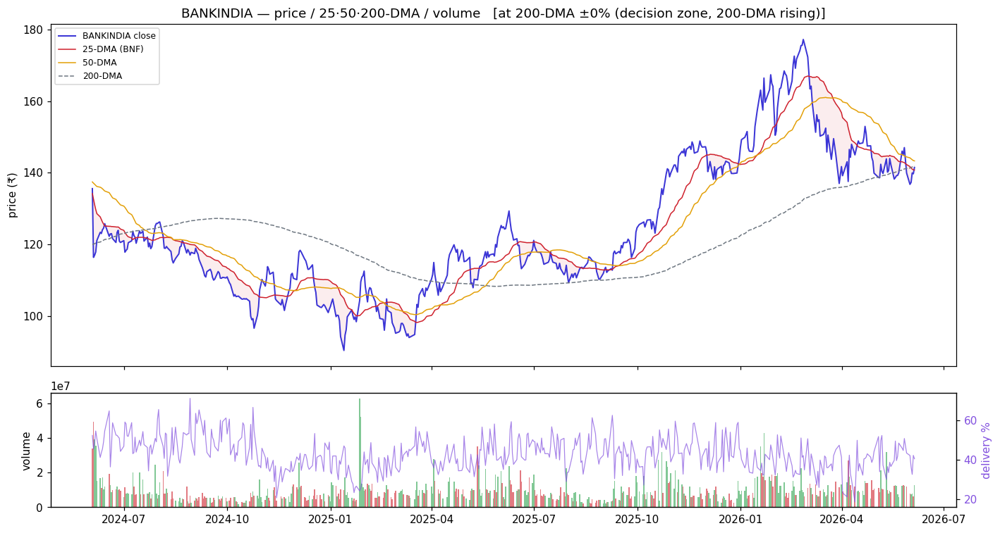
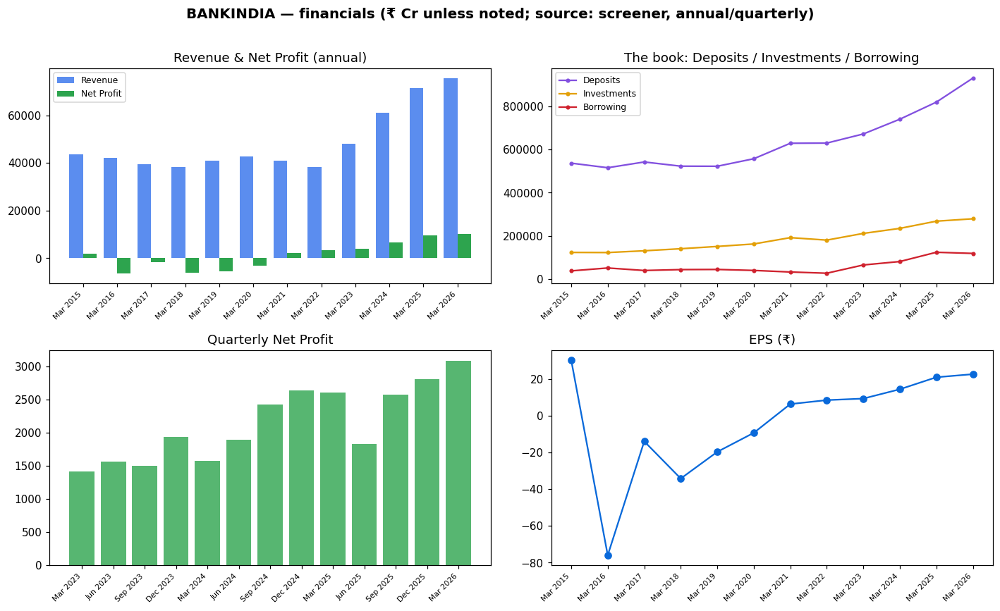

<!-- ASSEMBLED:BEGIN -->
# Bank of India (BANKINDIA) — Equity Research

> ### 🟡 Stance: **Watch for 200-DMA reclaim**
> **₹141.0** · Mcap ₹64,402 Cr · P/E 6.08 · P/B 0.71 · ROE 12.4% · Div 3.29% · 1-yr +13.5%
> Trend: 🔴 downtrend (below both DMAs) — vs50 -1.3%, vs200 -0.3%
>
> **Links:** [Screener](https://www.screener.in/company/BANKINDIA/consolidated/) · [TradingView](https://in.tradingview.com/symbols/NSE-BANKINDIA/) · [BSE](https://www.bseindia.com/stock-share-price/bank-of-india/BANKINDIA/532149/) · [NSE](https://www.nseindia.com/get-quotes/equity?symbol=BANKINDIA)

_Colour code: 🟢 constructive · 🟡 neutral/watch · 🔴 avoid. See [GLOSSARY](GLOSSARY.md) for every header, term and chart colour._

## Visuals (charts first)

### Price · volume · 25/50/200-DMA · delivery

> **What it shows:** daily split-adjusted price with 25/50/200-day moving averages, volume bars (green up / red down) and delivery%. **How to read:** above the 200-DMA = long-term uptrend; the 50-DMA is the buy-the-dip anchor (our EARNED strategy). **This name:** 🔴 downtrend (below both DMAs); delivery 40.5%, RelVol 0.99×.

### Financials — revenue/profit · the investment book · quarterly · EPS

> **What it shows:** (top-left) annual Revenue & Net Profit; (top-right) **the book** — Deposits vs Investments (G-sec/SLR) vs Borrowing = where the money is; (bottom-left) quarterly Net Profit momentum; (bottom-right) EPS trend. ₹ Cr, sourced screener.

### Group / dependency graph

> **What it shows:** subsidiaries/JVs (sourced; edge = stake %). Green node = listed (price-validated co-move with parent), yellow = unlisted, purple = foreign JV partner. See [GLOSSARY](GLOSSARY.md#graph-diagrams).

---

<!-- ASSEMBLED:END -->
## 1. Basic information
| Field | Value | Prov. |
|---|---|---|
| Price · Mcap | ₹141 · ₹64,402 Cr | sourced |
| Tally | < 0.2% ✓ | computed |
| P/E · P/B · Div% · ROE | 6.08 · **0.71 (cheapest)** · 3.29% · 12.4% | sourced |
| Stance | **Watch for 200-DMA reclaim** (§7) | computed read |
| Target | `unknown` | — |

## 2. Business description
**6th-largest nationalised bank**, advances **₹6.96 lakh Cr** (sourced). Segments: **Treasury
Operations, Wholesale Banking, Retail Banking** (sourced; % split `unknown` pending AR). Deposits
₹9,30,973 Cr, Investments ₹2,79,084 Cr, Borrowing ₹1,18,626 Cr (Mar 2026, sourced).

## 3. Industry & positioning
Mid-cap PSU, the **cheapest on book (P/B 0.71)** in the group; ROE 12.4% modest. See `00_industry.md`.

## 4. Investment summary
Deep value with improving earnings. **TTM profit +13%** (one of the better), 5-yr CAGR 39%, 1-yr
+13.5%. Quarterly Net Profit rising ₹2,576→2,814→**3,089 Cr** (sourced). The cheapness + improvement
is the thesis; price confirmation is what's missing.

## 5. Valuation
P/E 6.08 (cheapest P/E), **P/B 0.71 (cheapest)**, div 3.29% (highest tier). DCF `unknown`.

## 6. Financial analysis
Earnings recovering (TTM +13%); ROE 12.4% the constraint on re-rating. Loan mix split `unknown`
(AR pending). Investment book ₹2.79 lakh Cr.

## 7. Price & flow
`charts/BANKINDIA_price_volume.png`. Computed: **−1.3% vs 50-DMA, −0.3% vs 200-DMA** (right at both
— a decision point), 1-yr +13.5%, volume 0.99×, delivery 40.5%, absorption 0.20. *Coiled at its
DMAs; a clean reclaim of the 200-DMA on volume triggers the value play.*

## 8. Risks
Lowest-ROE-tier; cheap can stay cheap without a catalyst; smaller/less liquid. No qualified opinion sourced.

## 9. ESG — GoI-majority. Detail `unknown`.

## 10. References — `references.md`.

---
**Stance:** Watch for a 200-DMA reclaim — cheapest on book with improving earnings, sitting exactly
at its DMAs. Buy the reclaim, not before; ROE caps the upside vs the leaders.

---

---

## Concall — key points (latest, sourced)
_✅ latest transcript captured (`filings/concall/BANKINDIA.json`)._

_Key points pending agent review — the transcript is captured; raw text is **not** dumped here (would be boilerplate). Read it in `filings/concall/BANKINDIA.json`._

## DRHP
N/A for the parent — Bank of India is a long-listed PSU bank (no recent IPO/DRHP). Group IPOs: No recent group IPO of note.

## References (this company)
- Screener: https://www.screener.in/company/BANKINDIA/consolidated/
- TradingView: https://in.tradingview.com/symbols/NSE-BANKINDIA/
- BSE: https://www.bseindia.com/stock-share-price/bank-of-india/BANKINDIA/532149/
- NSE: https://www.nseindia.com/get-quotes/equity?symbol=BANKINDIA
- Audit snapshot: `filings/BANKINDIA_screener_page.pdf`
- Data: `data/BANKINDIA_*.json` / `.csv`

**News & disclosures (dated, sourced):**
- Bank Of India Has informed About One To One Physical Investor / Analyst Meet With M/S Schonfeld Strategic Advisors. 2d - — https://www.bseindia.com/stockinfo/AnnPdfOpen.aspx?Pname=72148836-51b6-44bb-8240-de74ad2b2dd2.pdf
- Announcement under Regulation 30 (LODR)-Change in Management 3 Jun - Shri Lalit Taneja appointed as CVO of Bank of India — https://www.bseindia.com/stockinfo/AnnPdfOpen.aspx?Pname=d80502dc-4175-47e5-b15d-888b147d332f.pdf
- Bank Of India Has informed About The One To One Virtual Investor/Analyst Meet. 3 Jun - Bank of India held a one-to-one v — https://www.bseindia.com/stockinfo/AnnPdfOpen.aspx?Pname=6c3bb23d-8494-4c8f-947a-9e86ca6905ba.pdf
- Announcement under Regulation 30 (LODR)-Analyst / Investor Meet - Outcome 2 Jun - Bank of India participated in BofA Ind — https://www.bseindia.com/stockinfo/AnnPdfOpen.aspx?Pname=87b6b9b4-70f2-4584-a01c-a3f8e9943fec.pdf
- Announcement under Regulation 30 (LODR)-Change in Management 1 Jun - Bank of India elevates Shri Vikash Krishna from Gen — https://www.bseindia.com/stockinfo/AnnPdfOpen.aspx?Pname=3efd2dc1-1f9b-49cf-8d9b-3f04d5b0924e.pdf
