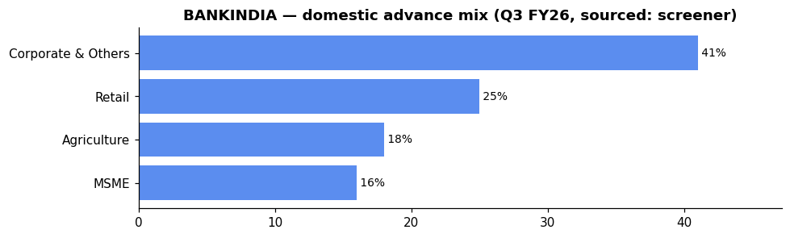

# Bank of India (BANKINDIA) — Equity Research

*2026-06-06. Prices split-adjusted (jugaad `adjust=True`). Provenance on every figure:
**(computed)** = our scripts · **(sourced)** = dated disclosure · **`unknown`** = not sourceable.
[GLOSSARY](GLOSSARY.md) explains every header, term and chart colour.*

## 🟡 Stance — Watch for 200-DMA reclaim

| Price | M-cap | P/E | P/B | ROE | Div yield | 1-yr |
|---|---|---|---|---|---|---|
| ₹141 | ₹64,402 Cr | 6.08 | 0.71 | 12.4% | 3.29% | +13.5% |

| Trend | vs 50-DMA | vs 200-DMA | Delivery | RelVol | Absorption |
|---|---|---|---|---|---|
| 🔴 downtrend | -1.3% | -0.3% | 40.5% | 0.99× | 0.2 |

**Why 🟡:** cheapest P/B in the basket (0.71), earnings recovering (+14% FY26), improving asset quality (GNPA 1.98%, PCR 93.57%), but below both DMAs with modest absorption (0.20) — value without price confirmation. Watch for a clean 200-DMA reclaim on volume to trigger the deep-value play.

**Links:** [Screener](https://www.screener.in/company/BANKINDIA/consolidated/) · [TradingView](https://in.tradingview.com/symbols/NSE-BANKINDIA/) · [BSE](https://www.bseindia.com/stock-share-price/bank-of-india/BANKINDIA/532149/) · [NSE](https://www.nseindia.com/get-quotes/equity?symbol=BANKINDIA)

---

## About & Key Points (sourced — screener, dated)
**About:** Bank of India — incorporated **1906**, nationalised **1969**, HQ Mumbai. Full-service PSU
bank (Treasury Operations, Wholesale Banking, Retail Banking). **6th-largest nationalised bank**,
advances **₹6.96 lakh Cr**, total business **₹15.49 lakh Cr** (Q3 FY25).

**Quality ratios (FY26, concall):** NIM **2.52%**, GNPA **1.98%**, NNPA **0.56%**, PCR **93.57%**,
CASA **37%**, Cost-to-Income **`unknown`** (not extracted), Cost of Funds **`unknown`** (not extracted).

**Market share:** ~6th among nationalised banks by advances (Q3 FY25, sourced).

**Loan book (Mar 2026)** — global advances **₹9.27 lakh Cr**, with RAM advances +19.11% YoY
to ₹3.85 lakh Cr. Advance mix (Q3 FY26, sourced screener): corporate-led at 41%.

**Deposits (Mar 2026):** ₹9,30,973 Cr, of which CASA 37% (~₹3.01 L cr), retail term deposits
~44%. Investment book ₹2,79,084 Cr (G-sec/SLR). Borrowing ₹1,18,626 Cr.

**Geography:** domestic-focused; international branches in Singapore, Hong Kong, London, New York,
Dubai, GIFT City.

**Subsidiaries / associates (sourced):** Bank of India (Uganda), Bank of India (Tanzania), Bank of
India (New Zealand) — mostly unlisted overseas WoS. No large domestic JV associates comparable
to CANBK's Canara Robeco / Canara HSBC.

**Corporate-action history (sourced, screener Corporate Actions modal):** Multiple **GOI preferential
allotments** (2016–2021) · **QIPs** (2021: ₹405 Cr shares at ₹52.89 premium; 2023: ₹449 Cr shares
at ₹90.2 premium) · **ESPS** (2019). No stock split or merger in recent history.

_Source: [screener Key Points panel](https://www.screener.in/company/BANKINDIA/consolidated/) (with its
citation links); figures are SOURCED disclosures, not our computed numbers._

---

## 1. Investment summary
**Deep value coiled at the DMAs, waiting for price confirmation.** FY26 (concall, sourced):
net profit **₹10,527 Cr (+14% YoY)**, NII ₹25,172 Cr (+3%), operating profit ₹16,641 Cr (+6%).
Global business **₹16.98 L cr**. **The mispricing thesis:** cheapest P/B (0.71) in the cohort —
the market is pricing in risk that the improved asset quality (GNPA 1.98%, PCR 93.57%, credit cost
0.48%) no longer justifies. **Caveat:** ROE 12.4% is the lowest-tier, capping the re-rating ceiling;
NIM compressed from 2.82% to 2.52% is a structural headwind. The stock sits exactly at both DMAs
— a clean reclaim of the 200-DMA on volume would trigger the value play; failure to hold risks
further underperformance.

## 2. Valuation
- Relative: P/E **6.08**, P/B **0.71** (cheapest in basket; in-line with PNB at 0.82), div yield
  **3.29%** — cheapest-quartile vs the cohort. (sourced)
- Management guidance: advances growth 15–16%, deposits 13–14% (concall). No direct ROE/RoA guidance
  sourced.
- Absolute (DCF / residual income): **`unknown`** — inputs not independently sourced; not fabricated.

## 3. Industry forces → how they hit BANKINDIA (sector analysis applied)
*(The sector frameworks live in [00_industry](00_industry.md); here is how each maps to THIS bank.)*

- **Porter — supplier power (funding):** BANKINDIA's **CASA 37%** is creditable but its **NIM 2.52%**
  is the tightest in the cohort (compressed 30 bps YoY from 2.82%). The **retail deposit franchise**
  (retail term 44.14%, CASA 37%) buffers cost-of-funds pressure but cannot fully offset margin
  compression. The bank's "UDAAN" project targeting branch-level CASA/retail-term improvement shows
  management is actively addressing this.
- **Porter — rivalry / substitutes:** Moderate PSU player; private banks plus NBFCs compete on
  the corporate side. ECLGS 5.0 provides some MSME growth tailwind.
- **PESTEL — rates:** Low NIM gives limited buffer against rate-tightening cycles. The bank's
  treasury book (₹2.79 L cr G-sec/SLR) carries MTM risk, though not called out specifically in the
  concall as a Q4 hit.
- **PESTEL — policy/ownership:** GoI holds **73.38%** (sourced, Mar 2026 — reduced from 81.41%
  in Jun 2023 via QIP dilution) → directed-lending overhang; capital-raising via QIP has already
  been used twice.
- **RBI sectoral deployment (system):** credit growing fastest in **Services/NBFC** and
  **infrastructure** — BANKINDIA's corporate book exposure to these segments is **`unknown`**
  (not sourced from screener for this bank; AR segment note pending).
- **Influence graph (computed):** Like all PSU banks, BANKINDIA is **market-beta-dominated**
  day-to-day (NIFTY50→PSU_BANK +0.90) — trade it off sector/market structure, not daily macro ticks.
- **Strategy (computed, EARNED):** 50-DMA mean-reversion beats buy-and-hold for the PSU basket
  (Sharpe-over-null +0.23). BANKINDIA sits **below both DMAs** → the EARNED strategy says *stand
  aside until it reclaims the 200-DMA on volume*, then treat as a mean-reversion entry.

## 4. Financial analysis
- Net profit trajectory — **cyclical losses → sustained recovery** (sourced): losses in FY16–FY20
  (worst −₹6,276 Cr) → turned profitable **₹2,081 Cr (FY21)** → ₹3,487 → ₹3,839 → ₹6,567 →
  ₹9,552 → **₹10,309 Cr (FY26)**. EPS ~₹22.64, dividend **₹2.10/share (21% of FV ₹10)**.
- **The book:** Deposits ₹9.31 L cr (+13.6%), advances ₹7.71 L cr (+12.6%), Investments ₹2.79 L cr
  (G-sec/SLR), Borrowing ₹1.19 L cr (Mar 2026, sourced).
- **RAM tilt:** RAM advances +19.11% to ₹3.85 L cr. Retail, Agri and MSME focus per concall.
- **Quarterly momentum (sourced):** Net Profit ₹2,576 Cr (Sep 25) → ₹2,814 Cr (Dec 25) → **₹3,089 Cr
  (Mar 26)** — accelerating. EPS ₹6.78 (Mar 26) from ₹5.66 (Sep 25).
- Quality caution: NIM compression (2.82%→2.52%) is a structural margin headwind that limits
  earnings growth; revenue growth (+6% TTM) lags profit growth.

## 5. Investment risks
Lowest-ROE tier (12.4%) caps re-rating; NIM compression (CoF pressure, CASA competition);
concentrated GoI ownership (73.38%) = directed-lending overhang; GNPA 1.98% still above best-in-class
(~1.4–1.5%); investment book MTM risk; cheap can stay cheap without a catalyst. No qualified opinion
sourced. Credit ratings: Fitch/CARE/CRISIL/ICRA — all updated 2025–26 (sourced); no downgrade
signal.

## 6. ESG
GoI-majority (73.38%); governance: government-appointed board; CVO change (Lalit Taneja, Jun 2026)
and management elevation (Vikash Krishna, Jun 2026). BRSR detail: **`unknown`** (not pulled).

---

## Concall — key points (Q4 & FY26 call, 8 May 2026, sourced: transcript)
- **Growth:** global business ₹16.98 L cr (+12%); advances +12.6%; deposits +13.6%.
- **Margins:** NII ₹25,172 Cr (+3% YoY); global NIM **2.52%** (vs 2.82% FY25 — compressed 30 bps).
- **Profit:** FY net profit ₹10,527 Cr **(+14% YoY)** ; Q4 net profit ₹3,016 Cr (+15% YoY). Operating
  profit ₹16,641 Cr (+6%).
- **Asset quality:** GNPA **1.98%** (−60 bps YoY), NNPA 0.56%, PCR 93.57%, credit cost 0.48%
  (improved from 0.76%), slippage ratio 0.83% (improved from 1.36%).
- **Mix:** RAM +19.11%. CASA 37%. Retail term deposits 44%. Branch expansion: 200+ branches
  planned for FY27, 600 new branches in total. "UDAAN" project for CASA/retail-term growth.
- **Capital:** CRAR 18.01% (well above RBI minimum 11.5%), CET-1 comfortable. Dividend payout
  ~₹1,800–2,000 Cr. ECLGS 5.0 credit guarantee scheme being assessed.
- **Guidance:** advances growth 15–16%, deposits growth 13–14% for FY27.
- **Risk:** MSME stress from West Asia/global headwinds being monitored; no material impact yet.

_Full extract: `filings/concall/BANKINDIA.json`._

## DRHP
N/A for the parent (Bank of India is a long-listed PSU bank). Group IPOs: No recent group IPO of
note (overseas WoS unlisted).

## References (this company)
- [Screener](https://www.screener.in/company/BANKINDIA/consolidated/) · [TradingView](https://in.tradingview.com/symbols/NSE-BANKINDIA/) · [BSE](https://www.bseindia.com/stock-share-price/bank-of-india/BANKINDIA/532149/) · [NSE](https://www.nseindia.com/get-quotes/equity?symbol=BANKINDIA)
- Audit snapshot: `filings/BANKINDIA_screener_page.pdf` · Data: `data/BANKINDIA_*.json/.csv` · Concall: `filings/concall/BANKINDIA.json`

### News & disclosures (dated, sourced)
- **CVO change — Shri Lalit Taneja appointed (3 Jun 2026)** — corporate governance. [BSE filings](https://www.bseindia.com/stockinfo/AnnPdfOpen.aspx?Pname=d80502dc-4175-47e5-b15d-888b147d332f.pdf)
- **Investor meets** with Schonfeld Strategic Advisors, Balyasny, BofA India Conference (Jun 2026). [BSE filings](https://www.bseindia.com/stockinfo/AnnPdfOpen.aspx?Pname=72148836-51b6-44bb-8240-de74ad2b2dd2.pdf)
- **Management elevation** — Shri Vikash Krishna to CGM (1 Jun 2026). [BSE filings](https://www.bseindia.com/stockinfo/AnnPdfOpen.aspx?Pname=3efd2dc1-1f9b-49cf-8d9b-3f04d5b0924e.pdf)

---
**Stance (computed read, not advice):** 🟡 **Watch for 200-DMA reclaim.** BANKINDIA is the
cohort's cheapest on book (P/B 0.71), with improving asset quality and a +14% FY26 profit growth
trajectory, but NIM compression (2.52%) and low ROE (12.4%) cap the fundamental ceiling. The
stock sits exactly at both DMAs — a binary decision point. The EARNED strategy says buy PSU
pullbacks to the 50-DMA; this name hasn't earned that entry yet. A clean volume reclaim of the
200-DMA triggers the deep-value mean-reversion play — wait for it.
