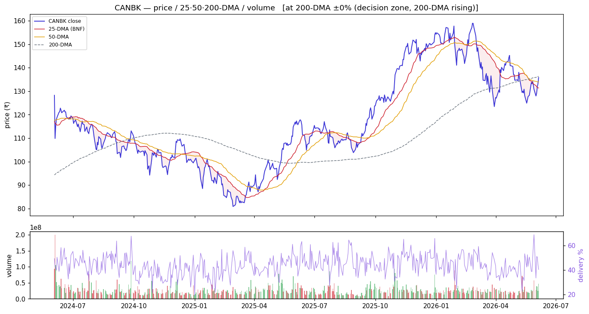
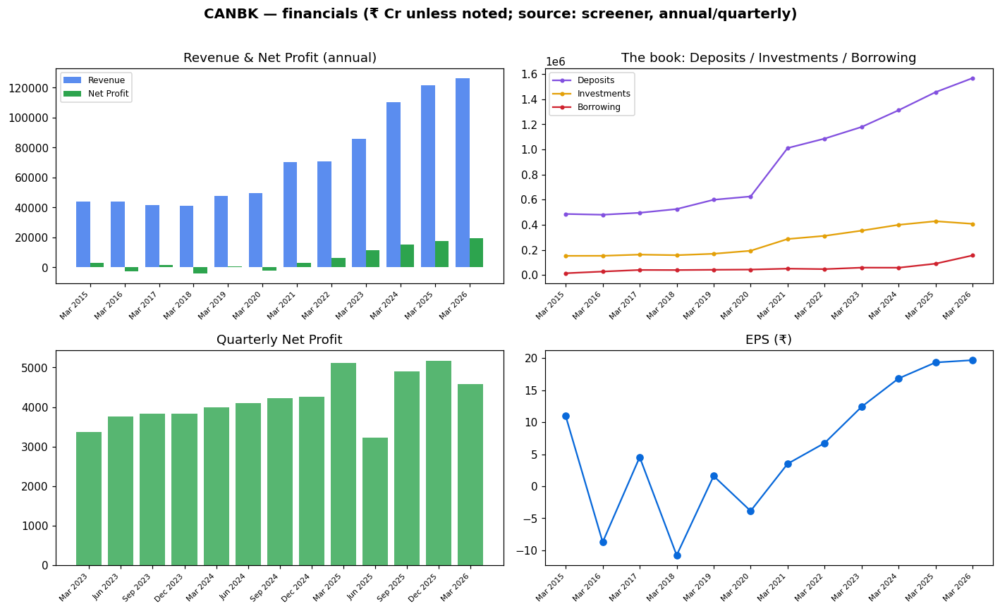
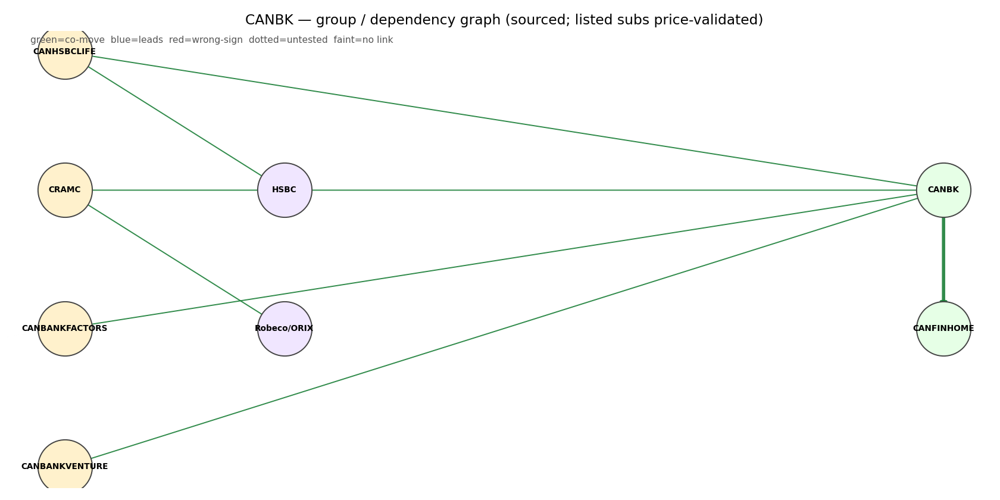

# Canara Bank (CANBK) — Equity Research

*2026-06-06. Prices split-adjusted (jugaad `adjust=True`). Provenance on every figure:
**(computed)** = our scripts · **(sourced)** = dated disclosure · **`unknown`** = not sourceable.
[GLOSSARY](GLOSSARY.md) explains every header, term and chart colour.*

> ### 🟢 Stance: **Accumulate on 50-DMA dips**
> **₹136** · Mcap **₹1,23,189 Cr** · P/E **6.87** · P/B **1.05** · ROE **16.1%** · Div **3.09%** · 1-yr **+17.2%**
> Trend: 🟡 **decision zone** — +1.4% vs 50-DMA, −0.4% vs 200-DMA (sitting on the rising long-term anchor)
> **Why 🟢:** only large PSU bank above its 50-DMA, **highest absorption in the basket (0.40)**, clean
> asset quality, modest P/B — fits the sector's EARNED 50-DMA reversion play. Watch the FY26-27
> capital raise (dilution) and the lumpy quarterly profit.
>
> **Links:** [Screener](https://www.screener.in/company/CANBK/consolidated/) · [TradingView](https://in.tradingview.com/symbols/NSE-CANBK/) · [BSE](https://www.bseindia.com/stock-share-price/canara-bank/CANBK/532483/) · [NSE](https://www.nseindia.com/get-quotes/equity?symbol=CANBK)

---

## Visuals (charts first)

### Price · volume · 25/50/200-DMA · delivery

> **What it shows:** split-adjusted daily price with 25/50/200-day moving averages, volume bars
> (green up / red down) and delivery %. **How to read:** above the 200-DMA = long-term uptrend; the
> **50-DMA is the buy-the-dip anchor** (the sector's EARNED strategy). **CANBK now (2026-06-04,
> computed):** +1.4% above the 50-DMA, −0.4% vs the 200-DMA — riding the rising long-term trend;
> delivery 40.4% (investor participation), RelVol 1.20×, **absorption 0.40 (highest of the 10)** =
> a buyer soaking up supply on dips. The 5:1 split (₹10→₹2, 15 May 2024, sourced) is back-adjusted —
> no fake cliff.

### Financials — revenue/profit · the investment book · quarterly · EPS

> **What it shows:** annual Revenue & Net Profit; **the book** (Deposits ₹15.68 L cr vs Investments
> ₹4.07 L cr=G-sec/SLR vs Borrowing ₹1.55 L cr — where the money sits); quarterly Net Profit
> momentum; EPS. ₹ Cr, sourced screener. The clean post-FY21 inflection is the asset-quality
> cleanup turning chronic losses into record profit.

### Group / dependency graph

> **What it shows:** subsidiaries/associates (edge = stake %). Green = listed (price-validated
> co-move with the parent), yellow = unlisted, purple = foreign JV partner.
> [Legend](GLOSSARY.md#graph-diagrams).

---

## About & Key Points (sourced — screener, dated)
**About:** Canara Bank — incorporated **1906**, nationalised **1969**, **merged with Syndicate Bank
on 1 Apr 2020**; HQ Bangalore. Full-service PSU bank (retail / wholesale / treasury + insurance & AMC
associates).

**Quality ratios (Q3 FY26):** NIM **2.50%**, GNPA **2.08%**, NNPA **0.45%**, CASA **29.52%**, PCR
**94.19%**, Cost-to-Income **46.86%**, Cost of Funds **5.18%**. *(Q4 FY26 concall updates these — see
below; GNPA improved to 1.84%.)*

**Market share (Jun'23):** 6.2% of net advances, 6.5% of deposits.

**Branch network (Q3 FY26):** 10,066 branches · 12,000 BC points · 7,048 ATMs · 3,740 recyclers · 4
international branches. Mix: 32% rural / 30% semi-urban / 19% urban / 19% metro.

**Loan book (Q3 FY26)** — gross advances **₹11,92,326 Cr**:
- Corporate **41%** · Agriculture **23%** · Retail **23%** · MSME **13%**.

**The markets they lend to — Corporate book exposure** (₹4,88,285 Cr, sourced): **NBFCs ~37%**,
**Infrastructure ~33%**, Commercial Real Estate ~6%, Textile ~5%, Iron & Steel ~4%, Engineering ~4%,
Chemicals ~3%, Food Processing ~3%, Petroleum/Coal/Nuclear ~3%, Construction ~2%. *(A third of the
corporate book is NBFC lending and another third infrastructure — see the sector-force mapping, §3.)*

**Geography:** domestic ~93% / overseas ~7% (4 overseas branches: London, New York, DIFC-Dubai, GIFT
City; Canara Bank (Tanzania) being wound down).

**Subsidiaries / associates (sourced):** Canara Robeco AMC (**38%**, JV with Orix Japan), Canara HSBC
Life Insurance (**36.5%**, JV with HSBC + PNB), CanFin Homes (**~30%**, listed), Canara Bank
Securities (WoS), Canbank Factors (**70%**).

**Corporate-action history (sourced, screener Corporate Actions modal):** Syndicate Bank **merger**
(158:1000, Mar 2020) · **rights** issue 1:10 (Feb 2017, premium ₹197) · **stock split** 5:1
(₹10→₹2, eff. 15 May 2024 — back-adjusted in our price series).

**Recent corporate action:** Canara Robeco and Canara HSBC Life **listed in Oct 2025**; an OFS cut the
bank's stake (51%→38% and →36.5%) so both became **associates**, generating a **net gain of ₹1,930 Cr**
(after ₹76 Cr IPO costs) — a one-off that flatters FY26 and won't repeat (management flagged this).

_Source: [screener Key Points panel](https://www.screener.in/company/CANBK/consolidated/) (with its
citation links); figures are SOURCED disclosures, not our computed numbers._

---

## 1. Investment summary
**A re-rated cyclical recovery, consolidating, with a clean RAM-led franchise.** FY26 (concall,
sourced): net profit **₹19,187 Cr (+12.69%)**, operating profit ₹33,019 Cr (+5.19%), global business
**₹28.0 L cr (+12.11%)**. Valuation modest (P/E 6.9, P/B ~1.0). The **mispricing thesis:** asset
quality is now genuinely clean (GNPA 1.84%, PCR 94%+) and the book is tilting to higher-quality RAM
(retail/agri/MSME), yet it trades around book — re-rating room *if* NIM holds and the FY26-27 capital
raise isn't dilutive at a discount. **Caveat:** Q4 profit was soft QoQ (the ₹1,930 Cr listing gain was
a prior-quarter one-off; ₹800 Cr treasury MTM hit as yields rose 6.59→7.05) — don't extrapolate the
headline.

## 2. Valuation
- Relative: P/E **6.87**, P/B **1.05** (≈ book), div yield **3.09%** — cheapest-quartile vs market; mid
  vs PSU peers (BoB/PNB cheaper at 0.82 P/B; SBIN richer at 1.51, MAHABANK 1.83). (sourced)
- Management's own FY26 guidance: RoE **18.5%**, RoA 1.05%, EPS ₹19 (sourced — their target, not ours).
- Absolute (DCF / residual income): **`unknown`** — inputs not independently sourced; not fabricated.

## 3. Industry forces → how they hit CANBK (sector analysis applied)
*(The sector frameworks live in [00_industry](00_industry.md); here is how each maps to THIS bank.)*
- **Porter — supplier power (funding):** CANBK's **CASA 29.5%** is below the strong-franchise banks and
  **cost of funds 5.18%** is mid-pack → its thin **NIM 2.5%** is the structural pressure point. This is
  the force that most constrains CANBK.
- **Porter — substitutes / rivalry:** NBFCs both compete with and *are* the bank's biggest borrowers —
  **~37% of the corporate book is NBFC lending** — so CANBK is doubly exposed to NBFC health.
- **PESTEL — rates:** the rate cycle hits CANBK twice: NIM (lending spread) and **treasury MTM** (the
  ₹800 Cr Q4 hit when G-sec yields rose). A falling-rate turn would reverse both (management expects the
  MTM to reverse).
- **PESTEL — policy/ownership:** GoI holds **62.93%** → the FY26-27 capital-raise (dilution risk) and
  directed-lending overhang; **RBI imposed a ₹41.80 lakh KYC penalty (5 Jun 2026)** — small, but signals
  compliance scrutiny.
- **RBI sectoral deployment (system):** credit is growing fastest in **Services/NBFC (+27.7%)** and
  **infrastructure** — *exactly* where CANBK's corporate book is concentrated (NBFC 37%, Infra 33%). So
  CANBK is **levered to the fastest-growing system-credit segments** (tailwind), with the matching
  concentration risk if those segments wobble.
- **Influence graph (computed):** CANBK is a **bellwether** (co-moves +0.42 with the basket) and, like
  all PSU banks, is **market-beta-dominated** day to day (NIFTY50→PSU_BANK +0.90) — trade it off sector/
  market structure, not daily macro ticks.
- **Strategy (computed, EARNED):** 50-DMA mean-reversion beats buy-and-hold for the PSU basket
  (Sharpe-over-null +0.23). CANBK sits **above its 50-DMA with the highest absorption** → the clean read
  is *accumulate pullbacks toward the 50-DMA*, not chase strength.

## 4. Financial analysis
- Net profit trajectory — **cyclical losses → sustained recovery** (sourced): losses in FY16
  (−₹2,535 Cr), FY18 (−₹3,873 Cr), FY20 (−₹1,921 Cr) → turned profitable **₹2,957 Cr (FY21)** →
  ₹6,158 → ₹11,345 → ₹15,401 → ₹17,692 → **₹19,187 Cr (FY26)**. EPS ~₹19, dividend **210% = ₹4.20/share** (FV ₹2).
- **The book:** Deposits ₹15.68 L cr (+9.71%), advances ₹12.37 L cr (+15.30%), Investments ₹4.07 L cr
  (G-sec/SLR), Borrowing ₹1.55 L cr (Mar 2026, sourced).
- **RAM tilt (quality):** RAM book ₹7.30 L cr (+19.73%) — retail +32.9%, housing +17.6%, vehicle +26.3%,
  MSME +12.9%; target mix ~60-40 RAM-corporate (now 59-40).
- **Gold loans ~20% of book** (₹2.45 L cr) — pricing unchanged, controls enhanced after sector fraud
  newsflow. A South-India structural strength but a concentration to watch.
- Quality caution: the FY26 +12.7% profit includes the ₹1,930 Cr one-off listing gain — underlying
  growth is lower.

## 5. Investment risks
Capital-raise dilution (FY26-27 plan); NIM compression (CoF 5.18%, CASA below peers); treasury MTM on a
rate back-up; concentration in NBFC + infra corporate lending; gold-loan concentration; GoI/directed-
lending overhang; the RBI KYC penalty (compliance signal). No auditor qualified opinion sourced.

## 6. ESG
GoI-majority (governance: govt-appointed board; leadership change — see references). BRSR/E/S detail:
**`unknown`** (not pulled for CANBK).

---

## Concall — key points (Q4 & FY26 call, 11 May 2026, sourced: screener AI summary)
- **Growth:** global business ₹28.0 L cr (+12.11%); advances +15.3%; deposits +9.71%.
- **Margins:** Q4 NII ₹9,808 Cr (+3.88%); NIM ~2.51% FY / ~2.54% Q4; guided to **hover 2.5–2.6%**.
- **Profit:** FY net profit ₹19,187 Cr (+12.69%); Q4 soft QoQ (~₹2,300 Cr) due to a **prior-quarter
  ₹1,930 Cr listing one-off** + **₹800 Cr treasury MTM** (yields 6.59→7.05) — MTM expected to reverse.
- **Asset quality:** GNPA **1.84%** (−110 bps YoY), NNPA 0.43%, PCR 94.21%, credit cost 0.59%,
  slippage 0.69%. CRAR 17.04%, LCR 118%.
- **Mix:** clear RAM tilt (RAM +19.7%; target 60-40). **Gold loans ~20% of book**, pricing unchanged,
  controls tightened.
- **Payout:** dividend 210% (₹4.20/share). Management flags forward EPS/RoE guidance is conservative
  since the ₹1,930 Cr one-off won't recur.

_Full extract: `filings/concall/CANBK.json`._

## DRHP
N/A for the parent (CANBK is a long-listed PSU bank). **Group IPOs:** Canara Robeco AMC and Canara HSBC
Life Insurance **listed Oct 2025** (now associates after the OFS; ₹1,930 Cr net gain to the bank).

## References (this company)
- [Screener](https://www.screener.in/company/CANBK/consolidated/) · [TradingView](https://in.tradingview.com/symbols/NSE-CANBK/) · [BSE](https://www.bseindia.com/stock-share-price/canara-bank/CANBK/532483/) · [NSE](https://www.nseindia.com/get-quotes/equity?symbol=CANBK)
- Audit snapshot: `filings/CANBK_screener_page.pdf` · Data: `data/CANBK_*.json/.csv` · Concall: `filings/concall/CANBK.json`

### News & disclosures (dated, sourced)
- **New MD & CEO — Brajesh Kumar Singh, eff. 1 Jun 2026** (succeeds Hardeep Singh Ahluwalia, who took over 1 Jan 2026). [BSE filings](https://www.bseindia.com/stock-share-price/canara-bank/CANBK/532483/)
- **Board approved FY26-27 capital-raising plan** — watch dilution. [BSE filings](https://www.bseindia.com/stock-share-price/canara-bank/CANBK/532483/)
- **RBI penalty ₹41.80 lakh (5 Jun 2026)** — KYC / inoperative-account lapses (small, reputational). [BSE filings](https://www.bseindia.com/stock-share-price/canara-bank/CANBK/532483/)

---
**Stance (computed read, not advice):** 🟢 **Accumulate on 50-DMA dips.** CANBK is the relative leader
on price-action (above its 50-DMA, highest absorption), with clean asset quality, a quality RAM tilt,
and exposure to the fastest-growing system-credit segments (NBFC/infra) — at ~book value. Manage the
capital-raise dilution risk and the lumpy, one-off-flattered headline profit. The sector's EARNED
play is 50-DMA mean-reversion: buy pullbacks toward the 50-DMA, don't chase.
