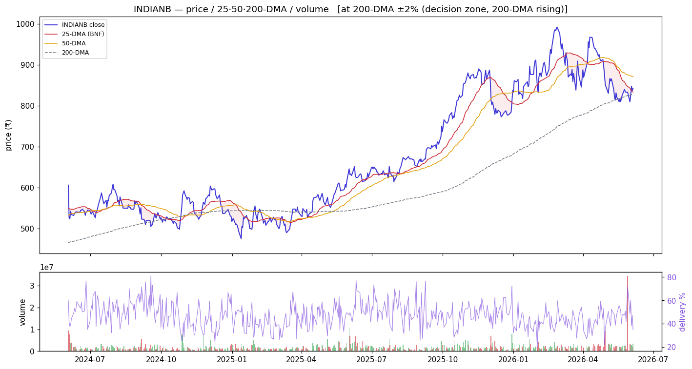
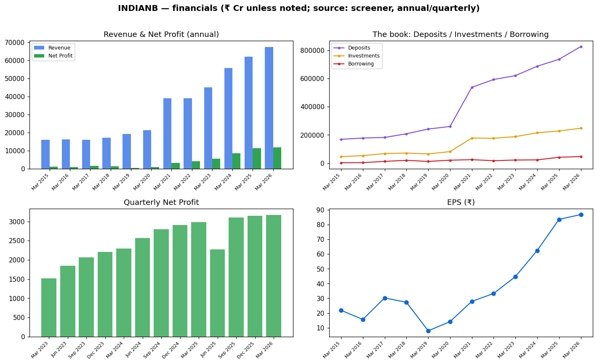
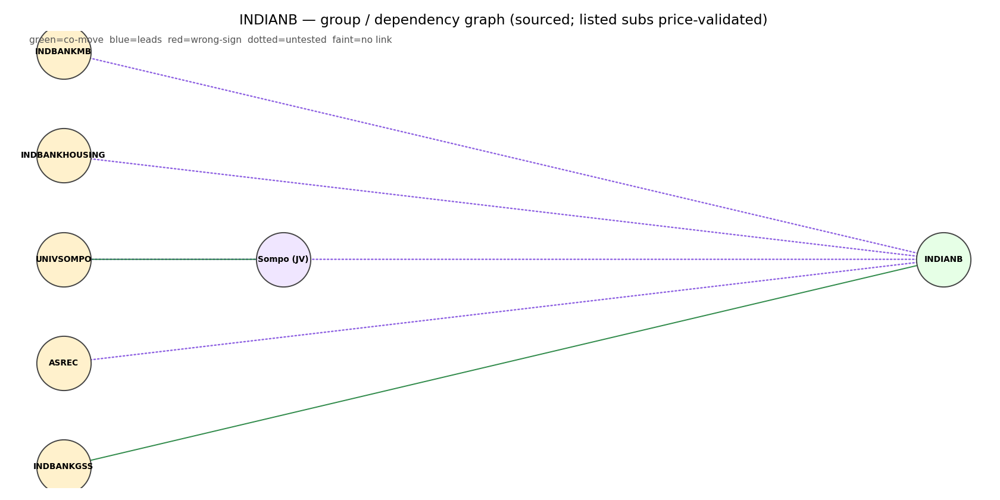
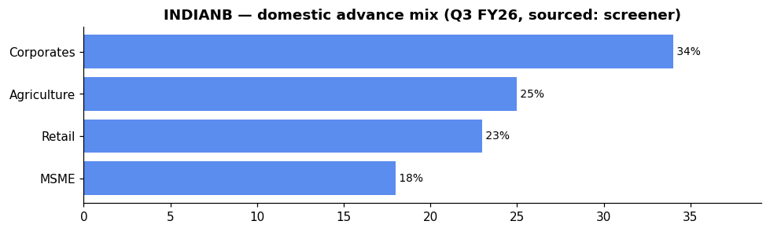

# Indian Bank (INDIANB) — Equity Research

*2026-06-06. Prices split-adjusted (jugaad `adjust=True`). Provenance on every figure:
**(computed)** = our scripts · **(sourced)** = dated disclosure · **`unknown`** = not sourceable.
[GLOSSARY](GLOSSARY.md) explains every header, term and chart colour.*

> ### 🟢 Stance: **Buy — let it base**
> **₹842.0** · Mcap **₹1,13,421 Cr** · P/E **9.69** · P/B **1.42** · ROE **15.4%** · Div **2.17%** · 1-yr **+33.2%**
> Trend: 🟡 **pullback within uptrend** — −3.3% vs 50-DMA, **+1.5% vs 200-DMA** (above the long-term anchor)
> **Why 🟢:** highest 1-yr momentum among large PSU banks, best NIM (3.23%) and ROE (19.53%) in the
> cohort, pristine asset quality (GNPA 1.98%, PCR 98.3%), strong RAM-led growth (+15.2%), and the
> highest relative volume (1.62×) — real investor participation. The −3.3% below 50-DMA is a base-
> building pullback within a strong uptrend. **Caveat:** richest P/B (1.42) after the small caps =
> less margin of safety; leadership transition (ED moved to CANBK); management guided NIM lower in FY27.
>
> **Links:** [Screener](https://www.screener.in/company/INDIANB/consolidated/) · [TradingView](https://in.tradingview.com/symbols/NSE-INDIANB/) · [BSE](https://www.bseindia.com/stock-share-price/indian-bank/INDIANB/532814/) · [NSE](https://www.nseindia.com/get-quotes/equity?symbol=INDIANB)

---

## Visuals (charts first)

### Price · volume · 25/50/200-DMA · delivery

> **What it shows:** split-adjusted daily price with 25/50/200-day moving averages, volume bars
> (green up / red down) and delivery %. **How to read:** above the 200-DMA = long-term uptrend; the
> **50-DMA is the buy-the-dip anchor** (the sector's EARNED strategy). **INDIANB now (2026-06-04,
> computed):** −3.3% below the 50-DMA (a base-building pullback), **+1.5% vs the 200-DMA** = above
> the long-term anchor; delivery 34.8%, RelVol **1.62× (highest of the basket)** — real investor
> participation into weakness, absorption 0.17. *Structure = strong trend on rising volume; wait for
> the base to settle near the 50-DMA.*

### Financials — revenue/profit · the investment book · quarterly · EPS

> **What it shows:** annual Revenue & Net Profit; **the book** (Deposits ₹8.28 L cr vs Investments
> ₹2.48 L cr=G-sec/SLR vs Borrowing ₹0.47 L cr — low leverage); quarterly Net Profit momentum
> (steady 3,100–3,200 Cr range); EPS. ₹ Cr, sourced screener.

### Group / dependency graph

> **What it shows:** subsidiaries/associates (edge = stake %). Green = listed (price-validated
> co-move with the parent), yellow = unlisted, purple = foreign JV partner.
> [Legend](GLOSSARY.md#graph-diagrams).

---

## About & Key Points (sourced — screener, dated)
**About:** Indian Bank — incorporated **1907**, nationalised **1969**, **merged with Allahabad Bank
on 1 Apr 2020**; HQ Chennai. Segments: Treasury, Corporate/Wholesale Banking, Retail Banking, Other
Banking Operations. 7th-largest PSU bank by deposits and advances (sourced).

**Quality ratios (Q4 FY26 concall, sourced):** NIM **3.23%** (Q4) / **3.24%** (FY) — **best NIM of
the PSU cohort** — GNPA **1.98%** (−111 bps YoY), NNPA **0.15%**, PCR **98.28%**, CASA **39.67%**,
Cost-to-Income **44.99%** (Q4, improving from 46.90% Dec), Credit Cost **0.31%** (FY), ROA **1.31%**,
ROE **19.53%** (FY — best of the large PSUs).

**Market share (sourced):** 7th-largest PSU by deposits and advances.

**Branch network:** 8,175+ branches (sourced) + 102 new branches opened in FY26 (on track toward ~300
in 3 years).

**Loan book (Q4 FY26)** — gross advances **₹7,55,778 Cr** (sourced, +13.43% YoY). Advance mix
(Q3 FY26, sourced screener): the most RAM-tilted of the basket — Corporates only 34%, Agri 25%, Retail 23%, MSME 18%.

**The markets they lend to — RAM tilt (concall, sourced):** Retail +18.72%, MSME +16.39%, Corporate
+9.19% (recovering from ~3% prior year). **Jewel loans** ~28% growth to **₹1.27 trillion** (~16–17%
of the book) — a meaningful contributor but management flags likely normalisation in FY27.

**Deposit franchise (Mar 2026):** Deposits ₹8.28 L cr (+12.29% YoY). Bank remains "very cautious in
raising bulk deposits"; bulk + CDs together ~18–19% of deposits. CASA **39.67%** (approaching ~40%
aspiration). Actions: re-activated ~34 lakh inoperative accounts (~₹4,000 Cr), added 3+ lakh salary
accounts, average balances improving (savings ₹30k→₹46k, current ₹1.88L→₹2.64L).

**Geography:** predominantly domestic; overseas presence in GIFT City and Singapore (syndicated loans +
trade finance). Sri Lanka exposure "hardly anything".

**Subsidiaries / associates (sourced):** IndBank Merchant Banking Services (WoS), Indian Bank
(Singapore), Indian Bank (UK). Screener's related-party feed is transaction-type-only for banks;
exhaustive list **`unknown`** pending AR AOC-1 note.

**Corporate-action history (sourced, screener Corporate Actions modal):** Allahabad Bank **merger**
(1 Apr 2020, 520,565,990 shares allotted) · **QIP** (2021: ₹2,368 Cr at ₹142.15/sh) · **QIP** (2023:
₹3,898 Cr at ₹394/sh) · **GoI preferential allotments** (2015, 2019). No stock split.

**Recent corporate action:** Brajesh Kumar Singh **ceased as ED** (1 Jun 2026 — appointed CANBK
MD&CEO). **MCLR/TBLR rates revised** (effective 3 Jun 2026; base rate/BPLR unchanged). **BRSR FY26
filed** 23 May. **AGM 17 Jun 2026.** FY26 Annual Report filed.

_Source: [screener Key Points panel](https://www.screener.in/company/INDIANB/consolidated/) (with its
citation links); figures are SOURCED disclosures, not our computed numbers._

---

## 1. Investment summary
**The quality momentum name — best NIM (3.23%) and ROE (19.53%) of the cohort, with pristine asset
quality.** FY26 (concall, sourced): net profit **₹12,156 Cr (+11.33% YoY)**, total business **+12.79%**.
The **mispricing thesis:** INDIANB delivers SBIN-like quality metrics (NIM >3%, PCR 98%+, GNPA <2%)
at a fraction of SBIN's market cap — the premium P/B 1.42 is justified by the metrics. **Strength:**
RAM-led growth (RAM +15.2%), CASA near 40%, jewel-loan franchise strong. **The watch areas:**
management explicitly guided NIM lower (3.10–3.25% FY27) and advised that jewel loan growth will
normalise; the ED departure is a governance/item. The −3.3% below 50-DMA is a base-building pullback
on **rising volume (1.62×)** — let it settle, don't chase.

## 2. Valuation
- Relative: P/E **9.69**, P/B **1.42**, div yield **2.17%** — 2nd-richest P/B in the basket after the
  small-caps (MAHABANK 1.83, IOB 1.71); priced for quality, justified by ROE + momentum. (sourced)
- Management's own: FY27 guidance of ROA 1.20–1.30% vs actual 1.31% (FY26) — implying a slight
  moderation. FY ROE 19.53% is best among large PSUs.
- Absolute (DCF / residual income): **`unknown`** — inputs not independently sourced; not fabricated.

## 3. Industry forces → how they hit INDIANB (sector analysis applied)
*(The sector frameworks live in [00_industry](00_industry.md); here is how each maps to THIS bank.)*
- **Porter — supplier power (funding):** INDIANB's **CASA 39.67%** is **best-in-cohort** among large
  PSUs — this is the structural advantage that sustains its sector-leading NIM.
- **Porter — rivalry / substitutes:** disciplined RAM tilt (Retail +18.7%, MSME +16.4%) and pristine
  asset quality (GNPA <2%, PCR 98.3%) differentiate INDIANB from peers. Jewel-loan franchise
  (~16–17% of book) is a structural South-India advantage.
- **PESTEL — rates:** the rate cycle affects NIM via EBLR-linked loans (~50% of book per CEO: "very
  few levers are left"). Management's FY27 NIM guidance of 3.10–3.25% accounts for this — a ~15–25 bps
  compression from FY26's 3.24%. Some offset via MCLR repricing (the CEO flagged this).
- **PESTEL — policy/ownership:** GoI holds **73.84%**. BRSR FY26 filed. **RBI LCR guideline changes**
  provide "benefit of 4 to 5 bps" per management. Bank maintains LCR with cushion (~123–124%).
- **RBI sectoral deployment (system):** system credit growing fastest in **Services/NBFC (+27.7%)**
  and **Personal loans (+16.0%)** — INDIANB's RAM focus (Retail +18.7%, Jewel +28%) aligns with this.
  **Corporate is recovering (+9.2% vs ~3% last year)** — management's mid-corp focus (₹50–500 Cr
  segments where "we can command little better price") positions for the infra/services tailwind.
- **Influence graph (computed):** INDIANB influence-graph loading not yet computed separately. As a
  large-cap PSU, it is **market-beta-dominated** (NIFTY50→PSU_BANK +0.90) — trade it on sector/
  market structure, not daily ticks.
- **Strategy (computed, EARNED):** 50-DMA mean-reversion beats buy-and-hold for the PSU basket
  (Sharpe-over-null +0.23). INDIANB sits **−3.3% below its 50-DMA** with **the highest relative
  volume (1.62×)** — this combination (dip + participation) is the strongest volume confirmation
  of accumulation in the basket. Absorption is modest (0.17) — the dip is being bought but not
  aggressively. *Let the base build toward the 50-DMA.*

## 4. Financial analysis
- Net profit trajectory — **consistent growth, no losses in the cycle** (sourced, screener): profit
  ₹862 Cr (FY20) → ₹3,151 (FY21) → ₹4,144 → ₹5,574 → ₹8,423 → ₹11,264 → **₹11,707 Cr (FY26)**.
  EPS ~₹86.89, dividend **₹18.25/share (21% payout)** (FV ₹10). Unlike many PSU peers, Indian Bank
  **never reported an annual loss** — its cleanest book metric.
- **The book:** Deposits ₹8.28 L cr (+12.29%), advances ₹7.56 L cr (+13.43%), Investments ₹2.48 L cr
  (G-sec/SLR), Borrowing **₹46,807 Cr** (lowest leverage in the basket — 4.7% of total liabilities,
  Mar 2026, sourced).
- **RAM tilt (quality, concall):** RAM book +15.18% (Retail +18.72%, MSME +16.39%, Jewel +28%).
  Corporate +9.19% (recovering). Total sanctions in FY26: **₹4.26 trillion (+62% YoY)**, of which
  corporate sanctions ~₹1.31 trillion (+62%) and MSME sanctions +81%.
- **Jewel loans:** ~28% growth to ₹1.27 trillion (16–17% of book). Management flags normalisation
  in FY27 — a growth headwind but good risk management.
- **Quarterly momentum (sourced):** Net Profit steady ₹2,277 (Jun'25, weaker quarter) → ₹3,109 (Sep)
  → ₹3,148 (Dec) → **₹3,174 Cr (Mar'26)** — consistent run-rate of ~₹3,100 Cr+ in H2. EPS ₹16.90 →
  ₹23.07 → ₹23.36 → ₹23.56.
- **Asset quality (sourced concall + quarterly data):** GNPA **1.98%** (−111 bps YoY), NNPA 0.15%,
  PCR 98.28%. SMA ratio improvement: 15.59% (Mar'24) → 18.06% (Mar'25) → **4.73% (Mar'26)**.
  SMA >₹5 Cr only ₹922 Cr. Slippages 0.85% annualised. Credit cost 0.31% (FY26).
- **Operating efficiency:** Cost-to-income 46.03% (FY), improving from 46.90% (Dec) to **44.99%
  (Mar)** — management called out "course correction".
- **ECL readiness:** Impact "will be a little higher" than draft because HTM book now included.
  Management expects to absorb impact within "six to nine months" through earnings. Some spillover
  into FY28 possible.
- **Pipeline:** ₹51,000 Cr, of which ₹34,000–35,000 Cr sanctioned & unavailed. Growth themes: green
  (battery/EV/solar), data centres, roads.

## 5. Investment risks
Richest P/B (1.42) = less margin of safety vs re-rating disappointment; NIM compression guided
(3.10–3.25% FY27 vs 3.24% FY26); jewel-loan growth normalisation (headwind to ~17% of book);
leadership transition (ED Brajesh Kumar Singh moved to CANBK — governance gap); ECL impact
unquantified but management signals manageable (6–9 month absorption); treasury profit expected
lower (₹1,000–1,200 Cr FY27 vs ₹`unknown` FY26). No auditor qualified opinion sourced.

## 6. ESG
GoI-majority (governance: govt-appointed board; ED transition). BRSR FY26 filed May 2026. E/S
detail: **`unknown`** (not pulled for INDIANB).

---

## Concall — key points (Q4 & FY26 call, 29 Apr 2026, sourced: screener AI summary)
- **Growth:** total business +12.79%; advances +13.43% (RAM +15.18%); deposits +12.29%; total
  sanctions ₹4.26 trillion (+62% YoY).
- **Margins:** NIM **3.23%** Q4 / **3.24%** FY (best in PSU cohort); guided 3.10–3.25% FY27 (downward
  bias). CEO: "very few levers" on NIM given ~50% EBLR-linked book.
- **Profit:** FY net profit **₹12,156 Cr (+11.33% YoY)**; Q4 ₹3,103 Cr (+1.3% QoQ). ROE **19.53%**.
- **Asset quality:** GNPA **1.98%** (−111 bps YoY), NNPA 0.15%, PCR 98.28%. SMA ratio collapsed
  from 18.06% to **4.73%**. Additional ₹310 Cr geopolitical prudence buffer created.
- **CASA:** improved sequentially to **39.67%** (FY) — approaching ~40% aspiration. Actions:
  re-activated 34 lakh inoperative accounts (~₹4,000 Cr), 3+ lakh new salary accounts.
- **Jewel loans:** +28% to ₹1.27 trillion (~16–17% of book). FY27 growth expected to normalise.
- **Cost-to-income:** 46.03% FY; quarterly improvement 46.90%→44.99% (management "course correction").
- **ECL:** impact "a little higher" than draft (HTM now included); expects absorption in 6–9 months
  via earnings — some spillover into FY28 possible.
- **Treasury:** FY27 treasury profit expectation ₹1,000–1,200 Cr (lower than FY26).
- **Digital:** business +63% to ₹2.72 trillion; 10+ AI platforms; 160+ fintech partners; 97% retail/
  agri digital sanction adoption.
- **FY27 guidance:** Advances 11–13%, Deposits 9–11%, CASA ~40%, NIM 3.10–3.25%, ROA 1.20–1.30%,
  GNPA 1.50–1.60%, NNPA <0.25%, credit cost <1%, slippage <1%.

_Full extract: `filings/concall/INDIANB.json`._

## DRHP
N/A for the parent (Indian Bank is a long-listed PSU bank). No recent group IPO of note.

## References (this company)
- [Screener](https://www.screener.in/company/INDIANB/consolidated/) · [TradingView](https://in.tradingview.com/symbols/NSE-INDIANB/) · [BSE](https://www.bseindia.com/stock-share-price/indian-bank/INDIANB/532814/) · [NSE](https://www.nseindia.com/get-quotes/equity?symbol=INDIANB)
- Audit snapshot: `filings/INDIANB_screener_page.pdf` · Data: `data/INDIANB_*.json/.csv` · Concall: `filings/concall/INDIANB.json`

### News & disclosures (dated, sourced)
- **Brajesh Kumar Singh ceased as ED (1 Jun 2026)** — appointed Canara Bank MD&CEO. [BSE](https://www.bseindia.com/stockinfo/AnnPdfOpen.aspx?Pname=eaf7ebe6-078f-44a5-a3b9-0efcb97c97aa.pdf)
- **MCLR/TBLR rates revised (effective 3 Jun 2026)** — base rate and BPLR unchanged. [BSE](https://www.bseindia.com/stockinfo/AnnPdfOpen.aspx?Pname=6f3324a9-8f58-4f76-81d7-92c5a3cf2356.pdf)
- **BRSR FY26 filed (23 May 2026).** [BSE](https://www.bseindia.com/stockinfo/AnnPdfOpen.aspx?Pname=fedfdf47-49fa-4729-9ad5-29122e544729.pdf)
- **20th AGM 17 Jun 2026.** [BSE](https://www.bseindia.com/stockinfo/AnnPdfOpen.aspx?Pname=ec303a35-3b24-43c2-979f-b45933614248.pdf)
- **FY26 Annual Report filed (23 May 2026).** [BSE](https://www.bseindia.com/stockinfo/AnnPdfOpen.aspx?Pname=1fb9961e-55dc-496e-9726-6e605ddde9f0.pdf)
- **CRISIL/CARE rating updates** — Mar 2026, Dec 2025, Sep 2025 (all stable). [CRISIL](https://www.crisil.com/mnt/winshare/Ratings/RatingList/RatingDocs/IndianBank_March%2016_%202026_RR_391731.html)

---
**Stance (computed read, not advice):** 🟢 **Buy — let it base.** INDIANB is the quality-momentum
leader (best NIM 3.23%, ROE 19.53%, pristine asset quality, RAM-led growth, rising CASA, digital
adoption) — the metrics justify the premium P/B 1.42. The −3.3% below the 50-DMA within a strong
uptrend (+1.5% above 200-DMA) on the highest relative volume (1.62×) is a genuine accumulation
setup. Manage the NIM compression guidance, jewel-loan normalisation, and the ED leadership gap.
Don't chase — wait for the base to settle toward the 50-DMA.
