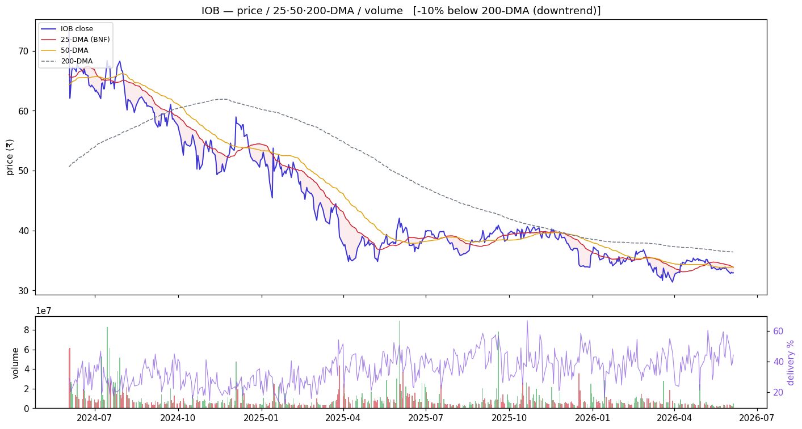
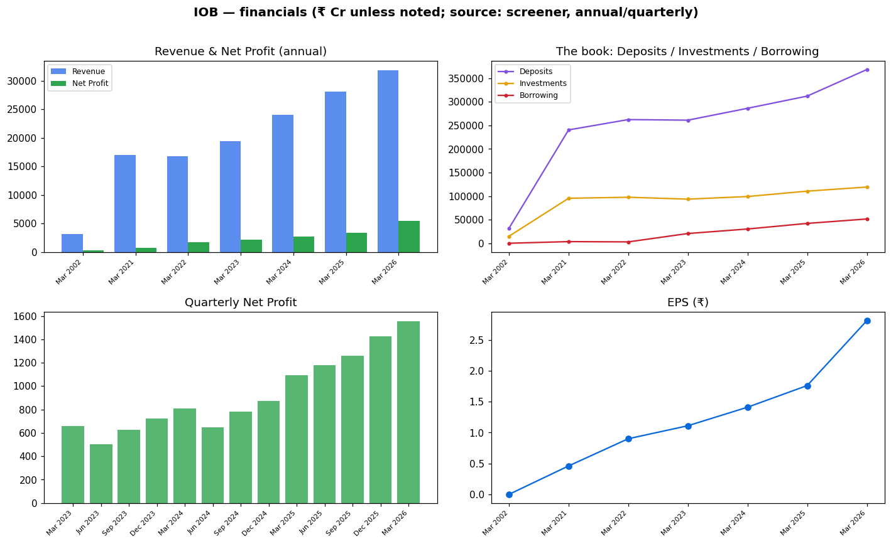

<!-- ASSEMBLED:BEGIN -->
# Indian Overseas Bank (IOB) — Equity Research

> ### 🔴 Stance: **Avoid (overvalued laggard)**
> **₹32.9** · Mcap ₹63,412 Cr · P/E 11.7 · P/B 1.71 · ROE 15.6% · Div 0.0% · 1-yr -18.8%
> Trend: 🔴 downtrend (below both DMAs) — vs50 -2.9%, vs200 -9.5%
>
> **Links:** [Screener](https://www.screener.in/company/IOB/consolidated/) · [TradingView](https://in.tradingview.com/symbols/NSE-IOB/) · [BSE](https://www.bseindia.com/stock-share-price/indian-overseas-bank/IOB/532388/) · [NSE](https://www.nseindia.com/get-quotes/equity?symbol=IOB)

_Colour code: 🟢 constructive · 🟡 neutral/watch · 🔴 avoid. See [GLOSSARY](GLOSSARY.md) for every header, term and chart colour._

## Visuals (charts first)

### Price · volume · 25/50/200-DMA · delivery

> **What it shows:** daily split-adjusted price with 25/50/200-day moving averages, volume bars (green up / red down) and delivery%. **How to read:** above the 200-DMA = long-term uptrend; the 50-DMA is the buy-the-dip anchor (our EARNED strategy). **This name:** 🔴 downtrend (below both DMAs); delivery 44.2%, RelVol 0.42×.

### Financials — revenue/profit · the investment book · quarterly · EPS

> **What it shows:** (top-left) annual Revenue & Net Profit; (top-right) **the book** — Deposits vs Investments (G-sec/SLR) vs Borrowing = where the money is; (bottom-left) quarterly Net Profit momentum; (bottom-right) EPS trend. ₹ Cr, sourced screener.

---

<!-- ASSEMBLED:END -->
## 1. Basic information
| Field | Value | Prov. |
|---|---|---|
| Price · Mcap | ₹32.9 · ₹63,412 Cr | sourced |
| Tally | < 0.2% ✓ | computed |
| P/E · P/B · Div% · ROE | **11.7 (rich)** · 1.71 · 0.00% · 15.6% | sourced |
| Stance | **Avoid (overvalued laggard)** (§7) | computed read |
| Target | `unknown` | — |

## 2. Business description
Founded 1937 (Chidambaram Chettyar), nationalised 1969 (sourced). **Business mix Q3 FY26 (sourced):
Advances 46%, Term Deposits 32%, Savings 18%, Current 4%** — i.e. an advances-led book funded mostly
by term deposits (lower CASA = costlier funding). Deposits ₹3,68,191 Cr, Investments ₹1,19,285 Cr,
Borrowing ₹51,603 Cr (Mar 2026, sourced).

## 3. Industry & positioning
Smaller PSU. The valuation/price mismatch is the story (see §4, §7). See `00_industry.md`.

## 4. Investment summary
**Optically growing, actually de-rating.** TTM profit **+60%** looks great but is a **low-base
artefact**; meanwhile the stock is **−18.8% over 1-yr**. Quarterly Net Profit rising ₹1,259→1,427→
**1,556 Cr** (sourced) — earnings up, price down: the market is repricing risk/quality, not rewarding
growth. Recent: **IFSCA license for an IFSC Banking Unit at GIFT City (2 Jun)** — small positive.
Pays **no dividend** (0%).

## 5. Valuation
P/E **11.7** and P/B **1.71** — the **richest in the cohort despite the worst-tier price-action**.
That is the red flag: paying a premium for a falling name. DCF `unknown`.

## 6. Financial analysis
Term-deposit-heavy funding (32%) + low CASA = structural NIM headwind. TTM +60% = base effect, not a
forward guide. Loan-book detail `unknown` beyond the business mix above.

## 7. Price & flow
`charts/IOB_price_volume.png`. Computed: **−9.5% below 200-DMA** (downtrend), −2.9% below 50-DMA,
1-yr **−18.8%**, **thinnest volume 0.42×**, delivery 44.2%, absorption 0.28. *Below a declining
200-DMA = the EARNED strategy says stand aside; no reversion edge under a falling long-term trend.*

## 8. Risks
Premium valuation + downtrend = poor risk/reward; no dividend; low-CASA NIM pressure; small/liquidity.
No qualified opinion sourced.

## 9. ESG — GoI-majority. Detail `unknown`.

## 10. References — `references.md`.

---
**Stance:** Avoid — richest valuation in the group attached to the second-worst price-action; the
+60% TTM is a low-base illusion. Below a falling 200-DMA there is no reversion setup. Stand aside.

---

---

## Concall — key points (latest, sourced)
_✅ latest transcript captured (`filings/concall/IOB.json`)._

_Key points pending agent review — the transcript is captured; raw text is **not** dumped here (would be boilerplate). Read it in `filings/concall/IOB.json`._

## DRHP
N/A for the parent — Indian Overseas Bank is a long-listed PSU bank (no recent IPO/DRHP). Group IPOs: No recent group IPO of note.

## References (this company)
- Screener: https://www.screener.in/company/IOB/consolidated/
- TradingView: https://in.tradingview.com/symbols/NSE-IOB/
- BSE: https://www.bseindia.com/stock-share-price/indian-overseas-bank/IOB/532388/
- NSE: https://www.nseindia.com/get-quotes/equity?symbol=IOB
- Audit snapshot: `filings/IOB_screener_page.pdf`
- Data: `data/IOB_*.json` / `.csv`

**News & disclosures (dated, sourced):**
- Receipt Of License From IFSCA For Establishing IFSC Banking Unit At GIFT City. 2 Jun - IFSCA granted license on 01.06.20 — https://www.bseindia.com/stockinfo/AnnPdfOpen.aspx?Pname=fc8e24a1-0b02-4cb1-b461-02f3c2bfa517.pdf
- Compliances-Reg.24(A)-Annual Secretarial Compliance 22 May - Filed Annual Secretarial Compliance Report for year ended 3 — https://www.bseindia.com/stockinfo/AnnPdfOpen.aspx?Pname=8ca8a0b8-c428-44f8-9819-c144b2bec9df.pdf
- Intimation Of Annual General Meeting Of The Bank Scheduled To Be Held On 07.07.2026 21 May — https://www.bseindia.com/stockinfo/AnnPdfOpen.aspx?Pname=aaffe0a4-6c26-478b-90fc-e20ab926ebfa.pdf
- Board Meeting Outcome for Outcome Of Board Meeting Held On 21.05.2026 21 May - Board approved up to ₹5,000 crore equity  — https://www.bseindia.com/stockinfo/AnnPdfOpen.aspx?Pname=d6c73eba-d9ae-4ce6-9a60-ed940ba975da.pdf
- Board Meeting Intimation for Consideration Of Capital Plan Of The Bank For FY 2026-27 18 May - Board meeting on 21 May 2 — https://www.bseindia.com/stockinfo/AnnPdfOpen.aspx?Pname=5c9024c1-8257-40f4-b04a-34bbe1896c02.pdf
