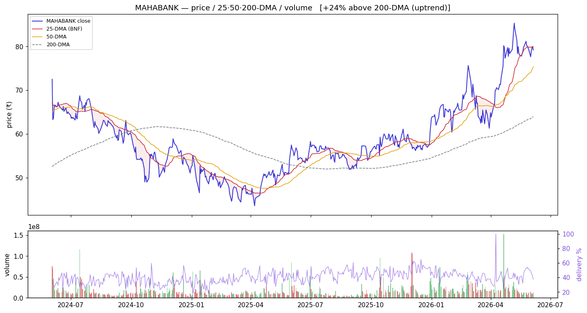
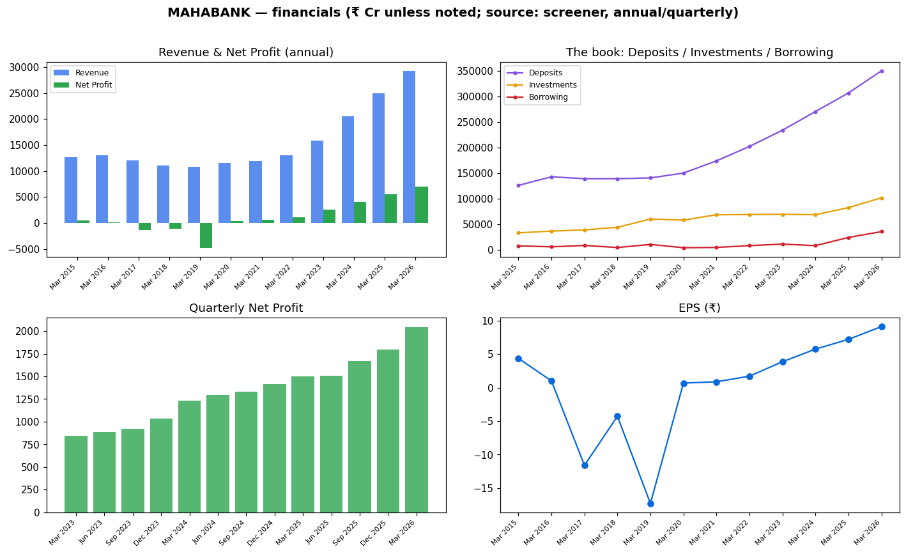
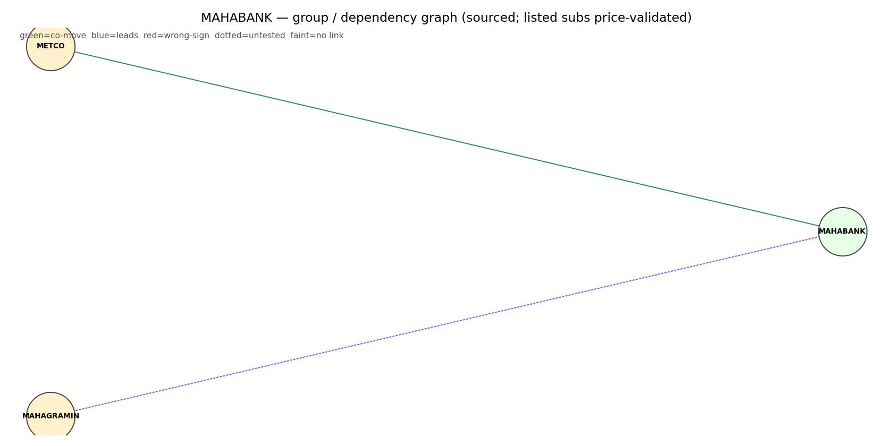
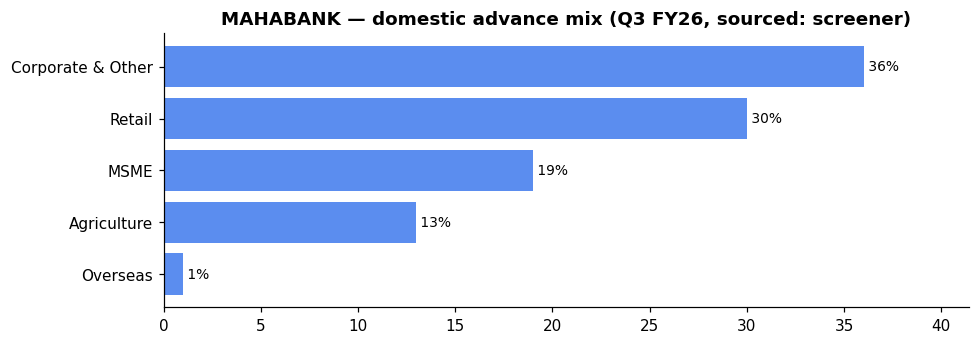

# Bank of Maharashtra (MAHABANK) — Equity Research

*2026-06-06. Prices split-adjusted (jugaad `adjust=True`). Provenance on every figure:
**(computed)** = our scripts · **(sourced)** = dated disclosure · **`unknown`** = not sourceable.
[GLOSSARY](GLOSSARY.md) explains every header, term and chart colour.*

> ### 🟡 Stance: **Hold — don't chase (extended)**
> **₹79.2** · Mcap **₹60,909 Cr** · P/E **8.68** · P/B **1.83** · ROE **22.7%** · Div **2.78%** · 1-yr **+39.8%**
> Trend: 🟢 **uptrend** — +5.1% vs 50-DMA, +23.7% vs 200-DMA (extended)
> **Why 🟡:** operationally the **best in the cohort** — ROE 22.7%, NIM 3.91%, CASA 52.5%, GNPA 1.45%,
> NNPA 0.13% — every quality metric leads the pack. But the price is +23.7% above its 200-DMA on
> **falling volume (0.60×) and near-zero absorption (0.04)** — extended and running out of fuel.
> The EARNED strategy buys pullbacks to the 50-DMA, not extension. Hold quality; wait for a dip.
>
> **Links:** [Screener](https://www.screener.in/company/MAHABANK/consolidated/) · [TradingView](https://in.tradingview.com/symbols/NSE-MAHABANK/) · [BSE](https://www.bseindia.com/stock-share-price/bank-of-maharashtra/MAHABANK/532525/) · [NSE](https://www.nseindia.com/get-quotes/equity?symbol=MAHABANK)

_Colour code: 🟢 constructive · 🟡 neutral/watch · 🔴 avoid. See [GLOSSARY](GLOSSARY.md) for every header, term and chart colour._

---

## Visuals (charts first)

### Price · volume · 25/50/200-DMA · delivery

> **What it shows:** split-adjusted daily price with 25/50/200-day moving averages, volume bars
> (green up / red down) and delivery %. **How to read:** above the 200-DMA = long-term uptrend; the
> **50-DMA is the buy-the-dip anchor** (the sector's EARNED strategy). **MAHABANK now (2026-06-04,
> computed):** +5.1% above the 50-DMA, +23.7% above the 200-DMA — extended in a strong uptrend;
> delivery 38.0%, RelVol 0.60× (falling), **absorption 0.04 (lowest in basket)** = no fresh
> institutional accumulation.

### Financials — revenue/profit · the investment book · quarterly · EPS

> **What it shows:** annual Revenue & Net Profit; **the book** (Deposits ₹3.51 L cr vs Investments
> ₹1.02 L cr=G-sec/SLR vs Borrowing ₹0.35 L cr — lowest leverage in the basket); quarterly Net
> Profit momentum; EPS. ₹ Cr, sourced screener. The clean post-FY19 inflection is the asset-quality
> cleanup and retail-led shift turning chronic losses into record profit (7× in 5 years).

### Group / dependency graph

> **What it shows:** subsidiaries/associates (edge = stake %). Green = listed (price-validated
> co-move with the parent), yellow = unlisted, purple = foreign JV partner.
> [Legend](GLOSSARY.md#graph-diagrams).

---

## About & Key Points (sourced — screener, dated)
**About:** Bank of Maharashtra — HQ Pune. Full-service PSU bank with a deliberate **retail-led
transformation** under way.

**Revenue mix (sourced, Q3 FY26 vs FY22):** Retail Banking **~46%** (vs ~35% FY22), Corporate/
Wholesale **~35%** (vs ~30%), Treasury **~19%** (vs ~32%) — a sustained shift into highest-quality
lending.

**Quality ratios (FY26, concall):** NIM **3.91%** (best in cohort), GNPA **1.45%**, NNPA **0.13%**
(best in cohort), PCR **~98%** (`unknown` exact; implied by GNPA/NNPA gap), CASA **52.51%** (best in
cohort), Cost-to-Income **37.08%** (best), Cost of Funds **4.15%** (reduced 7 bps YoY), Cost of
Deposits **4.52%** (improved 14 bps).

**Market share:** smallest by mcap (₹60,909 Cr) but the best operator — 11th-largest PSU by size,
targeting 9th in 2–3 years (concall).

**Loan book (Mar 2026)** — advances +22% YoY, within which RAM **63%** (retail +32%, agri/MSME
+11–15%), corporate **37%**. Home loans +29% YoY, vehicle/gold also strong. Retail focus enabled
by 2,500+ branches with a core-business review framework.

> Advance mix (Q3 FY26, sourced screener): corporate 36% / retail 30% / MSME 19% / agri 13% — the RAM tilt is retail-led.

**Deposits (Mar 2026):** ₹3,50,538 Cr (+14%), CASA 52.51% (₹1.84 L cr). Investment book ₹1,01,588 Cr.
Borrowing ₹35,234 Cr — **lowest leverage ratio in the basket**.

**Subsidiaries / associates (sourced):** Thin group structure — no major domestic JV equivalent to
CANBK's Robeco/HSBC. Maharashtra Gramin Bank + Vidharbha Konkan Gramin Bank (RRBs).

**Corporate-action history (sourced, screener):** Multiple **GOI preferential allotments** (2015–2020)
· **QIPs** (Oct 2024: ₹610 Cr shares at ₹47.36 premium; Jun 2023: ₹351 Cr shares at ₹18.50; Jul 2021:
₹170 Cr shares at ₹17.70). No stock split.

**Recent corporate action:** AGM on 30 Jun 2026 — up to **₹7,500 Cr capital raising** on the agenda.
GIFT City IBU launched in Sep 2025 — ₹650 Mn overseas business booked.

_Source: [screener Key Points panel](https://www.screener.in/company/MAHABANK/consolidated/) (with its
citation links); figures are SOURCED disclosures, not our computed numbers._

---

## 1. Investment summary
**The cohort's best operator — hold the quality, manage the entry.** FY26 (concall, sourced):
net profit **₹7,019 Cr (+27% YoY)**, NII +17%, global business +17%. ROE **23.19%** (full year)
/ **26.61%** (Q4), ROA **1.86%** (guidance 1.75%). **The thesis:** MAHABANK is executing a genuine
retail-mix shift (CASA 52.5%, RAM 63%, NIM 3.91%) that produces the best profitability ratios
in the basket — and still trading at only P/B 1.83 (earned premium for ROE 22.7%). **Caveat:** the
stock is +23.7% above its 200-DMA with near-zero absorption — extended and vulnerable to a
correction. The EARNED strategy buys pullbacks to the 50-DMA. **This is a hold, not a chase.**

## 2. Valuation
- Relative: P/E **8.68**, P/B **1.83** (richest in basket), div yield **2.78%**. The premium is
  earned: ROE 22.7% justifies a >1.5 P/B multiple. BoB/PNB trade at 0.82 P/B with ROEs ~12–15%.
  (sourced)
- Management's own FY27 guidance: ROA **1.80%** (upped from 1.75%), ROE **>20%**, NIM **3.75%**
  (concall). Business growth 16–17%.
- Absolute (DCF / residual income): **`unknown`** — not fabricated.

## 3. Industry forces → how they hit MAHABANK (sector analysis applied)
*(The sector frameworks live in [00_industry](00_industry.md); here is how each maps to THIS bank.)*
- **Porter — supplier power (funding):** MAHABANK's **CASA 52.51%** is the **highest in the PSU
  basket** — a structural funding-cost advantage. **Cost of deposits 4.52%** (down 14 bps YoY) and
  **cost of funds 4.15%** are the lowest. Its **NIM 3.91%** is best-in-class — this is the force
  where MAHABANK most differentiates itself.
- **Porter — substitutes / rivalry:** The retail focus (RAM 63%) and high CASA create a moat vs
  NBFCs and private banks. The corporate book (37%) is smaller and better-priced vs peers.
  Management explicitly refuses low-yield corporate lending.
- **PESTEL — rates:** The high NIM (3.91%) gives the widest buffer against rate cycles. Yield on
  advances 9.05% is maintained. The investment book (₹1.02 L cr) is small relative to deposits
  ⇒ lower MTM exposure vs CANBK/PNB.
- **PESTEL — policy/ownership:** GoI holds **73.6%** (sourced, Mar 2026 — down from 86.46% via QIP
  dilution) → capital-raising via QIP is a proven tool. **₹7,500 Cr capital raising approved at AGM**
  — watch dilution. Maharashtra-centric operations (political risk to the state).
- **RBI sectoral deployment (system):** MAHABANK's retail and agri focus aligns with system tailwinds.
  GIFT City IBU (launched Sep 2025, ₹650 Mn booked) is a small diversifier.
- **Influence graph (computed):** Market-beta-dominated like all PSU banks. MAHABANK's smaller mcap
  and lower free float (26.4%) mean it can move harder on sector flows.
- **Strategy (computed, EARNED):** 50-DMA mean-reversion beats buy-and-hold for the PSU basket
  (Sharpe-over-null +0.23). MAHABANK is **+5.1% above the 50-DMA** — not in pullback territory.
  The EARNED read is **wait for a dip to the 50-DMA before adding or initiating**.

## 4. Financial analysis
- Net profit trajectory — **losses → explosive recovery** (sourced): losses in FY17–FY19 (worst
  −₹4,763 Cr FY19) → turned profitable **₹399 Cr (FY20)** → ₹571 → ₹1,153 → ₹2,605 → ₹4,072 →
  ₹5,542 → **₹7,017 Cr (FY26)**. EPS ~₹9.12, dividend **₹2.40/share (24% of FV ₹10)**. 5-yr profit
  CAGR **65%** reflects both recovery and real ROE improvement.
- **The book:** Deposits ₹3.51 L cr (+14%), advances ₹`unknown` (total business ₹4.27 L cr),
  Investments ₹1.02 L cr, Borrowing ₹0.35 L cr (Mar 2026, sourced).
- **RAM tilt (quality driver):** 63% RAM, 37% corporate — retail +32% (home loans +29%), agri/MSME
  +11–15%. The retail mix shifted from 35% (FY22) to 46% (FY26).
- **Quarterly momentum (sourced, with GNPA/NNPA):** Net Profit ₹1,669 Cr (Sep 25) → ₹1,799 Cr
  (Dec 25) → **₹2,045 Cr (Mar 26)** — accelerating. GNPA improved from 1.72%→1.60%→**1.45%**.
  **NNPA 0.13% is the cleanest in the entire PSU basket.**
- **Profitability (sourced):** ROE 23.19% (FY26), Q4 ROE 26.61%. Cost-to-income **37.08%** (best
  in basket, guided <40%). Yield on advances 9.05%. NII +17% YoY.

## 5. Investment risks
Extended price (+23.7% above 200-DMA) = drawdown risk; richest P/B (1.83) = most to lose on a
multiple de-rating; ₹7,500 Cr capital-raise dilution pending; small size/less liquid (absorption
0.04); Maharashtra-concentrated operations; agri loan exposure (climatic/PSL risk); NRV (non-interest
income) weaker due to one-time RRB provision (₹290 Cr). No qualified opinion sourced. Credit ratings:
Infomerics/Brickwork/SMERA/CRISIL/ICARE — all 2025–26.

## 6. ESG
GoI-majority (73.6%); governance: board-appointed. BRSR **filed** (sourced, FY26). Environmental:
sustainability report filed. Detail beyond filing: **`unknown`**.

---

## Concall — key points (Q4 & FY26 call, 20 Apr 2026, sourced: transcript)
- **Growth:** total business +17%; advances +22%; deposits +14%; CASA +12% (CASA ratio 52.51%).
- **Margins:** FY26 NIM **3.91%** (guidance 3.75%); Q4 NIM **3.95%**. NII +17% YoY. Yield on advances
  maintained at 9.05%. Cost of funds 4.15% (−7 bps), cost of deposits 4.52% (−14 bps).
- **Profit:** FY net profit ₹7,019 Cr **(+27% YoY)** ; Q4 net profit ₹2,045 Cr. ROA 1.86% (guidance
  1.75%), ROE 23.19% (Q4 26.61%). Cost-to-income 37.08% (guided <40%).
- **Asset quality:** GNPA **1.45%** (−29 bps), NNPA **0.13%** (−5 bps), slippage <1%, credit cost
  ~1% (guided). SMA: no material stress. MSME NPA at a low number — no West Asia impact observed.
- **RAM dominance:** 63% RAM (retail +32%, home loans +29%). Corporate 37%.
- **Capital:** CRAR 18.36%, CET1 14.59%. **FY27 capital-raising plan ₹7,500 Cr** approved (AGM
  agenda 30 Jun 2026). GoI holding reduced to 73.6% via QIP.
- **FY27 guidance (management):** business 16–17%, advances 18%, deposits 14–15%, CASA ~50%, RAM
  ~18%, NIM 3.75%, ROA 1.80% (upped from 1.75%), ROE >20%, GNPA <2%, NNPA <0.25%, PCR ~98%,
  CRAR 18%, cost-to-income <40%.
- **Initiatives:** GIFT IBU — ₹650 Mn overseas business, targeting $1 Bn. Fee-based income focus
  for FY27 (Year of Deposits + Fee Income). Branch-core-business review driving organic growth.
  RRB merger (Maharashtra Gramin Bank) — ₹44,000 Cr book integrated.
- **Risk:** NRV (non-interest income) suppressed by ₹290 Cr one-time RRB provision; management
  expects improvement in FY27.

_Full extract: `filings/concall/MAHABANK.json`._

## DRHP
N/A for the parent (Bank of Maharashtra is a long-listed PSU bank). No recent group IPO.

## References (this company)
- [Screener](https://www.screener.in/company/MAHABANK/consolidated/) · [TradingView](https://in.tradingview.com/symbols/NSE-MAHABANK/) · [BSE](https://www.bseindia.com/stock-share-price/bank-of-maharashtra/MAHABANK/532525/) · [NSE](https://www.nseindia.com/get-quotes/equity?symbol=MAHABANK)
- Audit snapshot: `filings/MAHABANK_screener_page.pdf` · Data: `data/MAHABANK_*.json/.csv` · Concall: `filings/concall/MAHABANK.json`

### News & disclosures (dated, sourced)
- **AGM 30 Jun 2026** — agenda includes dividend, Executive Director appointment, and **₹7,500 Cr capital raising**. [BSE filings](https://www.bseindia.com/stockinfo/AnnPdfOpen.aspx?Pname=fce73fdc-d6cb-4f04-9ed0-298bca97bd68.pdf)
- **Record date for dividend (1 Jun 2026)** — 2.78% yield. [BSE filings](https://www.bseindia.com/stockinfo/AnnPdfOpen.aspx?Pname=a1d17522-36ee-4d44-86a5-1c4aae6eab4e.pdf)
- **BRSR FY26 filed** and annual report submitted. [BSE filings](https://www.bseindia.com/stockinfo/AnnPdfOpen.aspx?Pname=13fcfb22-ccc2-46d0-b077-3670e24ef202.pdf)

---
**Stance (computed read, not advice):** 🟡 **Hold (own quality), don't chase.** MAHABANK is the
cohort's undisputed quality leader — ROE 22.7%, NIM 3.91%, CASA 52.5%, NNPA 0.13% — but the
stock is +23.7% above its 200-DMA on falling volume and zero absorption. The EARNED strategy
explicitly buys pullbacks to the 50-DMA, not extension. **Hold existing positions; wait for a
dip to the rising 50-DMA before adding.** The fundamental case is intact; the technical setup
demands patience.
