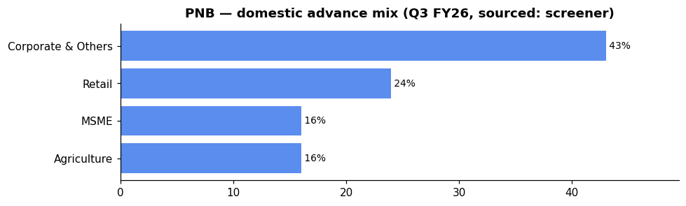

# Punjab National Bank (PNB) — Equity Research

*2026-06-06. Prices split-adjusted (jugaad `adjust=True`). Provenance on every figure:
**(computed)** = our scripts · **(sourced)** = dated disclosure · **`unknown`** = not sourceable.
[GLOSSARY](GLOSSARY.md) explains every header, term and chart colour.*

## 🔴 Stance — Avoid / wait

| Price | M-cap | P/E | P/B | ROE | Div yield | 1-yr |
|---|---|---|---|---|---|---|
| ₹107 | ₹1,22,802 Cr | 6.68 | 0.82 | 13% | 2.81% | -2.4% |

| Trend | vs 50-DMA | vs 200-DMA | Delivery | RelVol | Absorption |
|---|---|---|---|---|---|
| 🔴 downtrend | -0.6% | -7.5% | 30.4% | 1.1× | 0.13 |

**Why 🔴:** only negative 1-yr return in the basket, lowest delivery (30.4%) and absorption (0.13), zero TTM profit growth, and the steepest discount to its 200-DMA. Asset quality is improving (GNPA 2.95% / PCR 97%) but the tape shows zero demand — wait for a 200-DMA reclaim + delivery pickup before the 50-DMA reversion setup applies.

**Links:** [Screener](https://www.screener.in/company/PNB/consolidated/) · [TradingView](https://in.tradingview.com/symbols/NSE-PNB/) · [BSE](https://www.bseindia.com/stock-share-price/punjab-national-bank/PNB/532461/) · [NSE](https://www.nseindia.com/get-quotes/equity?symbol=PNB)

---

## About & Key Points (sourced — screener, dated)
**About:** Punjab National Bank — India's first Swadeshi bank, incorporated **1895**, nationalised
**1969**; HQ New Delhi. GoI-owned, **2nd largest PSU bank by business size, top-3 PSU**. (sourced)

**Quality ratios (Q4 FY26, concall, sourced):** NIM (domestic) **2.61%**, GNPA **2.95%**
(vs 3.95% Mar 2025), NNPA **0.29%** (vs 0.40%), CASA **~37%** (stable all 4 quarters), PCR
**97.14%** (guidance >96%), Cost-to-Income **51.79%** (from 54.59%), Cost of Funds: **`unknown`**
(not separately sourced). *(Full-year FY26: ROE 15.67%, ROA 0.89% with Q1 tax-hit; ex-Q1 ROA >1%).*

**Market share:** `unknown` (not sourced from screener).

**Branch network (FY26, concall, sourced):** 144 branches added in FY26; plan to open **250 more
in FY27**, primarily in Southern and Western regions. New zonal office in Bengaluru operationalised.

**Loan book (FY26, concall)** — gross advances **₹12.59 L Cr (+12.7% YoY)**, with a strategic tilt
toward RAM (retail/agri/MSME). Retail excl. IBPC **+18.2%**, MSME **+19.9%**, Agri PS **+16.2%**.
Corporate sanctions during FY26: **₹4 L Cr** with ₹1.18 L Cr pending disbursement. CD ratio **73.6%**.
IBPC book reduced to ₹34,049 Cr (from ~₹53,000 Cr) — bank plans to exit IBPC entirely.

**Advance mix (Q3 FY26, sourced screener):** still corporate-led at 43% (the RAM pivot in progress).

**RAM share (concall, sourced):** ~54% of advances; target **60% long-term** (58% for FY27). Corporate
book share targeting reduction to **40%** (from ~46%).

**Corporate yield vs RAM yield (concall, sourced):** Corporate standard advances **7.55%**; MSME
standard advances **9.0%**; domestic standard advances avg **8.23%** — the mix shift to RAM directly
lifts portfolio yield.

**Geography:** domestic ~93% / overseas through PNB International UK; `unknown` branch split
(rural/semi-urban/urban/metro — not sourced).

**Subsidiaries / associates (sourced, dependency graph):** Listed — PNB Housing Finance (**28%**),
PNB Gilts (**74%**, corr +0.41 with parent). Unlisted — PNB MetLife (**30%**, JV with MetLife),
PNB Investment Services (**100%** WoS), PNB International UK (**100%** WoS).

**Corporate-action history (sourced, screener):** Amalgamation of **Oriental Bank of Commerce &
United Bank of India** into PNB (Scheme 2020, 1 Apr 2020) · **Multiple QIPs** (2024: ₹101.75/sh,
2021: ₹31.75/sh, 2020: ₹33.50/sh) · **Preferential allotments** to GoI (2017–2019, range
₹71.66–₹161.38/sh) · No stock split in history (FV ₹2 unchanged).

**Recent corporate action:** ₹3 dividend recommended for FY26 (150% of FV ₹2, subject to AGM).
**FY26-27 capital raising:** no plan (Board-authorised INR8,000 Cr CET1+AT1 unused; INR5,890 Cr
AT1+Tier 2 maturing in FY27 *not* being refinanced).

_Source: concall (5 May 2026), screener Key Points + Corporate Actions modal; figures are SOURCED._

---

## 1. Investment summary
**The cheapest PSU bank on book (P/B 0.82, tied with BANKBARODA) — but with the weakest tape.**
FY26: global business **₹29.7 L Cr (+10.7%)**, net profit **₹16,904 Cr (annual report, standalone)**
or **₹18,467 Cr (screener consolidated)**, dividend **₹3 recommended** (27 May, sourced). Quarterly
Net Profit: ₹2,167→5,121→5,577→**5,602 Cr** — recovered from the Q1 tax-regime one-off (₹5,083 Cr
hit; Q1 NP was ₹2,167 Cr); Q2–Q4 run-rate ~₹5,400 Cr/quarter. **TTM profit growth 0%** (sourced).

**The mispricing thesis:** asset quality is genuinely improving (GNPA 3.95%→2.95% YoY, PCR 97%+,
underwriting since Jul 2020 has only 0.40% NPA on ₹12.46 L Cr disbursed — concall, sourced). Yet
the stock trades 0.82× book with negative 1-yr return (−2.4%). The **catch:** no price-action confirmation
(lowest delivery, absorption, furthest below the 200-DMA) and a **Q1 FY27 wage revision overhang**
(negotiation starts Nov 2026, provisioning from FY28 — but an uncertainty). The ECL implementation
(Apr 2027) is cushioned by ₹2,045 Cr floating provision and CRAR 17.74%.

**Caveat:** the 3-yr profit CAGR of 76% is off the deepest cyclical-loss base of the basket — least
reliable as a forward guide. The 5-yr CAGR (48%) is more meaningful but still a recovery statistic.

## 2. Valuation
- Relative: P/E **6.68** (lowest in the basket), P/B **0.82** (below book, tied with BANKBARODA),
  div yield **2.81%**. Cheapest on P/E and P/B metrics, but the market is pricing in the weakest
  momentum (sourced).
- Management's own FY26 performance: ROE **15.67%** (concall), ROA **0.89%** (ex-Q1: >1%).
  Tangible book value **₹102.95** (from ₹84.85 a year ago — sourced).
- RPKV (price-to-tangible-book): **₹107 / ₹102.95 = 1.04×** — trades essentially at tangible book.
- Absolute (DCF / residual income): **`unknown`** — inputs not independently sourced.

## 3. Industry forces → how they hit PNB (sector analysis applied)
*(The sector frameworks live in [00_industry](00_industry.md); here is how each maps to PNB.)*

- **Porter — supplier power (funding):** PNB's **CASA ~37%** is the best in the PSU peer group (CANBK
  29.5%) but its **NIM 2.47% (global)** is compressed — the CASA strength has not translated to margin
  advantage because **deposit costs stayed sticky** despite the Dec 2025 repo cut (concall, sourced).
  Management guides NIM to **2.6–2.7% for FY27**, banking on deposit cost moderation + RAM mix shift.
- **Porter — substitutes / rivalry:** The **IBPC book** (₹34,049 Cr, being wound down) was a low-yield
  drag. The pivot to RAM (retail/agri/MSME, target 60% share) directly addresses the substitution
  pressure from NBFCs by focusing on segments where PSU banks have distribution edge.
- **PESTEL — rates:** PNB carries a **₹5.24 L Cr G-sec/SLR investment book** — large treasury MTM
  sensitivity. In Q4 FY26, treasury income was "subdued" due to yield hardening, partially offset
  by an **AS-15 employee-cost reversal (₹736 Cr)** from the same yield move. A falling-rate turn
  would benefit both NIM (lending spreads) and treasury MTM.
- **PESTEL — policy/ownership:** GoI holds **70.08%** → the dominant shareholder; no capital-raising
  overhang (unlike CANBK's planned FY26-27 raise). However, GoI ownership means directed-lending
  obligations and board appointment by govt. **RBI regulatory compliance** — the 7-June circular
  restructuring guidelines drove a **₹727 Cr standard-provision release** (concall, sourced).
- **RBI sectoral deployment (system):** System credit is growing fastest in **Services/NBFC (+27.7%)**
  and infrastructure (+15.1%) — PNB's corporate book is ~46% of advances, and the mix is tilting away
  from corporate; unlike CANBK, PNB is *reducing* its NBFC/corporate exposure to strengthen RAM.
- **Influence graph (computed):** PNB is a **bellwether** (co-moves +0.44 with the basket — the highest
  of any constituent), and like all PSU banks, is **market-beta-dominated** (NIFTY50→PSU_BANK +0.90).
  The high bellwether status means PNB *expresses* the basket's direction; it does not lead it.
- **Strategy (computed, EARNED):** 50-DMA mean-reversion beats buy-and-hold for the PSU basket
  (Sharpe-over-null +0.23). PNB sits **−0.6% above its 50-DMA but −7.5% below the 200-DMA** — the
  50-DMA reversion setup is NOT yet valid because the trend structure is bearish. **Wait for a 200-DMA
  reclaim** before entry. The absorption (0.13) shows no accumulation.

## 4. Financial analysis
- **Net profit trajectory — cyclical losses → sustained recovery** (sourced, screener P&L): losses
  in FY16 (−₹3,510 Cr), FY18 (−₹12,111 Cr), FY19 (−₹9,550 Cr) → turned profitable **₹2,695 Cr
  (FY21)** → ₹3,908 → ₹3,359 → ₹9,157 → ₹18,553 → **₹18,467 Cr (FY26, screener consolidated)**.
  Standalone (annual report): **₹16,904 Cr**. EPS ~₹16 (screener) / ₹4.87 (Q4 run-rate), dividend
  **₹3 (150% of FV ₹2)**.
- **The book (Mar 2026, sourced):** Deposits **₹17.24 L Cr** (+9.2% YoY), Advances **₹12.59 L Cr**
  (+12.7% YoY), Investments **₹5.24 L Cr** (G-sec/SLR), Borrowing **₹1.08 L Cr** (lowest leverage
  among the big four PSUs). Reserves **₹1.47 L Cr**.
- **Core RAM tilt (concall, sourced):** RAM share ~54% (target 60%). Retail excl IBPC +18.2%,
  MSME +19.9%, Agri PS +16.2%. Corporate yield 7.55% vs MSME yield 9.0% — every 1% mix shift
  from corporate to RAM directly expands NIM.
- **IBPC wind-down:** book reduced from ~₹53,000 Cr to ₹34,049 Cr (FY26); another ₹18,000–20,000 Cr
  to be shed in FY27. This low-yield book replacement with RAM is a structural tailwind to NII.
- **Asset quality (concall, sourced):** GNPA **2.95%** (−100 bps YoY), NNPA **0.29%** (−11 bps),
  PCR **97.14%** (well above 96% guidance), slippage ratio **0.60%** (guidance <1%), credit cost
  **0.41%** (guided <0.50% for FY27). Recovery ₹15,501 Cr in FY26 = **2.4× slippages**.
- **Fresh underwriting quality (concall, sourced):** Since Jul 2020, ₹14.28 L Cr sanctioned, ₹12.46 L Cr
  disbursed; outstanding ₹8.75 L Cr (69.5% of loan book). NPA in this book = **0.40%** — the legacy
  NPA problem is exactly that, legacy.
- **Capital (concall, sourced):** CRAR **17.74%** (from 17.01%, +73 bps); CET1 13.62% (req 8%);
  Tier 1 15.15% (req 9.5%). **No capital raising planned** — INR5,890 Cr AT1+Tier 2 maturing in
  FY27 will not be refinanced, adding ~₹175 Cr to pre-tax profit.
- **Dividend:** 150% = **₹3/share** (FV ₹2), subject to AGM approval (sourced, concall).
- **ECL provisioning (Apr 2027):** floating provision of **₹2,045 Cr** already set aside; management
  confident of meeting transition without capital raise (concall, sourced). Detailed impact: wait
  for Q2/Q3 FY27 disclosure.
- Quality caution: FY26 headline profit includes the Q1 tax-regime one-off (₹5,083 Cr); Q2–Q4
  normalised ROA >1%.

## 5. Investment risks
- **Price-action risk:** Weakest structure (furthest below 200-DMA), lowest delivery/absorption —
  no momentum, no accumulation signal. Value-trap risk highest in the basket.
- **NIM compression risk:** Global NIM 2.47% is the thinnest among the big four; deposit costs
  stayed sticky despite repo cut. The 2.6–2.7% FY27 guidance depends on deposit-cost moderation
  *and* RAM mix shift — both are works in progress.
- **Treasury MTM risk:** ₹5.24 L Cr investment book = large G-sec sensitivity. Q4 FY26 treasury
  income was subdued (concall); a further yield backup hits both treasury P&L and AFS reserves.
- **Legacy asset-quality scars:** PNB had the largest NPA/fraud overhang of any PSU bank (the
  Nirav Modi fraud, etc.). While underwriting since 2020 is clean, the franchise carries a
  perception discount that may take years to erode.
- **Operational / compliance:** Wage revision negotiations begin Nov 2026 (due Nov 2027) —
  provisioning starts FY28, but the overhang may pressure near-term cost ratios.
- **ECL transition (Apr 2027):** well-cushioned (₹2,045 Cr floating provision, 97% PCR), but
  the one-time impact and run-rate credit-cost effect are not yet quantified publicly.
- **Concentration:** Corporate book still 46% — elevated exposure to large-ticket slippage.
  PNB is actively reducing this, but the transition takes time.
- No auditor qualified opinion sourced.

## 6. ESG
GoI-majority (70.08%; governance: govt-appointed board). FY26 BRSR filed (sourced). E/S/G detail:
**`unknown`** (not pulled for PNB). Note: 35% of customers are under 30 (concall, sourced) —
demographic tailwind for digital-first ESG; PNB ONE 2.0 mobile app with 350+ features, 95% digital
transactions. WhatsApp banking users 1.09 Cr (+77% YoY).

---

## Concall — key points (Q4 & FY26 call, 5 May 2026, sourced: transcript)
_✅ Latest transcript captured (`filings/concall/PNB.json`)._

- **Management:** MD & CEO Ashok Chandra, EDs: M Paramasivam, B P Mahapatra, D Surendran, A K Srivastava.
  Hosted by Elara Securities.
- **Growth:** global business ₹29.7 L Cr (+10.7%); advances +12.7% to ₹12.59 L Cr; deposits +9.2%.
  Ex-IBPC, core loan growth **~15%**. Sanctioned ₹4 L Cr corporate credit, ₹1.18 L Cr undrawn.
- **Margins:** Q4 domestic NIM **2.61%**, global NIM **2.47%**. Guided to **2.6–2.7% for FY27** —
  deposit cost moderation + RAM mix shift. Repricing of 444-day special deposits (7.25–7.75%) now
  95% complete.
- **Profit:** Q4 net profit ₹5,225 Cr (+14.4% YoY concall) / ₹5,602 Cr (screener consolidated).
  FY26 net profit ₹16,904 Cr (standalone AR) / ₹18,467 Cr (screener consolidated). Operating profit
  Q4 ₹7,500 Cr (+10.7%). ROE **15.67%**, ROA 0.89% (ex-Q1 tax-hit: >1%).
- **Asset quality:** GNPA **2.95%** (−100 bps YoY), NNPA **0.29%**, PCR **97.14%**, slippage ratio
  **0.60%** (guidance <1%), recovery ₹15,501 Cr = **2.4× slippages**. Credit cost guidance <0.50%
  for FY27.
- **Underwriting quality:** Since Jul 2020, sanctioned ₹14.28 L Cr, disbursed ₹12.46 L Cr;
  NPA on this book = **only 0.40%**. +85% of rated advances above A, +52% AAA.
- **Capital:** CRAR **17.74%** (+73 bps YoY), CET1 13.62% (req 8%), Tier 1 15.15% (req 9.5%).
  **No capital raising planned** — INR5,890 Cr AT1+Tier 2 maturing in FY27 will not be refinanced.
- **Floating provision:** ₹2,045 Cr set aside — cushions **ECL transition** (Apr 2027) and
  any Middle-East-crisis eventuality.
- **Sterling Biotech** (written-off account): write-back **already factored into operating profit** (Q4 call, sourced).
- **IL&FS recovery:** still held in **standard provision**, not yet in operating profit; may be recognised
  in **Q1/Q2 FY27** (concall, sourced).
- **RBI 7-June circular:** standard-provision release of **₹727 Cr** from modified large-borrower
  framework guidelines effective 1 Jan 2026 (concall, sourced).
- **Benami/Ashok Ajmera discussion on employee costs:** AS-15 reversal of **₹736 Cr** (prepaid) from
  G-sec yield hardening; total AS-15 expense for FY26 = ₹1,814 Cr. Treasury MTM subdued due to same
  yield move.
- **RAM pivot (detailed):** corporate yield 7.55% vs MSME yield 9.0%. Target: RAM share 54%→60%,
  corporate 46%→40%. Multiple outreach campaigns (retail: INR9,000 Cr leads, MSME: INR21,000 Cr leads).
- **Wage revision:** due 1 Nov 2027 — **no impact on FY27** (concall, sourced). Negotiations begin now.
- **Dividend:** ₹3 (150% of FV ₹2), subject to AGM.
- **Digital:** every 3rd loan sanctioned digitally — INR20,873 Cr in Q4 to 4.8 L customers. 95% of all
  transactions digital. WhatsApp banking users 1.09 Cr (+77% YoY).
- **SMA book:** SMA-0 ₹24,643 Cr / SMA-1 ₹13,970 Cr / SMA-2 ₹2,922 Cr — total 3.30% (lowest ever,
  concall). Retail SMA 8.21%, Agri 3.06%, MSME 6.43%, Others 0.28%.
- **IBPC exit:** book reduced to ₹34,049 Cr; another ₹18,000–20,000 Cr to be shed in FY27 — replacing
  low-yield IBPC with direct RAM lending.

_Full extract: `filings/concall/PNB.json`._

## DRHP
N/A for the parent — Punjab National Bank is a long-listed PSU bank (no recent IPO/DRHP). Group IPOs:
PNB Housing Finance already listed; PNB Gilts also listed. PNB Investment Services (100% WoS) and
PNB MetLife (JV) remain unlisted.

## References (this company)
- [Screener](https://www.screener.in/company/PNB/consolidated/) · [TradingView](https://in.tradingview.com/symbols/NSE-PNB/) · [BSE](https://www.bseindia.com/stock-share-price/punjab-national-bank/PNB/532461/) · [NSE](https://www.nseindia.com/get-quotes/equity?symbol=PNB)
- Audit snapshot: `filings/PNB_screener_page.pdf` · Data: `data/PNB_*.json/.csv` · Concall: `filings/concall/PNB.json`
- Dependency graph: `graph/dependency_PNB.json`
- Credit ratings: Brickwork (Dec 2025), CRISIL (Dec 2025), CARE (Dec 2025, Sep 2025), ICRA (Dec 2025), Fitch (Feb 2025) — links in `data/PNB_signals.json`

**News & disclosures (dated, sourced):**
- **Review Of Interest Rates 30 May** — MCLR, repo-linked lending rate and base rate unchanged from 1 June 2026. — https://www.bseindia.com/stockinfo/AnnPdfOpen.aspx?Pname=1ce51287-2a9e-483c-a809-f229f3714e53.pdf
- **Annual Report FY 2025-26 27 May** — ₹16,904 Cr profit, ₹3 dividend recommended. — https://www.bseindia.com/stockinfo/AnnPdfOpen.aspx?Pname=7b25eb2d-ca39-408a-bed4-5a4179200db2.pdf
- **BRSR FY2025-26 27 May** — sustainability report filed. — https://www.bseindia.com/stockinfo/AnnPdfOpen.aspx?Pname=fa2620cf-e46d-4462-952e-73893b2fad03.pdf
- **25th AGM Notice 27 May** — https://www.bseindia.com/stockinfo/AnnPdfOpen.aspx?Pname=497b7c2e-3cac-4f36-9369-a9f92ddc27df.pdf
- **Newspaper Publication 29 May** — https://www.bseindia.com/stockinfo/AnnPdfOpen.aspx?Pname=dae23220-15ac-47d8-bce5-bb2326ec5832.pdf

---

**Stance (computed read, not advice):** 🔴 **Avoid / wait.** PNB is the cheapest PSU bank on P/E and
P/B, with genuinely improving asset quality (GNPA 2.95%, PCR 97%, underwriting 0.40% NPA) and a
credible RAM pivot. But the tape is unequivocal: furthest below its 200-DMA, lowest delivery and
absorption, only negative 1-yr return. The sector's EARNED 50-DMA reversion play does not trigger
below the 200-DMA. Wait for a **200-DMA reclaim + delivery pickup** (delivery >35%, absorption >0.25)
before the reversion setup activates.
