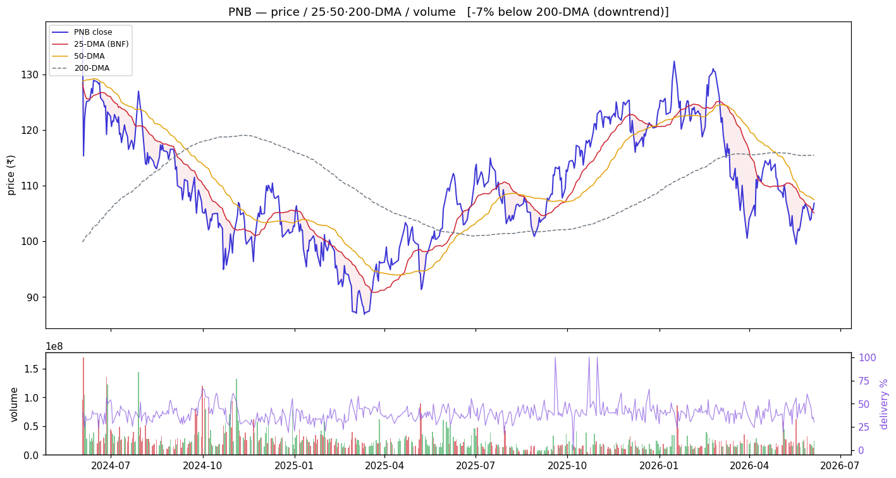
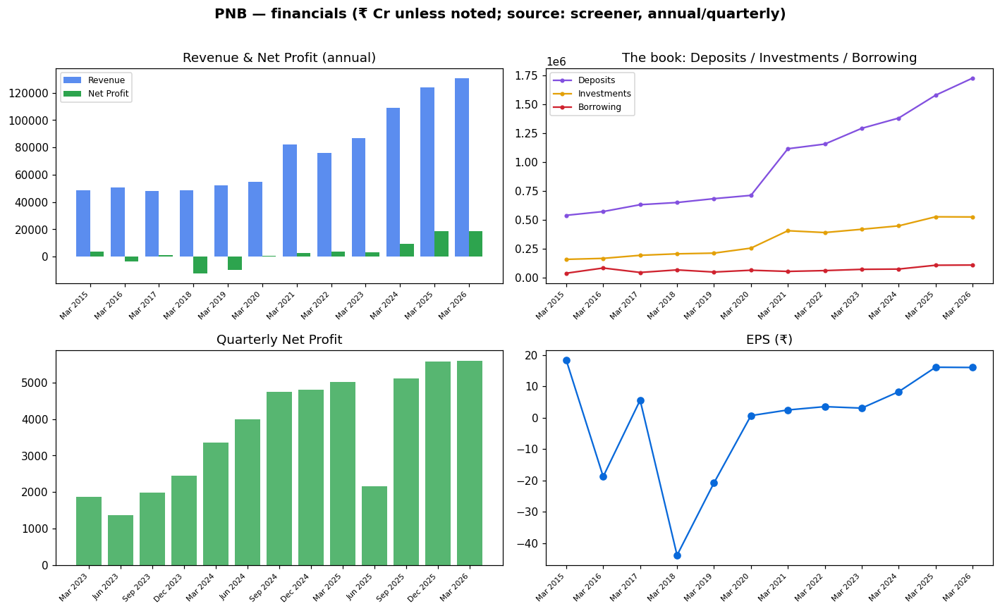

<!-- ASSEMBLED:BEGIN -->
# Punjab National Bank (PNB) — Equity Research

> ### 🔴 Stance: **Avoid / wait**
> **₹107.0** · Mcap ₹122,802 Cr · P/E 6.68 · P/B 0.82 · ROE 13.0% · Div 2.81% · 1-yr -2.4%
> Trend: 🔴 downtrend (below both DMAs) — vs50 -0.6%, vs200 -7.5%
>
> **Links:** [Screener](https://www.screener.in/company/PNB/consolidated/) · [TradingView](https://in.tradingview.com/symbols/NSE-PNB/) · [BSE](https://www.bseindia.com/stock-share-price/punjab-national-bank/PNB/532461/) · [NSE](https://www.nseindia.com/get-quotes/equity?symbol=PNB)

_Colour code: 🟢 constructive · 🟡 neutral/watch · 🔴 avoid. See [GLOSSARY](GLOSSARY.md) for every header, term and chart colour._

## Visuals (charts first)

### Price · volume · 25/50/200-DMA · delivery

> **What it shows:** daily split-adjusted price with 25/50/200-day moving averages, volume bars (green up / red down) and delivery%. **How to read:** above the 200-DMA = long-term uptrend; the 50-DMA is the buy-the-dip anchor (our EARNED strategy). **This name:** 🔴 downtrend (below both DMAs); delivery 30.4%, RelVol 1.1×.

### Financials — revenue/profit · the investment book · quarterly · EPS

> **What it shows:** (top-left) annual Revenue & Net Profit; (top-right) **the book** — Deposits vs Investments (G-sec/SLR) vs Borrowing = where the money is; (bottom-left) quarterly Net Profit momentum; (bottom-right) EPS trend. ₹ Cr, sourced screener.

### Group / dependency graph

> **What it shows:** subsidiaries/JVs (sourced; edge = stake %). Green node = listed (price-validated co-move with parent), yellow = unlisted, purple = foreign JV partner. See [GLOSSARY](GLOSSARY.md#graph-diagrams).

---

<!-- ASSEMBLED:END -->
## 1. Basic information
| Field | Value | Provenance |
|---|---|---|
| Ticker / exchange | PNB / NSE·BSE | sourced |
| Current price | ₹107 | sourced |
| **Tally check** | jugaad ₹106.85 vs screener ₹107 = **0.1%** ✓ | computed |
| Market cap | ₹1,22,802 Cr | sourced |
| P/E · P/B | 6.68 · **0.82** (below book) | sourced |
| Dividend yield · ROE | 2.81% · 13.0% | sourced |
| Recommendation | **weakest momentum — avoid/wait** (§4,§7) | computed read |
| Target price | `unknown` | `unknown` |

## 2. Business description
India's first Swadeshi bank; GoI-owned, HQ New Delhi; **2nd largest PSU bank by business size,
top-3 PSU** (sourced). NIM/GNPA detail: `unknown` from about panel.

## 3. Industry & competitive positioning
Large North-India-anchored PSU bank. See `00_industry.md`. Below book like BANKBARODA.

## 4. Investment summary
**Cheap, but the clearest laggard.** P/B 0.82, but **1-yr stock −2.4%** (only negative performer)
and TTM profit growth **0%** (sourced). Recent (sourced): **FY25-26 annual report — ₹16,904 Cr
profit, ₹3 dividend recommended (27 May)**; **MCLR / repo-linked / base rates unchanged from 1 Jun
2026** (rate-environment signal); FY26 BRSR filed; 25th AGM noticed. Quarterly Net Profit
₹5,011→2,167→5,121→5,577→**5,602 Cr** (sourced) — recovered from a weak Q, now steady.

## 5. Valuation
P/E 6.68 (lowest), **P/B 0.82**, div yield 2.81%. 3-yr profit CAGR **76%** (sourced — but off the
deepest cyclical-loss base of the four; least reliable as a forward guide). DCF: `unknown`.

## 6. Financial analysis
Investment book **₹5,23,515 Cr**, Deposits **₹17,24,795 Cr**, Borrowing **₹1,07,558 Cr** (lowest
leverage; Mar 2026, sourced). Loan-book sector split: **`unknown`** (gated). FY26 profit ₹16,904 Cr
(sourced). Quality caution highest here — the 76% 3-yr CAGR is a base effect.

## 7. Price & flow
`charts/PNB_price_volume.png`. Computed 2026-06-04: **−0.6% vs 50-DMA, −7.5% vs 200-DMA** (furthest
below its 200-DMA = weakest structure of the four), 1-yr **−2.4%** (only loser), volume **1.10×**
(least elevated), delivery **30.4%** (lowest — weakest investor conviction), **absorption 0.13**
(lowest). The clearest "no demand yet" tape in the basket.

## 8. Investment risks
Weakest price structure + lowest delivery/absorption = no momentum; profit growth flat; historical
asset-quality scars (PNB had the largest legacy NPA/fraud overhang). Value-trap risk highest.
No qualified opinion sourced.

## 9. ESG
GoI-majority; FY26 BRSR filed (sourced). E/S/G detail: `unknown`.

## 10. References — see `references.md`.

---
**Stance (computed read):** weakest of the four on every price-action/flow signal (furthest below
200-DMA, lowest delivery, absorption, only negative 1-yr). Cheap on book but no demand confirmation
— avoid/wait for a 200-DMA reclaim + delivery pickup before the 50-DMA reversion setup applies.

---

---

## Concall — key points (latest, sourced)
_✅ latest transcript captured (`filings/concall/PNB.json`)._

- Sterling Biotech (a written-off account) write-back has been factored into operating profit (Q4FY26 call, sourced).
- IL&FS recovery still held in standard provision — not yet taken to operating profit; may be recognised in Q1/Q2 FY27.
- A standard-asset provision reversal this quarter relates to implementation of the RBI 7-June circular on restructuring.

## DRHP
N/A for the parent — Punjab National Bank is a long-listed PSU bank (no recent IPO/DRHP). Group IPOs: PNB Housing Finance already listed.

## References (this company)
- Screener: https://www.screener.in/company/PNB/consolidated/
- TradingView: https://in.tradingview.com/symbols/NSE-PNB/
- BSE: https://www.bseindia.com/stock-share-price/punjab-national-bank/PNB/532461/
- NSE: https://www.nseindia.com/get-quotes/equity?symbol=PNB
- Audit snapshot: `filings/PNB_screener_page.pdf`
- Data: `data/PNB_*.json` / `.csv`

**News & disclosures (dated, sourced):**
- Review Of Interest Rates 30 May - PNB's MCLR, repo-linked lending rate and base rate remain unchanged from 1 June 2026. — https://www.bseindia.com/stockinfo/AnnPdfOpen.aspx?Pname=1ce51287-2a9e-483c-a809-f229f3714e53.pdf
- Newspaper Publication 29 May — https://www.bseindia.com/stockinfo/AnnPdfOpen.aspx?Pname=dae23220-15ac-47d8-bce5-bb2326ec5832.pdf
- Annual Report For FY 2025-26 27 May - PNB FY26 annual report shows Rs16,904 crore profit and recommends Rs3 dividend. — https://www.bseindia.com/stockinfo/AnnPdfOpen.aspx?Pname=7b25eb2d-ca39-408a-bed4-5a4179200db2.pdf
- Business Responsibility and Sustainability Reporting (BRSR) 27 May - Punjab National Bank published its FY2025-26 BRSR r — https://www.bseindia.com/stockinfo/AnnPdfOpen.aspx?Pname=fa2620cf-e46d-4462-952e-73893b2fad03.pdf
- Notice Of The 25Th Annual General Meeting Of The Bank 27 May — https://www.bseindia.com/stockinfo/AnnPdfOpen.aspx?Pname=497b7c2e-3cac-4f36-9369-a9f92ddc27df.pdf
