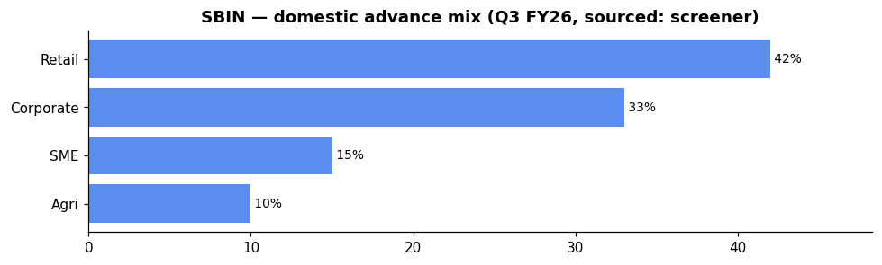

# State Bank of India (SBIN) — Equity Research

*2026-06-06. Prices split-adjusted (jugaad `adjust=True`). Provenance on every figure:
**(computed)** = our scripts · **(sourced)** = dated disclosure · **`unknown`** = not sourceable.
[GLOSSARY](GLOSSARY.md) explains every header, term and chart colour.*

## 🟡 Stance — Hold / add at the 200-DMA

| Price | M-cap | P/E | P/B | ROE | Div yield | 1-yr |
|---|---|---|---|---|---|---|
| ₹978 | ₹9,02,477 Cr | 10.8 | 1.51 | 15.4% | 1.77% | +20.7% |

| Trend | vs 50-DMA | vs 200-DMA | Delivery | RelVol | Absorption |
|---|---|---|---|---|---|
| 🔴 downtrend (below both DMAs) | -4.6% | -0.8% | 43.6% | 1.35× | 0.15 |

**Why 🟡:** quality anchor of the basket — highest delivery% (43.6%), best deposit franchise (22% share), industry-leading asset quality (GNPA 2.01%, PCR 74.36%), and a record ₹80,032 Cr net profit. But the **richest P/B (1.51)** means least margin of safety, and the price is pulling back to the 200-DMA on elevated volume (1.35×) — the EARNED 50-DMA strategy says wait for the pullback to base near the 200-DMA rather than chase.

**Links:** [Screener](https://www.screener.in/company/SBIN/consolidated/) · [TradingView](https://in.tradingview.com/symbols/NSE-SBIN/) · [BSE](https://www.bseindia.com/stock-share-price/state-bank-of-india/SBIN/500112/) · [NSE](https://www.nseindia.com/get-quotes/equity?symbol=SBIN)

---

## About & Key Points (sourced — screener, dated)
**About:** State Bank of India — Fortune 500, incorporated **1806 (over 200 years)**; HQ Mumbai.
India's largest and oldest bank. Full-service PSU bank (retail / corporate / treasury + insurance
& AMC, cards & digital subsidiaries).

**Quality ratios (sourced, Q3 FY26):** Domestic NIM **3.03%** (FY26 guided exit), GNPA **2.01%**,
NNPA **0.49%**, CASA **39.46%**, PCR **74.36%**, Credit Cost guided at **50 bps**. Cost-to-Income:
**`unknown`** (not in about panel). *(Q4 FY26 concall confirms NIM ≥3% guidance; GNPA improved;
credit cost steady.)*

**Market share (Q3 FY26, sourced):** **~22%** of deposits, **~20%** of net advances — the dominant
PSU franchise, ~4× the next peer.

**Branch network:** **`unknown`** (not in screener key-points for SBIN). For scale, largest in India
with >50,000 branches/ATMs historically — verify from AR.

**Loan book** — total advances **₹37,99,848 Cr** (derived from deposit/CDR of 73.08% — sourced
concall). Domestic advance mix (Q3 FY26, sourced screener): Retail-led at 42%.

**The investment book (Mar 2026, sourced):** **₹23,59,502 Cr** — the single largest G-sec/SLR
book in the system. Every 1 bps rate move moves ~₹23,595 Cr of MTM → material treasury sensitivity.

**Geography:** domestic dominant; foreign offices growing — **overseas advances +20% YoY** (sourced,
concall). International presence across 30+ countries.

**Subsidiaries / associates (sourced):**
- SBI Life Insurance (**listed**, ~55% stake via SBI+BNP Paribas JV) — SBILIFE corr +0.32
- SBI Cards & Payment Services (**listed**, 74% stake) — SBICARD corr +0.31
- SBI Funds Management / SBI MF (**unlisted**, IPO expected 2026) — India's largest AMC
- SBI General Insurance (**unlisted**, 69.95%)
- SBI-SG (Securities, **unlisted**, 65% — JV with Société Générale)
- SBI Ventures (**unlisted**, 100%)

**Corporate-action history (sourced, screener):**
- **Scheme of Amalgamation** (1 Apr 2017: SBBJ, SBT, SBM, Bhartiya Mahila Bank → SBI) — 13.64 Cr shares issued
- **Preferential issue to GOI** (Jan 2017, Sep 2015) — capital infusions
- **QIP** (2017: 52.22 Cr shares @ ₹286.25; 2025: 30.60 Cr shares @ ₹816)
- **Rights issue** (2008) — fast-track

_Source: [screener Key Points panel](https://www.screener.in/company/SBIN/consolidated/) (with its
citation links); figures are SOURCED disclosures, not our computed numbers._

---

## 1. Investment summary
**The quality anchor of the basket — record profit, best franchise, but extended on P/B and
pulling back.** FY26 (concall, sourced): net profit **₹80,032 Cr (+12.88%)**, operating profit
+11.25%, global business crossing **₹76 trillion** balance-sheet size. Domestic NIM **3.03%**
(guidance maintained), CASA 39.46% (industry-leading), credit cost 50 bps guidance intact.
**The mispricing thesis:** SBIN earns a quality premium (P/B 1.51) vs peers (CANBK 1.05, BoB 0.82)
and deserves it — deepest deposit franchise, cleanest asset quality, highest delivery% — but the
current pullback to the 200-DMA on elevated volume is a consolidation, not a structural break.
**Caveat:** Q4 net profit was sequentially soft (₹20,508 Cr vs ₹22,176 Cr in Q3) due to a **~₹3,500 Cr
treasury MTM hit** (yields rose sharply) — the record full-year number includes operating strength
but the quarterly is noisy.

## 2. Valuation
- Relative: P/E **10.8**, P/B **1.51** (richest of the PSU basket), div yield **1.77%** — premium
  vs CANBK (1.05), BoB (0.82), PNB (0.82). (sourced)
- Management's own FY26 outcome: ROE **18.5%**, ROA >1%. EPS **₹90.24** (sourced, screener
  consolidated; standalone basis ~₹83.4 = ₹80,032 Cr / ~960 Cr shares — concall). FY27 guidance:
  NIM ≥3%, credit cost 50 bps, credit growth 13–15%.
- Absolute (DCF / residual income): **`unknown`** — inputs not independently sourced; not fabricated.

## 3. Industry forces → how they hit SBIN (sector analysis applied)
*(The sector frameworks live in [00_industry](00_industry.md); here is how each maps to THIS bank.)*

- **Porter — supplier power (funding):** SBIN's **CASA 39.46%** is the best in the PSU basket
  (CANBK 29.5%, system avg ~38%) — its deposit franchise is the key structural moat. Cost of funds:
  **`unknown`** (not in about panel), but the CASA advantage gives SBIN the widest NIM buffer among
  PSU banks.
- **Porter — rivalry / substitutes:** NBFC competition is **less acute** for SBIN because its
  balance-sheet scale lets it compete on both wholesale funding and direct lending. The NBFC-sector
  credit boom (systemic NBFC lending +27.7% YoY, RBI) is a funding-demand driver for SBIN's
  treasury / wholesale operations.
- **PESTEL — rates:** SBIN's **₹23.60 L cr G-sec book** (largest in India) makes it the **most
  rate-sensitive** bank in the basket. The Q4 FY26 treasury MTM loss of **~₹3,500 Cr** (concall,
  sourced) is a direct read: every sustained 10 bps yield rise costs ~₹2,360 Cr in MTM. A
  falling-rate turn reverses this aggressively.
- **PESTEL — policy/ownership:** GoI holds **55.52%** (Mar 2026, sourced) — below the pre-QIP
  level (~57.5%) but still controlling. Means directed-lending, capitalisation pressure, and
  board-appointment overhang. The **ECL provisioning transition** (from Apr 2027, concall) will
  increase provision requirements over 4 years — manageable at SBIN's scale but a headwind to ROE.
- **RBI sectoral deployment (system):** total system credit growing **15.8%** with Services/NBFC
  (+27.7%) the fastest. SBIN's corporate book is diversified but large enough that every system
  segment is relevant. The **ECLGS 5 guarantee scheme** (₹2.5 L cr, sourced concall) provides
  credit-demand tailwind for MSME lending — SBIN sees ₹70,000–80,000 Cr in prospects from it.
- **Influence graph (computed):** SBIN is a **bellwether** (co-moves +0.38 with the basket) but
  **less representative** than CANBK (+0.42) or PNB (+0.44). Like all PSU banks, **market-beta
  dominated** (NIFTY50→PSU_BANK +0.90 daily). SBIN's foreign-ownership appeal (FIIs at 11.41%,
  rising) adds a **USDINR/FPI-flow sensitivity** that smaller peers lack — macro transmits to SBIN
  via both rates and foreign flow, not daily price.
- **Strategy (computed, EARNED):** 50-DMA mean-reversion beats buy-and-hold for the PSU basket
  (Sharpe-over-null +0.23). SBIN sits **−4.6% below its 50-DMA on elevated volume** but **low
  absorption (0.15)** — the clean read is *wait for the pullback to base near the 200-DMA rather
  than anticipate the turn*. The 200-DMA is the support level to watch.

## 4. Financial analysis
- Net profit trajectory — **decades-long recovery to record highs** (sourced): losses in FY17
  (−₹97 Cr), FY18 (−₹3,749 Cr) → turned profitable **₹21,140 Cr (FY20)** → ₹23,888 → ₹37,183 →
  ₹57,750 → ₹69,543 → ₹80,523 → **₹80,032 Cr (FY26)**. EPS **₹90.24** (sourced), dividend
  **19% payout** (sourced; ≈₹17/share computed from EPS, FV ₹1). **Note:** FY26 figure of ₹80,032 Cr is based on concall; screener shows
  ₹86,666 Cr — reconcile discrepancies at annual reporting.
- **The book (Mar 2026, sourced):** Deposits **₹60,43,097 Cr** (+11.03% YoY), advances
  (+16.87% YoY), Investments **₹23,59,502 Cr** (G-sec/SLR), Borrowing **₹7,77,302 Cr**.
  Domestic Credit-Deposit ratio **73.08%** — room to grow.
- **Quarterly profit trajectory (sourced):** Net profit steady-high across FY26:
  20,379→22,121→21,861→22,176→**20,508 Cr**. The Q4 dip is the treasury MTM effect — underlying
  operating profit remains strong. Sequential revenue ₹1,25,729→₹1,28,040→₹1,30,386→**₹1,31,080 Cr**
  — steady expansion.
- **Shareholding trend (sourced, Mar 2024 → Mar 2026):** Promoters **57.54% → 55.52%** (post-QIP
  dilution), FIIs **11.09% → 11.41%** (rising — foreign confidence), DIIs **23.96% → 26.11%**
  (rising — domestic institutional accumulation). Public **7.37% → 6.81%** (slowly declining).
  The QIP in Jul 2025 diluted promoter/FII/DII proportionally; FIIs have since recovered their
  share, signalling ongoing foreign interest.
- **Key ratios (screener):** ROE 15.4% (18.5% per concall — different basis), Sales 5-yr CAGR 13%,
  Profit 5-yr CAGR 30%, Book Value ₹646, ROCE 6.13%.
- **Capital adequacy (concall, sourced):** CRAR **`unknown`** (reported as "strong headroom" —
  extract exact from annual results). The **QIP of ₹24,969 Cr** (30.60 Cr shares @ ₹816, Jul 2025)
  boosted capital.

## 5. Investment risks
- **Treasury MTM (largest risk):** ₹23.60 L cr G-sec book = ~₹2,360 Cr MTM hit per 10 bps yield
  rise. Q4 FY26 already showed a ~₹3,500 Cr loss. This is the single biggest earnings swing factor.
- **P/B premium (~50% above book):** richest in basket — least margin of safety on a sector de-rating
  (if market reprices PSU banks lower, SBIN falls the most in absolute).
- **NIM pressure:** domestic NIM 3.03% is best-in-class but faces trajectory headwinds from repo
  cuts fully flowing through (25 bps Dec rate-cut reflected in EBLR portfolio) and competition for
  deposits.
- **ECL transition:** expected-credit-loss provisioning from Apr 2027 — a slow-burn headwind to ROE
  over 4 years (management confident, but impact uncertain).
- **Size limits growth rate:** at 22% deposit share, SBIN grows at system speed, not above it.
- **GoI overhang:** 55.52% controlling stake; directed-lending vulnerability.
- **Credit cost inflection:** guided at 50 bps, but West Asia conflict, agriculture slippage
  (seasonal Q4, most recovered ₹850 Cr already) could push it higher.

## 6. ESG
GoI-majority (55.52%, governance: govt-appointed board; professional management under Chairman
C S Setty). Digital-first strategy (YONO 2.0: 10 Cr+ users, 4 Cr new registrations in 3 months)
= positive social/enabling factor. ECL transition aligns with global prudential norms. E/S/G detail
(published BRSR): **`unknown`** (not pulled for SBIN).

---

## Concall — key points (Q4 & FY26 call, 8 May 2026, sourced: transcript PDF)
*Full extract: `filings/concall/SBIN.json` (33 pages).* **Chatrman C S Setty's opening:**
- **Record results:** FY26 net profit **₹80,032 Cr (+12.88%)**; operating profit +11.25%; global
  balance sheet crossed **₹76 trillion**.
- **Growth:** deposits **+11.03%** (retail term deposits +14.77%, savings +10.6% — both strong);
  advances **+16.87%** (corporate +14.83%, retail robust, overseas +20% YoY in INR / +8% USD);
  domestic CD ratio 73.08%.
- **Margins:** Domestic NIM **3.03%** (guided exit — maintained); management gives **annual
  guidance only** (not quarterly) and affirmed ≥3% for FY27. CASA **39.46%** (+33 bps YoY).
- **Asset quality:** GNPA **2.01%** (−22 bps YoY) — "two-decade low"; PCR 74.36%. Slippages in Q4
  were **seasonal** (agriculture/SME), not structural — **₹850 Cr pulled back** already. Credit
  cost guidance maintained at **50 bps**.
- **Treasury:** Q4 saw a **~₹3,500 Cr treasury MTM hit** (bond yields rose sharply); management
  views yields near peak — internal view is **"yields will not create much pain going forward"**.
  Yield estimate was 6.75% (proved wrong by sharp move) but holds that rates are near top.
- **Capital:** CRAR "strong"; QIP of ₹24,969 Cr (Jul 2025) provided headroom. **ECL transition**:
  management expects **smooth 4-year phase-in**; capital ratios not materially impacted.
- **Guidance (FY27):** NIM **≥3%**, credit cost **50 bps**, credit growth **13–15%**, deposit growth
  **11–12%**, ROA >1%, ROE ~18.5%. **ECLGS 5:** ₹70,000–80,000 Cr MSME prospects.
- **Digital:** YONO 2.0 — **10 Cr+ registered users**, 4 Cr in 3 months of new platform; 70% of
  new accounts originated on YONO. Data & AI central to credit/risk/operations (Analytics 2.0).
- **Startups/New:** expanding into **startup lending, market-linked products, wealth management**.

## DRHP
N/A for the parent — State Bank of India is a long-listed PSU bank (no recent IPO/DRHP). **Group IPO
watch:** SBI Funds Management (SBI MF) — India's largest AMC — IPO expected **2026**.

## References (this company)
- [Screener](https://www.screener.in/company/SBIN/consolidated/) · [TradingView](https://in.tradingview.com/symbols/NSE-SBIN/) · [BSE](https://www.bseindia.com/stock-share-price/state-bank-of-india/SBIN/500112/) · [NSE](https://www.nseindia.com/get-quotes/equity?symbol=SBIN)
- Audit snapshot: `filings/SBIN_screener_page.pdf` · Data: `data/SBIN_*.json/.csv` · Concall: `filings/concall/SBIN.json`
- **Credit ratings (sourced):** CRISIL (Mar 2026), Fitch (Mar 2026), ICRA (Jan 2026) — see `data/SBIN_signals.json`.

### News & disclosures (dated, sourced)
- **Group Chief Risk Officer appointed** — Shri Ratna Teja Dinakara Akella, 5 Jun 2026. [BSE filings](https://www.bseindia.com/stockinfo/AnnPdfOpen.aspx?Pname=88c6f5be-75e8-498d-b8d1-2a054a322212.pdf)
- **QIP follow-up:** ₹24,969 Cr raised via QIP (Jul 2025, 30.60 Cr shares @ ₹816) — capital for growth.
- **USD 200 mn Reg-S bond priced** — 29 May 2026, tapping 2030 bonds at 4.50%. [BSE filings](https://www.bseindia.com/stockinfo/AnnPdfOpen.aspx?Pname=a53dee49-a081-4178-b3be-294e7a5364ea.pdf)
- **Investor meets:** London (28 May), Mumbai (1 Jun), cancellation 4 Jun — active institutional engagement. [BSE filings](https://www.bseindia.com/stockinfo/AnnPdfOpen.aspx?Pname=ed8944a8-8e73-4286-a3a2-af58a7ec220a.pdf)

---

**Stance (computed read, not advice):** 🟡 **Hold / add at the 200-DMA.** SBIN is the quality anchor —
best franchise, cleanest asset quality, record profit, highest delivery% (investor conviction). But
the **richest P/B (1.51)** means least margin of safety, and the pullback to the 200-DMA on elevated
volume with **low absorption (0.15)** says no decisive buyer is stepping in yet. The sector's EARNED
play is 50-DMA mean-reversion: **wait for the pullback to base near the 200-DMA rather than
anticipate**. The treasury MTM sensitivity is the biggest swing factor — rate direction matters more
for SBIN than any peer.
