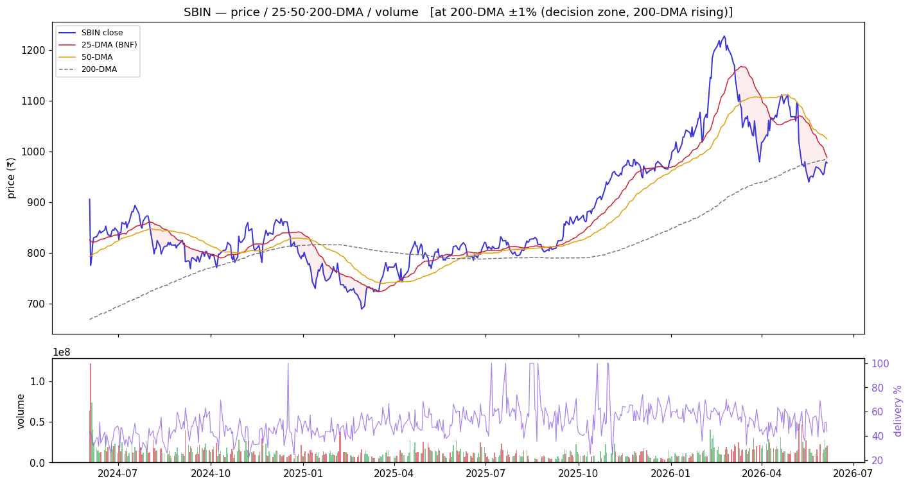
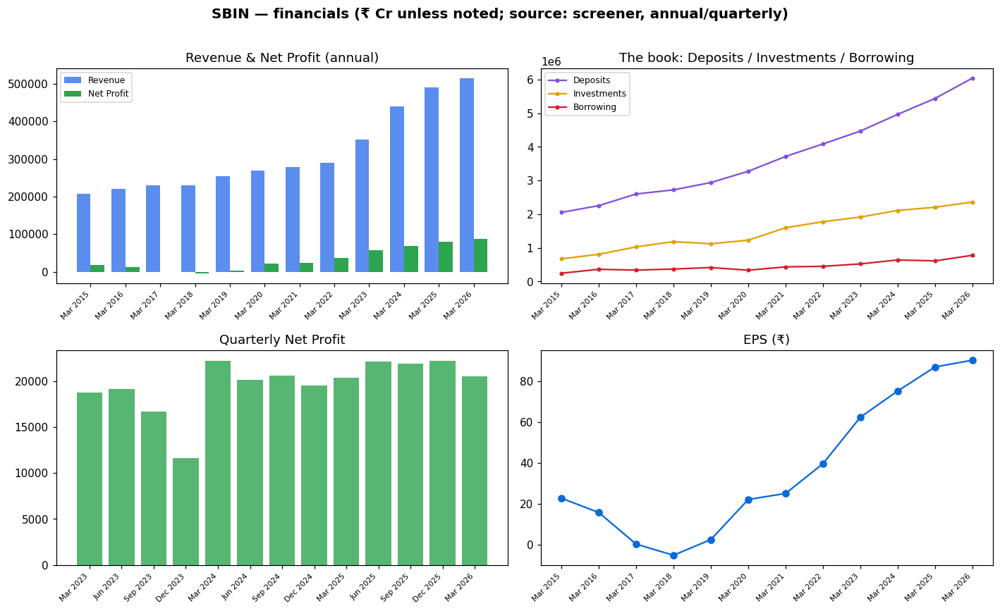

<!-- ASSEMBLED:BEGIN -->
# State Bank of India (SBIN) — Equity Research

> ### 🟡 Stance: **Hold / add at the 200-DMA**
> **₹978.0** · Mcap ₹902,477 Cr · P/E 10.8 · P/B 1.51 · ROE 15.4% · Div 1.77% · 1-yr +20.7%
> Trend: 🔴 downtrend (below both DMAs) — vs50 -4.6%, vs200 -0.8%
>
> **Links:** [Screener](https://www.screener.in/company/SBIN/consolidated/) · [TradingView](https://in.tradingview.com/symbols/NSE-SBIN/) · [BSE](https://www.bseindia.com/stock-share-price/state-bank-of-india/SBIN/500112/) · [NSE](https://www.nseindia.com/get-quotes/equity?symbol=SBIN)

_Colour code: 🟢 constructive · 🟡 neutral/watch · 🔴 avoid. See [GLOSSARY](GLOSSARY.md) for every header, term and chart colour._

## Visuals (charts first)

### Price · volume · 25/50/200-DMA · delivery

> **What it shows:** daily split-adjusted price with 25/50/200-day moving averages, volume bars (green up / red down) and delivery%. **How to read:** above the 200-DMA = long-term uptrend; the 50-DMA is the buy-the-dip anchor (our EARNED strategy). **This name:** 🔴 downtrend (below both DMAs); delivery 43.6%, RelVol 1.35×.

### Financials — revenue/profit · the investment book · quarterly · EPS

> **What it shows:** (top-left) annual Revenue & Net Profit; (top-right) **the book** — Deposits vs Investments (G-sec/SLR) vs Borrowing = where the money is; (bottom-left) quarterly Net Profit momentum; (bottom-right) EPS trend. ₹ Cr, sourced screener.

### Group / dependency graph

> **What it shows:** subsidiaries/JVs (sourced; edge = stake %). Green node = listed (price-validated co-move with parent), yellow = unlisted, purple = foreign JV partner. See [GLOSSARY](GLOSSARY.md#graph-diagrams).

---

<!-- ASSEMBLED:END -->
## 1. Basic information
| Field | Value | Provenance |
|---|---|---|
| Ticker / exchange | SBIN / NSE·BSE | sourced |
| Current price | ₹978 | sourced |
| **Tally check** | jugaad ₹977.70 vs screener ₹978 = **0.0%** ✓ | computed |
| Market cap | ₹9,02,477 Cr (largest PSU bank) | sourced |
| P/E · P/B | 10.8 · 1.51 | sourced |
| Dividend yield · ROE | 1.77% · 15.4% | sourced |
| Recommendation | **core hold / quality anchor** (§4,§7) | computed read |
| Target price | `unknown` | `unknown` |

## 2. Business description
Largest & oldest bank in India, Fortune 500, HQ Mumbai (sourced). **Deposit market share ~22%,
net-advance share ~20%** as of Q3 FY26 (sourced) — the dominant PSU franchise. Detailed quality
ratios (NIM/GNPA): **`unknown`** from the about panel (not in SBIN key-points); pull from the AR/
concall if needed.

## 3. Industry & competitive positioning
The sector bellwether — highest float, NIFTY50 constituent. Strongest deposit franchise of the
basket; the closest PSU competitor to private banks on scale. See `00_industry.md`.

## 4. Investment summary
**The quality anchor of the basket.** Highest absolute profit, richest valuation (P/E 10.8, P/B
1.51 — the market pays up for SBIN's franchise). 5-yr profit CAGR 30%, stock CAGR 18%, **1-yr
+20.7%** (sourced/computed). Recent (sourced): **new Group CRO (5 Jun 2026)**; priced **USD 200mn
senior unsecured Reg-S notes (29 May)**; active London/investor meets (late May). Quarterly Net
Profit steady-high: ₹20,379→22,121→21,861→22,176→**20,508 Cr** (sourced) — large and stable.

## 5. Valuation
P/E 10.8, **P/B 1.51** (richest of the four — quality premium), div yield 1.77%. DCF: `unknown`.

## 6. Financial analysis
Investment book **₹23,59,502 Cr**, Deposits **₹60,43,097 Cr**, Borrowing **₹7,77,302 Cr** (Mar
2026, sourced) — an order of magnitude above peers. Loan-book sector split: **`unknown`** (gated).
Profit growth 10-yr 21% / 5-yr 30% / TTM 7% (sourced) — decelerating but off a high base.

## 7. Price & flow
`charts/SBIN_price_volume.png`. Computed 2026-06-04: **−4.6% below 50-DMA**, −0.8% vs 200-DMA
(sitting on the long-term anchor), 1-yr +20.7%, volume **1.35×** (most elevated in basket),
delivery **43.6%** (highest — strong investor, not trader, participation), **absorption 0.15** (low
— no decisive soak-up of the pullback yet). Pulling back to the 200-DMA on rising volume = a
watch-for-support setup.

## 8. Investment risks
Size limits growth rate; NIM pressure; the richest valuation = least margin of safety on a
de-rating; macro/rate sensitivity given the huge G-sec book. No qualified opinion sourced.

## 9. ESG
GoI-majority; governance via govt-appointed board. E/S/G detail: `unknown`.

## 10. References — see `references.md`.

---
**Stance (computed read):** core hold / quality anchor. Best franchise + highest delivery%
(investor conviction), but the priciest on P/B and currently below its 50-DMA on rising volume —
the 50-DMA strategy says wait for the pullback to base near the 200-DMA rather than chase.

---

---

## Concall — key points (latest, sourced)
_✅ latest transcript captured (`filings/concall/SBIN.json`)._

_Key points pending agent review — the transcript is captured; raw text is **not** dumped here (would be boilerplate). Read it in `filings/concall/SBIN.json`._

## DRHP
N/A for the parent — State Bank of India is a long-listed PSU bank (no recent IPO/DRHP). Group IPOs: SBI Funds Mgmt (SBI MF) IPO expected 2026.

## References (this company)
- Screener: https://www.screener.in/company/SBIN/consolidated/
- TradingView: https://in.tradingview.com/symbols/NSE-SBIN/
- BSE: https://www.bseindia.com/stock-share-price/state-bank-of-india/SBIN/500112/
- NSE: https://www.nseindia.com/get-quotes/equity?symbol=SBIN
- Audit snapshot: `filings/SBIN_screener_page.pdf`
- Data: `data/SBIN_*.json` / `.csv`

**News & disclosures (dated, sourced):**
- Group Chief Risk Officer 1d - Shri Ratna Teja Dinakara Akella appointed Group Chief Risk Officer on 5 June 2026. — https://www.bseindia.com/stockinfo/AnnPdfOpen.aspx?Pname=88c6f5be-75e8-498d-b8d1-2a054a322212.pdf
- Cancellation Of Meeting With Institutional Investors Schedule On 04.06.2026 3 Jun - SBI cancelled investor/analyst meeti — https://www.bseindia.com/stockinfo/AnnPdfOpen.aspx?Pname=4671ab4b-162f-4911-b70a-b9c20705a28d.pdf
- Announcement under Regulation 30 (LODR)-Analyst / Investor Meet - Outcome 1 Jun - SBI held analyst and institutional inv — https://www.bseindia.com/stockinfo/AnnPdfOpen.aspx?Pname=4bc31c79-a8c3-44a6-b35f-254642e2afb9.pdf
- Raising Of Senior/ Unsecured/ Fixed Rate / Reg S Bond 29 May - SBI priced USD 200 million senior unsecured Reg-S notes,  — https://www.bseindia.com/stockinfo/AnnPdfOpen.aspx?Pname=a53dee49-a081-4178-b3be-294e7a5364ea.pdf
- Announcement under Regulation 30 (LODR)-Analyst / Investor Meet - Outcome 28 May - SBI held investor interactions in Lon — https://www.bseindia.com/stockinfo/AnnPdfOpen.aspx?Pname=ed8944a8-8e73-4286-a3a2-af58a7ec220a.pdf
