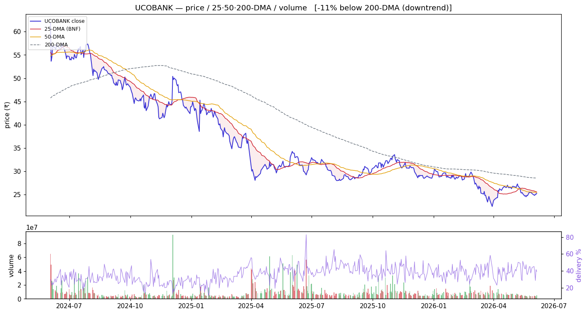
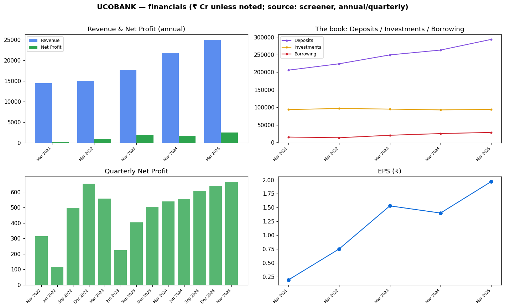

<!-- ASSEMBLED:BEGIN -->
# UCO Bank (UCOBANK) — Equity Research

> ### 🔴 Stance: **Avoid (weakest)**
> **₹25.3** · Mcap ₹31,675 Cr · P/E 12.8 · P/B 1.03 · ROE 8.5% · Div 1.74% · 1-yr -25.6%
> Trend: 🔴 downtrend (below both DMAs) — vs50 -0.9%, vs200 -11.5%
>
> **Links:** [Screener](https://www.screener.in/company/UCOBANK/consolidated/) · [TradingView](https://in.tradingview.com/symbols/NSE-UCOBANK/) · [BSE](https://www.bseindia.com/stock-share-price/uco-bank/UCOBANK/532505/) · [NSE](https://www.nseindia.com/get-quotes/equity?symbol=UCOBANK)

_Colour code: 🟢 constructive · 🟡 neutral/watch · 🔴 avoid. See [GLOSSARY](GLOSSARY.md) for every header, term and chart colour._

## Visuals (charts first)

### Price · volume · 25/50/200-DMA · delivery

> **What it shows:** daily split-adjusted price with 25/50/200-day moving averages, volume bars (green up / red down) and delivery%. **How to read:** above the 200-DMA = long-term uptrend; the 50-DMA is the buy-the-dip anchor (our EARNED strategy). **This name:** 🔴 downtrend (below both DMAs); delivery 39.3%, RelVol 0.59×.

### Financials — revenue/profit · the investment book · quarterly · EPS

> **What it shows:** (top-left) annual Revenue & Net Profit; (top-right) **the book** — Deposits vs Investments (G-sec/SLR) vs Borrowing = where the money is; (bottom-left) quarterly Net Profit momentum; (bottom-right) EPS trend. ₹ Cr, sourced screener.

---

<!-- ASSEMBLED:END -->
## 1. Basic information
| Field | Value | Prov. |
|---|---|---|
| Price · Mcap | ₹25.3 · ₹31,675 Cr (smallest of 10) | sourced |
| Tally | < 0.2% ✓ | computed |
| P/E · P/B · Div% · ROE | **12.8 (richest)** · 1.03 · 1.74% · **8.5% (worst)** | sourced |
| Stance | **Avoid (weakest + expensive)** (§7) | computed read |
| Target | `unknown` | — |

## 2. Business description
Full-service PSU bank. **Revenue mix Q3 FY26 (sourced): Corporate Banking ~37%, Treasury ~27%,
Retail ~36%** — corporate/treasury-heavy (lower-quality, more cyclical mix than the retail leaders).
Deposits ₹2,93,542 Cr, Investments ₹94,153 Cr, Borrowing ₹28,687 Cr (Mar 2026, sourced).

## 3. Industry & positioning
Smallest, lowest-ROE PSU of the 10. See `00_industry.md`.

## 4. Investment summary
**The weakest name on nearly every axis.** ROE just **8.5%** (half the leaders'), 5-yr profit CAGR
**0%**, and although TTM is **+48%** that is a **low-base artefact** on tiny absolute profit
(quarterly Net Profit only ₹607→640→**666 Cr** (sourced)). Stock **−25.6% over 1-yr** (worst).
Recent: CEO **Ashwani Kumar ceased (1 Jun)** — leadership transition into weakness.

## 5. Valuation
P/E **12.8 (richest in the cohort)** for the **lowest ROE** — the clearest valuation/quality
mismatch in the group. P/B 1.03. DCF `unknown`.

## 6. Financial analysis
Low profitability (ROE 8.5%), flat 5-yr profit, corporate/treasury-tilted book. The +48% TTM is base
effect, not durable growth. Loan mix sourced (above).

## 7. Price & flow
`charts/UCOBANK_price_volume.png`. Computed: **−11.5% below 200-DMA (worst structure)**, −0.9% below
50-DMA, 1-yr **−25.6% (worst)**, volume 0.59×, delivery 39.3%, absorption 0.19. *Deep in a downtrend
below a falling 200-DMA — no reversion edge; the EARNED strategy stands aside.*

## 8. Risks
Lowest ROE + richest P/E + worst price-action + CEO change = stacked negatives; smallest/least liquid.
No qualified opinion sourced.

## 9. ESG — GoI-majority; CEO transition (governance). Detail `unknown`.

## 10. References — `references.md`.

---
**Stance:** Avoid — the cohort's weakest operator (ROE 8.5%, 0% 5-yr profit) trading at its richest
P/E, with the worst price-action and a leadership change. Every signal red except the optical TTM.
Stand aside.

---

---

## Concall — key points (latest, sourced)
_⏳ extraction pending (`filings/concall/UCOBANK.json`)._

_Key points pending agent review — the transcript is captured; raw text is **not** dumped here (would be boilerplate). Read it in `filings/concall/UCOBANK.json`._

## DRHP
N/A for the parent — UCO Bank is a long-listed PSU bank (no recent IPO/DRHP). Group IPOs: No recent group IPO of note.

## References (this company)
- Screener: https://www.screener.in/company/UCOBANK/consolidated/
- TradingView: https://in.tradingview.com/symbols/NSE-UCOBANK/
- BSE: https://www.bseindia.com/stock-share-price/uco-bank/UCOBANK/532505/
- NSE: https://www.nseindia.com/get-quotes/equity?symbol=UCOBANK
- Audit snapshot: `filings/UCOBANK_screener_page.pdf`
- Data: `data/UCOBANK_*.json` / `.csv`

**News & disclosures (dated, sourced):**
- Announcement under Regulation 30 (LODR)-Cessation 1 Jun - Ashwani Kumar ceased as UCO Bank MD & CEO on 31 May 2026 after — https://www.bseindia.com/stockinfo/AnnPdfOpen.aspx?Pname=0513c04c-b0e6-4f9e-a996-31e293011943.pdf
- Business Responsibility and Sustainability Reporting (BRSR) 21 May - UCO Bank filed BRSR 2025-26 under SEBI LODR and pos — https://www.bseindia.com/stockinfo/AnnPdfOpen.aspx?Pname=ee8760ac-293d-4b0e-a594-1f3e03963066.pdf
- Reg. 34 (1) Annual Report. 21 May — https://www.bseindia.com/stockinfo/AnnPdfOpen.aspx?Pname=ca19db4a-430a-4e1a-80cf-974fcfe16f77.pdf
- Notice Of Annual General Meeting Of The Bank 18 May - UCO Bank AGM on 12 June 2026 to approve dividend and Rs2,700 crore — https://www.bseindia.com/stockinfo/AnnPdfOpen.aspx?Pname=b3e325d4-7101-43c7-ba73-34e24df8f7b7.pdf
- Announcement under Regulation 30 (LODR)-Change in Directorate 14 May - UCO Bank appoints Shri Hari Har Mishra as directo — https://www.bseindia.com/stockinfo/AnnPdfOpen.aspx?Pname=be464e0d-d1ef-45ae-94ae-ddba0c51c3b8.pdf
