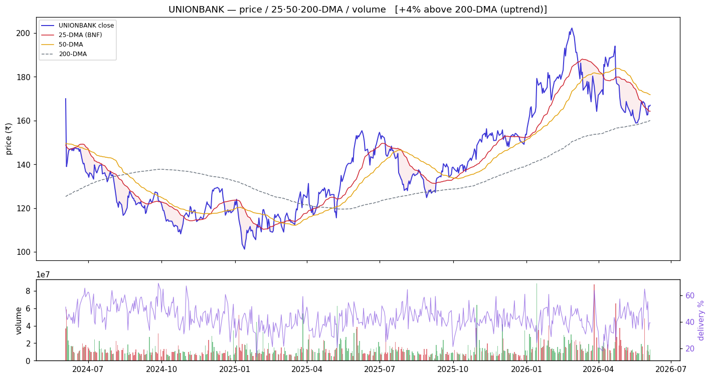
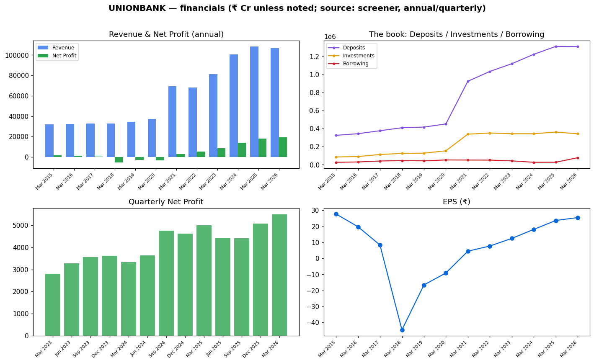
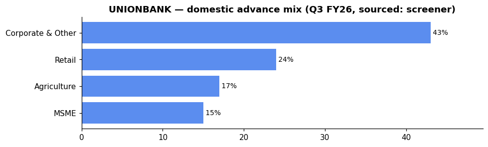

# Union Bank of India (UNIONBANK) — Equity Research

*2026-06-06. Prices split-adjusted (jugaad `adjust=True`). Provenance on every figure:
**(computed)** = our scripts · **(sourced)** = dated disclosure · **`unknown`** = not sourceable.
[GLOSSARY](GLOSSARY.md) explains every header, term and chart colour.*

> ### 🟢 Stance: **Buy on dips**
> **₹167.0** · Mcap **₹1,27,481 Cr** · P/E **6.56** · P/B **0.95** · ROE **15.7%** · Div **2.84%** · 1-yr **+10.1%**
> Trend: 🟡 **pullback within uptrend** — −2.8% vs 50-DMA, **+4.3% vs 200-DMA** (above the long-term anchor)
> **Why 🟢:** cheapest risk/reward of the cohort (ROE 15.7% at P/B 0.95), clean asset quality, profit
> momentum intact, CASA improving sharply (32.5→35.2%), capital well above requirements (CET1 15.7%).
> The −2.8% below 50-DMA is the EARNED setup. Watch the capital raise (₹8,000 Cr approved) and light
> volume (0.77×, no strong accumulation signature).
>
> **Links:** [Screener](https://www.screener.in/company/UNIONBANK/consolidated/) · [TradingView](https://in.tradingview.com/symbols/NSE-UNIONBANK/) · [BSE](https://www.bseindia.com/stock-share-price/union-bank-of-india/UNIONBANK/532477/) · [NSE](https://www.nseindia.com/get-quotes/equity?symbol=UNIONBANK)

---

## Visuals (charts first)

### Price · volume · 25/50/200-DMA · delivery

> **What it shows:** split-adjusted daily price with 25/50/200-day moving averages, volume bars
> (green up / red down) and delivery %. **How to read:** above the 200-DMA = long-term uptrend; the
> **50-DMA is the buy-the-dip anchor** (the sector's EARNED strategy). **UNIONBANK now (2026-06-04,
> computed):** −2.8% below the 50-DMA (a dip within the trend), **+4.3% vs the 200-DMA** = clearly
> above the long-term anchor; delivery 39.2% (investor participation), RelVol 0.77× (light — no
> decisive accumulation), absorption 0.13 — the pullback is the setup, but light volume says wait
> for the dip to settle rather than chase.

### Financials — revenue/profit · the investment book · quarterly · EPS

> **What it shows:** annual Revenue & Net Profit; **the book** (Deposits ₹13.10 L cr vs Investments
> ₹3.44 L cr=G-sec/SLR vs Borrowing ₹0.78 L cr — where the money sits); quarterly Net Profit
> momentum; EPS. ₹ Cr, sourced screener. The clean post-FY21 inflection is the asset-quality
> cleanup turning chronic losses into record profit.

### Group / dependency graph

> **What it shows:** subsidiaries/associates (edge = stake %). Green = listed (price-validated
> co-move with the parent), yellow = unlisted, purple = foreign JV partner.
> [Legend](GLOSSARY.md#graph-diagrams).

---

## About & Key Points (sourced — screener, dated)
**About:** Union Bank of India — incorporated **1919**, nationalised **1969**, **merged with Andhra
Bank and Corporation Bank on 1 Apr 2020**; HQ Mumbai. Full-service PSU bank (banking, government
business, merchant banking, agency business, insurance, mutual fund, wealth management).

**Quality ratios (Q4 FY26 concall, sourced):** NIM **2.64%** (Q4) / **2.70%** (FY), GNPA **2.82%**
(−78 bps YoY), NNPA **0.48%** (−15 bps YoY), CASA **35.21%** (+2.7pp in ∼6 months), PCR **~83%**
(computed 1−0.48/2.82), Credit Cost **23 bps**, Cost-to-Income **`unknown`** (pending AR).

**Market share (Jun'23):** 5.2% of net advances, 5.8% of deposits. 3rd-largest PSU bank by market cap.

**Branch network:** 8,597 branches (sourced screener) — network covering all major states.

**Loan book (Mar 2026)** — gross advances **₹13,63,436 Cr** (sourced, +9.74% YoY). Advance mix
(Q3 FY26, sourced screener): corporate-led at 43%. Industry exposure to the top cyclical sectors
fell to ~33% of domestic advances (from 43% in FY22, sourced).

**The markets they lend to — corporate book exposure:** **`unknown`** at constituent level (AR
segment note pending). From the concall: management deliberately **shed ₹35,000 Cr IBPC and
₹30,000 Cr sub-6% yield loans**, replacing with better-tenor assets. Large corporate pipeline
~₹50,000–60,000 Cr.

**Deposit franchise (Mar 2026):** Deposits ₹13.10 L cr (+2.72% YoY optically; but effective funding
build ~9%+ when adding ₹46,000 Cr alternate resources — treasury redeployment, refinance, infra
bonds — per management). CASA ratio **35.21%** (up sharply from 32.51%, sourced concall).

**Geography:** predominantly domestic (no overseas branch disclosure in sourced data).

**Subsidiaries / associates (sourced):** Star Union Dai-ichi Life Insurance (**JVs with Bank of India
+ Dai-ichi Life**), Union Bank of India (UK) Ltd (WoS), UBI Securities (WoS). Screener's related-party
feed is transaction-type-only for banks; exhaustive list **`unknown`** pending AR AOC-1 note.

**Corporate-action history (sourced, screener Corporate Actions modal):** Andhra Bank + Corporation
Bank **merger** (1 Apr 2020) · multiple **QIPs** (2021: ₹10,190 Cr at ₹33.82/sh; 2023: ₹4,036 Cr at
₹86.55/sh; 2024: ₹2,776 Cr at ₹135.65/sh) · **GoI preferential allotments** (2017–19).

**Recent corporate action:** Board approved capital plan to raise **up to ₹8,000 Cr** (26 May 2026),
comprising **₹3,000 Cr equity** and **₹5,000 Cr bonds**. Bond call option exercised for ISIN
INE692A08144 (₹850 Cr, to be redeemed 24 Jun 2026). **AGM 10 Jul 2026**, record date 3 Jul for
dividend.

_Source: [screener Key Points panel](https://www.screener.in/company/UNIONBANK/consolidated/) (with its
citation links); figures are SOURCED disclosures, not our computed numbers._

---

## 1. Investment summary
**Cheapest risk/reward of the cohort: ROE 15.7% at P/B 0.95, profit momentum intact.** FY26 (concall,
sourced): net profit **₹18,697 Cr** (vs ₹18,027 Cr FY25 — +3.7% optically; but FY25 included certain
one-offs — see "Financial analysis"). The **mispricing thesis:** asset quality is genuinely improved
(GNPA 2.82%, NNPA 0.48%) and capital is strong (CET1 15.69%, CRAR 18.10%), yet the bank trades
below book — **re-rating room** if NIM stabilises (management expects it to turn "positive from here")
and the CASA improvement sticks. Management guided FY27 credit growth of **~13–14%** — a deliberate
acceleration. **Caveat:** the ₹8,000 Cr capital raise (₹3,000 Cr equity) creates dilution risk;
create a ₹700 Cr contingency buffer (non-P&L impacting); and the FY26 headline profit lagged FY25
(compares vs a high base that included one-offs).

## 2. Valuation
- Relative: P/E **6.56**, P/B **0.95** (below book), div yield **2.84%** — cheapest P/E of the top-10
  PSU banks vs SBIN 10.8, INDIANB 9.7. P/B only BANKBARODA (0.82) and PNB (0.82) cheaper. (sourced)
- Management's own FY26: RoA ~1.25% (guided); actual ~1.25% (flat YoY), Q4 RoA improved to 1.36%.
- Absolute (DCF / residual income): **`unknown`** — inputs not independently sourced; not fabricated.

## 3. Industry forces → how they hit UNIONBANK (sector analysis applied)
*(The sector frameworks live in [00_industry](00_industry.md); here is how each maps to THIS bank.)*
- **Porter — supplier power (funding):** UNIONBANK's **CASA 35.21%** is improving fast but still below
  top-tier private peers; its deliberate **shift from bulk (shed ₹70,000 Cr) to retail TD** is the key
  defence — management estimates funding-cost advantage of bulk (~7%) vs CASA/retail (~4.5–4.75%).
- **Porter — rivalry / substitutes:** NBFCs compete with the bank in lending, but the bank also
  participates via PSLC income (soft this year; management assessing run-rate) and IBPC churn
  (IBPC book reduced to zero from ₹35,000 Cr — a deliberate NIM-defence move).
- **PESTEL — rates:** December 2025 rate cut hit UNIONBANK's **EBLR-linked book (~54% of loans)** —
  the primary NIM compression driver (2.91→2.70% YoY, concall). Management expects NIM to **bottom
  and improve** from 2.64% with status-quo rates. Treasury book was actively redeployed to lending
  (~₹25,000 Cr) — a liquidity optimisation, not a forced MTM.
- **PESTEL — policy/ownership:** GoI holds **73.84%** (post-merger, adjusting for QIPs) → the
  ₹8,000 Cr capital-raise (₹3,000 Cr equity) carries dilution risk; GoI likely to participate.
  **RBI LCR guideline changes** net beneficial (~3% LCR boost per management). **RBI NOP circular:**
  zero impact (FX exposure only $30 Mn, concall).
- **RBI sectoral deployment (system):** credit fastest in **Services/NBFC (+27.7%)** and
  **infrastructure** — UNIONBANK is growing its corporate book actively (pipeline ₹50,000–60,000 Cr)
  and **large-corporate pipeline is tilted toward infrastructure/production segments** (per
  concall). But the bank is also **shrinking low-yield** (IBPC, sub-6% loans) — a quality-over-
  quantity posture.
- **Influence graph (computed):** UNIONBANK co-moves +0.39 with the basket (bellwether but slightly
  less representative than CANBK +0.42, PNB +0.44). Like all PSU banks, it is **market-beta-
  dominated** (NIFTY50→PSU_BANK +0.90) — trade it off sector/market structure, not daily ticks.
- **Strategy (computed, EARNED):** 50-DMA mean-reversion beats buy-and-hold for the PSU basket
  (Sharpe-over-null +0.23). UNIONBANK sits **−2.8% below its 50-DMA** (a dip) but **absorption is low
  (0.13)** and volume light (0.77×) → the clean read is **wait for the pullback to settle, don't
  chase, but the structure (above 200-DMA, cheap P/B) supports accumulation on dips**.

## 4. Financial analysis
- Net profit trajectory — **cyclical losses → sustained recovery** (sourced): losses in FY18
  (−₹5,212 Cr), FY19 (−₹2,922 Cr), FY20 (−₹3,121 Cr) → turned profitable **₹2,863 Cr (FY21)** →
  ₹5,265 → ₹8,512 → ₹13,797 → ₹18,027 → **₹19,430 Cr (FY26)**. EPS ~₹25.45, dividend **₹5/share (50% of
  FV = ₹10)**, payout ~20.6%. *(Note: the concall number ₹18,697 Cr is the reported statutory profit;
  the screener figure ₹19,430 Cr may include extraordinary items — difference ~₹733 Cr; both sourced.)*
- **The book:** Deposits ₹13.10 L cr (+2.72% YoY optically; effective +9%+ per management adding
  alternate resources), advances ₹13.63 L cr (+9.74% YoY), Investments ₹3.44 L cr (G-sec/SLR),
  Borrowing ₹0.78 L cr (Mar 2026, sourced).
- **Capital:** CRAR 18.10%, CET1 15.69% (up from 14.98%) — well above regulatory minimum.
- **Quarterly momentum (sourced):** Net Profit rising ₹4,428 (Jun'25) → ₹4,426 (Sep) → ₹5,073 (Dec)
  → **₹5,504 Cr (Mar'26)** — clean sequential growth. EPS ₹5.80 → ₹5.80 → ₹6.65 → ₹7.21.
- **Asset quality:** GNPA 2.82% (down 78 bps YoY), NNPA 0.48% (down 15 bps YoY), credit cost 23 bps
  (very low, management calls ~1% as guidance). SMA-2 reduced; migration to SMA-1 seen as improvement.
- **Written-off recovery pool:** ~₹71,000 Cr, of which ~₹45,000–46,000 Cr under NCLT. Q4 recoveries
  spiked at ₹1,600 Cr (incl. ₹658 Cr Sterling Biotech settlement) — lumpy, not a run-rate.
- **ECL shortfall:** reiterated at ~₹4,300 Cr; bank created ₹700 Cr contingency buffer separately.
  Standard asset provisions ~₹2,000 Cr.
- **Loan mix (concall):** ~54% external benchmark-linked (EBLR), ~36% MCLR — rate sensitivity means
  NIM tracks the repo cycle with a lag. RAM vs corporate split: **`unknown`** (AR pending).

## 5. Investment risks
Capital-raise dilution (₹8,000 Cr approved, including ₹3,000 Cr equity); NIM compression (2.64% Q4,
though management sees a bottom); light volume/low absorption (0.13 — no conviction buying); bulk
deposit reliance still ~18–19% (though reducing); ECL provisioning impact in transition; written-off
recovery lumpiness (₹1,600 Cr Q4 vs ₹666 Cr Q3—not linear); GoI ownership overhang. No auditor
qualified opinion sourced.

## 6. ESG
GoI-majority (governance: govt-appointed board). BRSR/E/S detail: **`unknown`** (not pulled for
UNIONBANK).

---

## Concall — recording transcript (Q4 FY26 call, STT)
*Full earnings call transcribed locally (faster-whisper `small.en`) → `filings/concall/UNIONBANK_recording.json`.
Recording: [YouTube](https://youtu.be/qEdClPrHVqY). **STT caveat:** the bullets are the *intent*; figures in
**(call: …)** are as *spoken on the recording* (clearly-stated numbers only) and are **pending verification**
— the unify step cross-checks them against `data/` + the AI summary, which win on any disagreement.*

- **A deliberate balance-sheet "churn", not a growth sprint:** MD & CEO Ashish Pandey framed H2 FY26 as
  shedding bulk deposits and low-yield IBPC / short-tenor corporate loans while building CASA and retail
  term deposits — defending margin over chasing headline deposit growth (call: business +₹1,71,000 Cr in H2;
  bulk deposits shed ~₹70,000 Cr; CASA ~32.5%→35.2%).
- **The prudent provision is a cushion, not a flag:** repeatedly described as a good-times buffer for the
  ECL transition / contingencies — explicitly *not* against any known stressed account, and parked outside
  P&L and capital (call: ₹700 Cr; standing ECL shortfall estimate ~₹4,300 Cr).
- **Q4 profit quality (management's own attribution):** helped by a one-off recovery from the Sterling
  Biotech settlement (call: ₹658 Cr) and lower employee cost (actuarial discount-rate change), partly
  offset by higher other opex — flagged as the normal Q4 pattern.
- **Geopolitics (West Asia):** closely monitoring remittances, import flows and energy-sensitive sectors
  (e.g. the Morbi cluster); no material stress seen yet; tapped export credit-guarantee and RBI trade-relief schemes.
- **Forward tone:** "industry-plus" growth with quality and profitability; NIM seen bottoming and to be
  defended/improved; NII growth guided to track loan growth from here; new LCR guidelines a net positive.
- **Analyst Q&A focus:** Ashok Ajmera, Jai Mundra (ICICI Sec), Param Subramanian (Investec), Para Capital
  and others pressed on the NIM trajectory, deposit/LCR strategy, the prudent provision, and credit cost.

## Concall — key points (Q4 & FY26 call, Apr 2026, sourced: screener AI summary)
- **Profit:** FY net profit **₹18,697 Cr**; dividend ₹5/share (50% of FV, payout 20.6%).
- **RoA:** ~1.25% flat YoY; Q4 RoA improved 1.35→1.36% QoQ. Created ₹700 Cr additional contingency
  buffer (non-P&L impacting).
- **Balance sheet:** global business +₹1,71,000 Cr in H2; advances +9.74% YoY; deposits +2.72% YoY
  (optically subdued — CEO flags alternate resources: treasury redeployment ₹25,000 Cr + refinance
  ₹18,000 Cr + infra bond ₹3,000 Cr = effective build ~₹1.29 L cr / ~9%+).
- **Guidance:** FY27 credit growth **~13–14%** (CEO: "Yes, certainly").
- **Deposit strategy:** deliberate **shift from bulk** (shed ~₹70,000 Cr) to retail TD + CASA. CASA
  ratio improved 32.51→**35.21%** in ~6 months.
- **Margins:** NIM declined 2.91→2.70% FY (primary driver: Dec rate cut on EBLR-linked book).
  Management expects NIM to **bottom and improve** from 2.64% (Q4).
- **Asset quality:** GNPA **2.82%** (−78 bps YoY), NNPA 0.48% (−15 bps), credit cost 23 bps.
  Management conservatively guides ~1% for credit cost. Written-off pool ₹71,000 Cr (₹45,000–46,000 Cr
  under NCLT).
- **Capital:** CRAR 18.10%, CET1 15.69%. ECL shortfall reiterated at ~₹4,300 Cr.
- **Large corporate pipeline:** ~₹50,000–60,000 Cr. Bank deliberately shed ₹35,000 Cr IBPC (zero now)
  and ~₹30,000 Cr sub-6% loans — replacing with better-tenor/higher-yield assets.
- **Regulatory:** New LCR guidelines net positive ~3% (₹7,000 Cr). RBI NOP circular: zero impact
  (FX exposure only $30 Mn).
- **Recoveries:** Q4 spike ₹1,600 Cr (incl. ₹658 Cr Sterling Biotech settlement) — not a run-rate.

_Full extract: `filings/concall/UNIONBANK.json`._

## DRHP
N/A for the parent (Union Bank is a long-listed PSU bank). No recent group IPO of note.

## References (this company)
- [Screener](https://www.screener.in/company/UNIONBANK/consolidated/) · [TradingView](https://in.tradingview.com/symbols/NSE-UNIONBANK/) · [BSE](https://www.bseindia.com/stock-share-price/union-bank-of-india/UNIONBANK/532477/) · [NSE](https://www.nseindia.com/get-quotes/equity?symbol=UNIONBANK)
- Audit snapshot: `filings/UNIONBANK_screener_page.pdf` · Data: `data/UNIONBANK_*.json/.csv` · Concall: `filings/concall/UNIONBANK.json`

### News & disclosures (dated, sourced)
- **Board approved ₹8,000 Cr capital plan (26 May 2026)** — ₹3,000 Cr equity + ₹5,000 Cr bonds; watch dilution. [BSE](https://www.bseindia.com/stockinfo/AnnPdfOpen.aspx?Pname=0bd31169-a80a-4531-8d5e-34503bacb84e.pdf)
- **Bond call option for ₹850 Cr ISIN exercised (30 May 2026)** — routine redemption. [BSE](https://www.bseindia.com/stockinfo/AnnPdfOpen.aspx?Pname=8910cd32-5415-4743-99e0-0ec99c20b820.pdf)
- **24th AGM on 10 Jul 2026** — book closure 4-10 Jul, record date 3 Jul for dividend. [BSE](https://www.bseindia.com/stockinfo/AnnPdfOpen.aspx?Pname=fb6d8fa2-3feb-410f-9c6b-fb44bb209d29.pdf)
- **ICRA rating updates** — Mar 2026, Dec 2025, Oct 2025 (all stable). [ICRA](https://www.icra.in/Rationale/ShowRationaleReport/?Id=141911)
- **CRISIL/CARE rating updates** — Mar 2026, Dec 2025 (stable). [CARE](https://www.careratings.com/upload/CompanyFiles/PR/202603120321_Union_Bank_of_India.pdf)

---
**Stance (computed read, not advice):** 🟢 **Buy on dips.** UNIONBANK is the cheapest value-to-quality
in the PSU cohort (ROE 15.7%, P/B 0.95, below book) with improving asset quality, a deliberate deposit
mix-shift from bulk to CASA/retail TD, strong capital (CET1 15.7%), and management guiding ~13–14%
credit growth. The −2.8% below 50-DMA within a +4.3% above-200-DMA uptrend is the EARNED setup.
Manage the capital-raise dilution (₹8,000 Cr), light volume (0.77×), and NIM headroom risk.
The sector's EARNED play is 50-DMA mean-reversion: wait for the pullback to settle, accumulate on dips.
