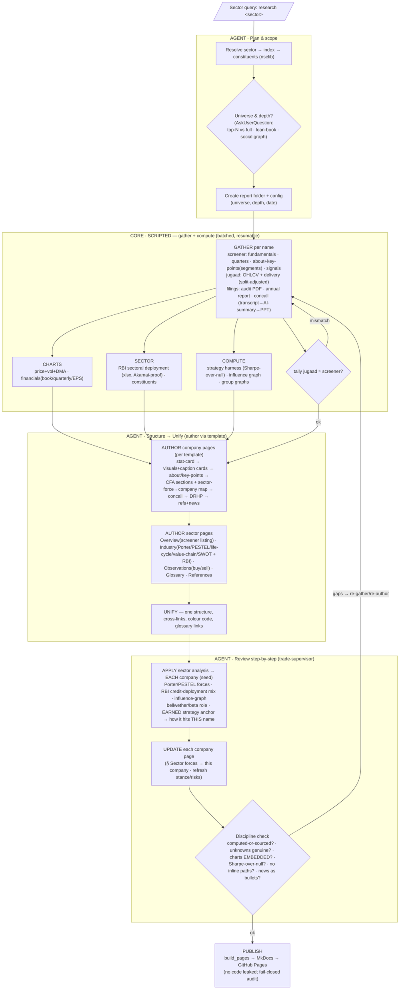

# Sectoral research — workflow

The canonical flow for a query like *"research the top-10 PSU banks"*. Hard rule: **scripted core
only gathers + computes; the agent plans, structures, unifies and reviews.** Prose/structure is
authored from the template — never emitted by a program.

> **TODO is the heart.** Before anything, build a plan with the built-in task tools
> (`TaskCreate`) — one task per stage/sub-step — and keep it live (`TaskUpdate`: in_progress →
> completed; `TaskList` to check). Every stage below updates it; every gap found in review is added
> back as a task. The todo list is the single source of truth for progress across the whole flow.
>
> **If the task tools aren't available**, fall back to a **TODO file** — `_todo.md` in the report
> folder, ONE per unique research query/search — and update it the same way. Persist it until the
> **context changes** (the user pivots to a different search/investigation); on a context change,
> **confirm with the user** before replacing or abandoning the existing todo.

**Legend** — `A1/A2/A3` = agent stages (judgement, prose, review). `CORE` = Python (gather +
compute only). Loops: tally mismatch → re-gather; review gaps → re-gather or re-author.

## Stage outputs
| Stage | Owner | Produces |
|---|---|---|
| Plan &amp; scope | agent | report folder + config (universe, depth) |
| Gather | script | `data/` `filings/` |
| Charts/Sector/Compute | script | `charts/` `graph/` `strategies/` + RBI table |
| Structure/Unify | **agent** | `00_comprehensive` `00_industry` `01_observations` `<SYM>_equity_research` `GLOSSARY` `references` |
| Review | **agent** | discipline-passed report (or gaps routed back) |
| Publish | script | MkDocs site on Pages |
